# Abraham / Triple A — Master Build Document (Complete)

> **Single .md file for building Propa3 end-to-end.**  
> Combines: Abraham's verbal process walkthrough · extracted Google Docs/Sheets/infographics · operational form field specs · roles & access · workflows · enums · approval gates · **Master Business Requirements (Project + Property + Sales + Procurement)**.
>
> **Use for:** database schemas, APIs, UI forms, RBAC, automations, client portal, acceptance tests.  
> **Updated:** Sep 8, 2026 (Property Docs Batch 2 EXTRACTED — inventory, offer letter, PM proposal, tenant application)  
> **Generated:** Sep 3, 2026  
> **Governance:** Abraham documents > Abraham verbal instructions > Team Charter (`PROJECT_GOVERNANCE.md`)  
> **Evidence rules:** Mark every requirement as **CONFIRMED** (client said) · **EXTRACTED** (from Abraham docs) · **PROPOSED** (industry/logical — not client-confirmed) · **WAITING** (document expected — do not invent).

---

## Document Map

| Part | Contents |
|------|----------|
| **A** | [System design — principles, entities, enums, roles, gates, automations](#part-a-system-design) |
| **B** | [Phase-based workflows — 6 phases, user stories, organograms, embedded docs](#part-b-phase-based-workflows-detailed) |
| **C** | [Appendix — full verbatim extractions](#part-c-appendix--full-verbatim-extractions) |
| **D** | [Form field specs](#part-d-form-field-specs-operational-forms) |
| **E** | [Team roles & org structure](#part-e-team-roles--org-structure) |
| **G** | [Property Management — tenancy, scoring, maintenance, remittance](#part-g-property-management) |
| **H** | [Property Sales — listings, CRM interest, inspection, JV](#part-h-property-sales) |
| **I** | [Procurement — Goods / Services / Works + fee rules](#part-i-procurement-goods-services-works) |
| **J** | [Artisan registration & KYC](#part-j-artisan-registration--kyc) |
| **K** | [Cross-module integration](#part-k-cross-module-integration) |
| **L** | [Confirmed business rules (latest client clarifications)](#part-l-confirmed-business-rules-latest-client-clarifications) |
| **M** | [End-to-end journeys (Project → Property → Sales → Maintenance)](#part-m-end-to-end-journeys) |
| **F** | [Gaps — documents expected · do not invent · reconciliation](#part-f-gaps--validation-needed) |

### Phase quick navigation (Part B)

| Phase | Section |
|-------|---------|
| Project Initiation | [B.1](#b1-project-initiation) |
| Project Planning | [B.2](#b2-project-planning) |
| Project Execution | [B.3](#b3-project-execution) |
| Procurement | [B.4](#b4-procurement) |
| Project Monitoring & Controlling | [B.5](#b5-project-monitoring--controlling) |
| Project Closure | [B.6](#b6-project-closure) |

### Module quick navigation (Parts G–M)

| Module | Section |
|--------|---------|
| Property Management | [G](#part-g-property-management) |
| Property Sales | [H](#part-h-property-sales) |
| Procurement (3 categories) | [I](#part-i-procurement-goods-services-works) |
| Artisan KYC | [J](#part-j-artisan-registration--kyc) |
| Integration | [K](#part-k-cross-module-integration) |
| Confirmed rules | [L](#part-l-confirmed-business-rules-latest-client-clarifications) |
| Journeys | [M](#part-m-end-to-end-journeys) |

---

# Part A: System Design

## A.1 Design Principle — Controlled Workflow, Not a Tracker

Abraham described a **controlled operational workflow**. The system must **block** the next stage until prerequisites pass.

```
Lead → Initial Proposal → Project Charter (sign-off) → Planning → Design/BOQ/Permits
  → Procurement → Execution → Inspection → Measurement → Valuation → Payment
  → Progress Reporting → UAT → Handover → Closure → Retrospective
```

**Approval gates (non-negotiable):**

| Transition | Blocked until |
|------------|---------------|
| Initiation → Planning | Client + company charter signatures |
| Planning → Execution | Dev Control approval + BOQ approved + schedule published |
| Concrete pour | Pre-pour checklist pass + engineer sign-off |
| Subcontractor payment | IVC measured % + PM recommendation |
| Major scope change | Client approval (+ Dev Control if structural) |
| Handover | UAT pass + fitness certificate + financial closure |
| Project closed | Retrospective completed |

## A.2 Operating System Pillars (Interconnected)

> **CONFIRMED architecture:** propA3 is one connected OS — Projects · Properties (Sales + Management) · Procurement (Goods / Services / Works) · Finance · CRM · Documents · Notifications · Reporting. See [Part K](#part-k-cross-module-integration) and [Part M](#part-m-end-to-end-journeys).

```
                         PROPA3
                           │
        ┌──────────────────┼──────────────────┐
        │                  │                  │
     PROJECTS          PROPERTIES         PROCUREMENT
        │                  │                  │
        │          ┌───────┴───────┐          │
        │        SALES        MANAGEMENT      │
        │      (listings)   (units/tenancy)   │
        │                  │                  │
        └──────────────────┼──────────────────┘
                           │
                        FINANCE ← CRM ← DOCUMENTS ← NOTIFICATIONS ← REPORTING

Procurement categories (CONFIRMED):
  GOODS (materials) · SERVICES (artisans/professionals, 2.5%) · WORKS (~10% of project cost)
```

## A.3 Core Entities

| Entity | Description |
|--------|-------------|
| organization | Triple A Realty Projects Ltd. |
| site | Jikwoyi, Mpape, Guzape I/II/III, Lugbe, Rockvilla |
| property | Land, plot, unit, building |
| project | Construction engagement |
| client | Owner, purchaser, tenant |
| stakeholder | Registered party with comms plan |
| user | System user with role(s) |
| document | Drawing, permit, certificate, report |
| milestone / task | WBS schedule row |
| daily_site_log | 10-section daily report |
| inspection | Phase QC or pre-pour checklist |
| change_request | Scope variation row |
| subcontract + ivc | Subcontractor work + valuation certificate |
| invoice / payment | Billing and ledger |
| material_request | Site indent |
| vendor | Supplier directory row |
| progress_report | Weekly/monthly stakeholder report |
| personnel_log | Attendance (verbal — no template yet) |
| retrospective | Post-project lessons |
| listing | Property for sale / JV |
| unit | Unit within a multi-unit property |
| tenant | Occupant applicant or active tenant |
| tenancy | Agreement linking tenant ↔ unit |
| tenant_application | Screening application |
| tenant_evaluation_score | FM scores: 4 criteria × 0–10 + system average |
| offer_letter | Pre-tenancy offer (rent, service charge, deposit) |
| move_in_inspection / move_out_inspection | Condition baseline & exit compare |
| maintenance_request | Tenant/FM corrective maintenance ticket |
| service_charge_ledger | Levy balance = spend boundary for FM |
| landlord_remittance | Gross rent − expenses → landlord |
| artisan_profile | Registered service provider + KYC + guarantor |
| purchase_requisition | Goods need → PR |
| purchase_order | Approved PO to supplier |
| goods_receipt | Delivery verification vs PO/invoice |
| service_request | Services procurement (photo + artisan) |
| works_contract | Works procurement linked to project |
| buyer_interest | Sales "Show Interest" → CRM lead |
| sales_inspection | Mandatory physical viewing record |
| jv_submission | Joint-venture property pathway (fields WAITING) |

## A.4 Project Status State Machine

`lead` → `initiation` → `charter_draft` → `charter_approved` → `planning` → `design_review` → `permits_pending` → `active_construction` → `monitoring` → `commissioning` → `handover` → `closed` → `archived`

## A.5 Global Enums & Dropdown Values

### Sites
| Code | Name |
|------|------|
| JKW | Jikwoyi |
| MPP | Mpape Plaza |
| GZP2 | Guzape II — Vida Shelter Estate |
| GZP3 | Guzape III — Boing Estate |
| GZP | Guzape (duplex / general) |
| LGB | Lugbe / River Park |
| RCK | Rockvilla Estate, Guzape |

### Project types
`residential_detached` · `residential_apartment` · `commercial_mall` · `mixed_use` · `renovation` · `infrastructure`

### Stakeholder types
client · government_dev_control · government_fcta · architect · structural_engineer · mechanical_engineer · electrical_engineer · subcontractor · vendor · consultant · community_leader · internal_pm · internal_supervisor · logistics_officer · media_team

### Change request status
`draft` → `in_review` → `approved` | `rejected` | `pending_client` | `pending_dev_control`

### Change impact
`low` · `medium` · `high`

### IVC payment stages
`mobilization` · `milestone_1` … `milestone_5` · `final`

### Purchaser payment schedule (default %)
Month1=20% · Month2=15% · Month3=15% · Month4=15% · Month5=15% · Month6=20%

### Ref code patterns
| Module | Pattern | Example |
|--------|---------|---------|
| Daily Site Log | AAA/{SITE}/{PROJECT_NUM}/{MONTH}/{YEAR}/{SEQ} | AAA/GZP/530/JULY/2026/01 |
| Change ID | CHG-{PROJECT}-{SEQ} | CHG-JKW-001 |
| Invoice | {PREFIX}/{YEAR}/{TYPE}-{SEQ} | AAA/2026/SOL-084 |
| Variation | V-{SEQ} | V-01 |

## A.6 System Roles

ceo · project_manager · site_supervisor · store_manager · architect · structural_engineer · mechanical_engineer · electrical_engineer · surveyor · procurement · logistics · qs · finance · sales · client · subcontractor · consultant · media · hse · admin · artisan

## A.7 Complete Form Registry

> **Abraham validation (2026-09-03):** Planning must accept **uploadable planning documents** as project inputs — TDP, copy of C of O, soil test result, Architectural / Structural / M&E designs, Bill of Quantities — plus **Labour schedule** and **Material schedule** on the registry list. System stores metadata + file attachments (PDF/DWG/XLSX/images) against the project.

### A.7.1 Planning documents (attachable inputs)

These belong to **Project Planning**. Each row is a discrete document type that can be **uploaded / attached** to the project (with version, uploader, date, and approval status).

| Form ID | Name | Attach? | Notes | Source status |
|---------|------|---------|-------|---------------|
| FORM_TDP | Technical Design Package (TDP) | Yes | Compiled design package for planning / Dev Control | Draft (verbal — Abraham) |
| FORM_C_OF_O | Certificate of Occupancy (copy) | Yes | Land title evidence — copy of C of O | Draft (verbal — Abraham) |
| FORM_SOIL_TEST | Soil Test Result | Yes | Geotech / soil investigation report | Draft (verbal) |
| FORM_ARCHITECTURAL_DESIGN | Architectural Design | Yes | Drawings + specs; versioned | Draft (verbal — Abraham) |
| FORM_STRUCTURAL_DESIGN | Structural Design | Yes | Structural drawings + calculations | Draft (verbal — Abraham) |
| FORM_ME_DESIGN | M&E Design | Yes | Mechanical & Electrical design package | Draft (verbal — Abraham) |
| FORM_BOQ | Bill of Quantities | Yes | Quantities + rates; budget baseline | Draft (verbal) |
| FORM_LABOUR_SCHEDULE | Labour Schedule | Yes | Gang / trade / dates / cost — **Sheet 5** | Headers only |
| FORM_MATERIAL_SCHEDULE | Material Schedule | Yes | Materials list linked to BOQ / WBS | Draft (verbal — Abraham) |
| FORM_WORK_SCHEDULE | WBS / Gantt (Work Schedule) | Yes | **Sheet 1** — 101-task example | Authoritative |
| FORM_DESIGN_PACKAGE | Design Package (bundle) | Yes | Optional parent linking Arch + Structural + M&E + TDP | Draft (verbal) |
| FORM_KICKOFF_MEETING | Kick-off Meeting | Yes | **Document 2** | Authoritative |
| FORM_SITE_SURVEY | Site Survey | Yes | Requirements / site notes | Draft (verbal) |
| FORM_DEV_CONTROL_SUBMISSION | Dev Control / Permit Submission | Yes | Submission pack + approval evidence | Draft (verbal) |

**UI / data rule:** Project → Planning Documents library lists all of the above; user can attach one or more files per type; missing hard-gate docs (e.g. C of O where required, soil test for multi-storey, Dev Control approval) block phase exit.

### A.7.2 Full registry (all process groups)

| Form ID | Name | Process group | Source status |
|---------|------|---------------|---------------|
| FORM_INITIAL_PROPOSAL | Initial Proposal | Initiation | Draft (verbal) |
| FORM_PROJECT_CHARTER | Project Charter | Initiation | Authoritative |
| FORM_KICKOFF_MEETING | Kick-off Meeting | Planning | Authoritative |
| FORM_SITE_SURVEY | Site Survey | Planning | Draft (verbal) |
| FORM_TDP | Technical Design Package (TDP) | Planning | Draft (verbal — Abraham) |
| FORM_C_OF_O | Certificate of Occupancy (copy) | Planning | Draft (verbal — Abraham) |
| FORM_SOIL_TEST | Soil Test Result | Planning | Draft (verbal) |
| FORM_ARCHITECTURAL_DESIGN | Architectural Design | Planning | Draft (verbal — Abraham) |
| FORM_STRUCTURAL_DESIGN | Structural Design | Planning | Draft (verbal — Abraham) |
| FORM_ME_DESIGN | M&E Design | Planning | Draft (verbal — Abraham) |
| FORM_DESIGN_PACKAGE | Design Package (bundle) | Planning | Draft (verbal) |
| FORM_BOQ | Bill of Quantities | Planning | Draft (verbal) |
| FORM_WORK_SCHEDULE | WBS / Gantt | Planning | Authoritative |
| FORM_LABOUR_SCHEDULE | Labour Schedule | Planning | Headers only |
| FORM_MATERIAL_SCHEDULE | Material Schedule | Planning | Draft (verbal — Abraham) |
| FORM_DEV_CONTROL_SUBMISSION | Dev Control Submission | Planning | Draft (verbal) |
| FORM_PERSONNEL_LOG | Personnel Log | Planning/Execution | Draft (verbal) |
| FORM_DAILY_SITE_LOG | Daily Site Log | Execution | Authoritative |
| FORM_PRE_POUR_CHECKLIST | Pre-Concrete Pour | Execution | Authoritative (verbal) |
| FORM_PHASE_INSPECTION | 20-Category Inspection | Execution/QC | Authoritative |
| FORM_MATERIAL_REQUEST | Material Request / Indent | Procurement | Draft |
| FORM_PROGRESS_REPORT | Progress Report | Monitoring | Authoritative |
| FORM_CHANGE_LOG | Change Request Log | Monitoring | Authoritative headers |
| FORM_IVC | Interim Valuation Certificate | Monitoring | Authoritative |
| FORM_PURCHASER_INSTALMENT | Purchaser Instalment | Property/Finance | Authoritative |
| FORM_CLOSEOUT_REPORT | Closeout Report | Closure | Authoritative |
| FORM_RETROSPECTIVE | Retrospective | Closure | Authoritative |
| FORM_INVOICE | Invoice | Finance | Authoritative |
| FORM_VENDOR | Vendor Directory | Procurement | Authoritative |
| FORM_TENANT_APPLICATION | Tenant Application | Property Mgmt | **EXTRACTED** Doc 12 / Part D FORM 4 |
| FORM_TENANT_EVALUATION | Tenant Evaluation Scores (4×0–10) | Property Mgmt | Method CONFIRMED; bands **PROVISIONAL** |
| FORM_OFFER_LETTER | Offer Letter (rent/SC/deposit/fees) | Property Mgmt | **EXTRACTED** Doc 10 example schema |
| FORM_TENANCY_AGREEMENT | Tenancy Agreement | Property Mgmt | **PROVISIONAL** \`templates/provisional/\` |
| FORM_FM_LANDLORD_AGREEMENT | Tenant–FM–Landlord agreement | Property Mgmt | **PROVISIONAL** — replace when Abraham sends |
| FORM_MOVE_IN_INSPECTION | Move-in Inventory Condition | Property Mgmt | **EXTRACTED** Doc 9 |
| FORM_MOVE_OUT_INSPECTION | Move-out Inventory Condition | Property Mgmt | **EXTRACTED** Doc 9 (same form) |
| FORM_MAINTENANCE_REQUEST | Maintenance Request | Property Mgmt | **PROVISIONAL** |
| FORM_MAINTENANCE_WORK_ORDER | Maintenance Work Order | Property Mgmt | **PROVISIONAL** |
| FORM_SERVICE_CHARGE_STATEMENT | Service Charge Statement | Property Mgmt | **PROVISIONAL** |
| FORM_LANDLORD_REMITTANCE | Landlord Remittance | Property Mgmt | CONFIRMED concept |
| FORM_PROPERTY_LISTING | Sale / JV Listing | Sales | **PROVISIONAL** (+ Part D partial) |
| FORM_BUYER_INTEREST | Buyer Show Interest → CRM | Sales | **PROVISIONAL** |
| FORM_SALES_INSPECTION | Physical Sales Inspection + Response | Sales | Mandatory CONFIRMED; form **PROVISIONAL** |
| FORM_PURCHASE_REQUISITION | Purchase Requisition (Goods) | Procurement | **PROVISIONAL** |
| FORM_PURCHASE_ORDER | Purchase Order | Procurement | **PROVISIONAL** |
| FORM_GOODS_RECEIPT | Goods Receipt / Delivery Note | Procurement | **PROVISIONAL** |
| FORM_SUPPLIER_PERFORMANCE | Supplier Performance Review | Procurement | **PROVISIONAL** |
| FORM_ARTISAN_KYC | Artisan / Professional Registration | Procurement | Fields CONFIRMED; form **PROVISIONAL** |
| FORM_SERVICE_REQUEST | Service Request (photo + artisan) | Procurement | Photo CONFIRMED; form **PROVISIONAL** |
| FORM_WORKS_CONTRACT | Works / Construction Contract Link | Procurement | **PROVISIONAL** subcontractor agreement |
| FORM_PM_ENGAGEMENT_PROPOSAL | Property Management Services Proposal | Property Mgmt | **EXTRACTED** Doc 11 |

## A.8 Automation Rules

| Trigger | Action |
|---------|--------|
| 06:00 weekday | Daily log reminder → foreman |
| 18:00 no log | Alert foreman + PM |
| Log submitted | Notify PM to approve |
| PM approves log | Update milestone %; push photos to client portal |
| Incident checked | Auto HSE draft |
| Material balance negative | Alert store manager |
| Pre-pour fail | Block pour; notify structural engineer |
| Charter unsigned | Block planning phase |

---

# Part B: Phase-Based Workflows (Detailed)

> Every step below lists **actors**, **user stories**, **forms**, **gates**, and the **extracted Abraham document/table** embedded at the point it belongs in the process.

---

## B.0 System Organogram & Classification

### B.0.1 Master system organogram

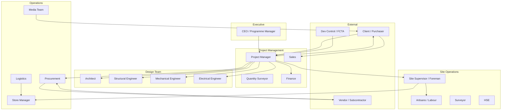

### B.0.2 Phase classification index

| Phase | Steps | Key Abraham artifacts |
|-------|-------|----------------------|
| **Project Initiation** | B.1.1 – B.1.5 | Initial Proposal, **Project Charter (Doc 1)** |
| **Project Planning** | B.2.1 – B.2.12 | **Kick-off (Doc 2)**, **Work Schedule (Sheet 1)**, **Labour Schedule (Sheet 5)**, **Planning Infographic (Doc 3)**, **Planning docs library*** (TDP, C of O, Soil Test, Arch/Structural/M&E, BOQ, Material Schedule), Dev Control* |
| **Project Execution** | B.3.1 – B.3.8 | **Daily Log (Sheet 4)**, **Inspection Log (Doc 4)**, **Construction Checklist (Infographic 1)**, Pre-Pour Checklist, **Ethics (Infographic 2)** |
| **Procurement** | B.4.1 – B.4.5 | **Vendor Directory (Sheet 7)**, Material Request*, Stock ledger |
| **Project Monitoring & Controlling** | B.5.1 – B.5.6 | **Change Log (Sheet 6)**, **IVC (Doc 6)**, **Progress Report (Sheet 3)**, **Purchaser Instalment (Sheet 2)**, **Invoice (Doc 5)** |
| **Project Closure** | B.6.1 – B.6.5 | **Closeout (Doc 7)**, **Retrospective (Doc 8)**, UAT*, Fitness Certificate* |

*\* = verbal/draft schema — no Abraham upload yet*

### B.0.3 Master workflow swimlane

```mermaid
flowchart LR
    subgraph INIT [Project Initiation]
        I1[Lead] --> I2[Proposal]
        I2 --> I3[Charter]
        I3 --> I4[Sign-off]
    end

    subgraph PLAN [Project Planning]
        P1[Kick-off] --> P2[Survey/Design]
        P2 --> P3[BOQ/Schedule]
        P3 --> P4[Permits]
    end

    subgraph EXEC [Project Execution]
        E1[Site works] --> E2[Daily logs]
        E2 --> E3[Inspections]
        E3 --> E4[Pre-pour gate]
    end

    subgraph PROC [Procurement]
        PR1[Vendors] --> PR2[Indent]
        PR2 --> PR3[Deliver/Store]
    end

    subgraph MON [Monitoring & Controlling]
        M1[Progress] --> M2[Change log]
        M2 --> M3[IVC/Pay]
    end

    subgraph CLOSE [Project Closure]
        C1[UAT] --> C2[Handover]
        C2 --> C3[Retrospective]
    end

    I4 --> P1
    P4 --> E1
    P3 --> PR1
    PR3 --> E1
    E4 --> M1
    M3 --> C1
```

---

# B.1 PROJECT INITIATION

**Phase goal:** Convert client intent into an authorized project with signed charter.  
**Phase owner:** Project Manager (with Sales/CEO for commercial leads)  
**Phase exit gate:** Client + company charter signatures → unlock Planning

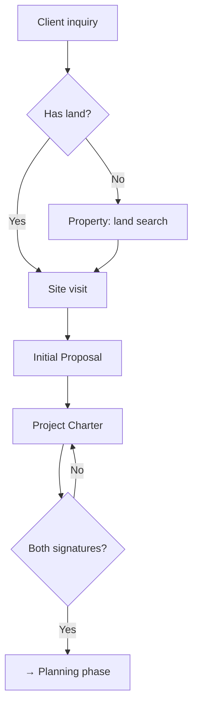


### B.1.1 Client inquiry & CRM lead

| Attribute | Detail |
|-----------|--------|
| **Phase** | Project Initiation |
| **Primary actors** | Client, Sales, PM, CEO |
| **System forms** | `CRM_LEAD` |
| **Inputs** | Client contact, requirement text, optional property link |
| **Outputs** | Qualified lead record; optional site visit scheduled |
| **Approval gate** | None |
| **Automations** | New web/WhatsApp inquiry → CRM notification to Sales |

**User stories**

- **US-INIT-01:** As **Sales**, I want to capture a lead with location, building type, and land status so that PM can qualify the opportunity.
- **US-INIT-02:** As **PM**, I want to see all open leads with source (WhatsApp, web, referral) so that I can prioritize follow-up.
- **US-INIT-03:** As **Client**, I want to submit my requirements online so that Triple A can respond with guidance.


### B.1.2 Land / property assessment

| Attribute | Detail |
|-----------|--------|
| **Phase** | Project Initiation |
| **Primary actors** | PM, Sales, Client, Surveyor (optional) |
| **System forms** | `PROPERTY` record, site visit photos |
| **Inputs** | Land ownership docs OR purchase in progress; site visit checklist |
| **Outputs** | Property record with GPS, photos, suitability notes |
| **Approval gate** | None |
| **Automations** | If `needs_land` → create Property workflow branch |

**User stories**

- **US-INIT-04:** As **PM**, I want to link a property/plot record to the lead so that land and project stay connected.
- **US-INIT-05:** As **Sales**, I want to shortlist available plots for a client who needs land so that acquisition can start before charter.
- **US-INIT-06:** As **Client**, I want to know whether my land is suitable for my intended building.


### B.1.3 Initial high-level proposal

| Attribute | Detail |
|-----------|--------|
| **Phase** | Project Initiation |
| **Primary actors** | PM, Client, CEO (review if large) |
| **System forms** | `FORM_INITIAL_PROPOSAL` |
| **Inputs** | Client requirements, site assessment |
| **Outputs** | Accepted proposal → triggers charter draft |
| **Approval gate** | Client acceptance required before charter finalization |
| **Automations** | Proposal sent → client portal notification |

**User stories**

- **US-INIT-07:** As **PM**, I want to document a high-level proposal (rooms, type, cost/duration ranges) so that the client sees our recommendation before charter.
- **US-INIT-08:** As **Client**, I want to accept or reject the proposal so that we only charter agreed scope.


### B.1.4 Project charter creation

| Attribute | Detail |
|-----------|--------|
| **Phase** | Project Initiation |
| **Primary actors** | PM (author), CEO (review), Client (sign), Sponsor |
| **System forms** | `FORM_PROJECT_CHARTER` — **Document 1 (Jikwoyi example)** |
| **Inputs** | Accepted proposal, client requirements, commercial/personal flag |
| **Outputs** | Signed charter PDF; project record created |
| **Approval gate** | Both signatures required |
| **Automations** | Charter draft complete → notify client to sign |

**User stories**

- **US-INIT-09:** As **PM**, I want a one-page charter template with goal, budget range, duration, benefits, risks, scope, team so that I have formal authority to proceed.
- **US-INIT-10:** As **CEO**, I want to review charter before client sign-off on high-value projects.
- **US-INIT-11:** As **Client**, I want to sign the charter digitally so that the project is officially authorized.


<details open>
<summary><strong>Embedded source document / table</strong></summary>

## Document 1: Development of Mixed Use Commercial Plaza and Serviced Apartments at Jikwoyi, Abuja

**Source:** https://docs.google.com/document/d/1UwL6nBAia3YoozePdP9NdNXeKe4S1Ufpa9u-cQpga8I/edit  
**Date on document:** September 2ND, 2025  
**Document Status:** Draft | In Review | Approved

### Executive Summary

To design, develop, and deliver a high-quality, mixed-use commercial development, featuring contemporary shopping mall and premium serviced apartments, strategically designed to meet the growing demand for integrated urban lifestyles in a suburb.

### Project Goal (SMART)

- Develop a vibrant lifestyle destination that attracts locals, travelers and urban professionals seeking comfort, convenience, and luxury in the suburb, strategically offering a diverse mix of shopping, entertainment, and services to enhance consumer experience 200% higher than the competitors within the first month of commissioning.
- Maximize land use efficiency by integrating commercial and residential components that generate steady and diversified revenue streams in excess of N140m per annum

### Deliverables

- Architectural and engineering design
- A total lettable/usable commercial space of 800 square metres comprising various uses.
- Completed comfortable and luxurious 12 units of studio apartments and 3units mezzanine bedroom
- Outdoor swimming pool
- Marketing and sales plan for apartment and commercial spaces
- Facility management and maintenance plan

### Business Case / Background

**Why are we doing this?**

The proposed Jikwoyi construction project is a strategically planned mixed-use development designed to meet the growing demand for integrated residential and commercial facility in the suburban district of Abuja. With increasing urban migration and population growth in Abuja's periphery, the project aims to provide sustainable, modern, and secure living spaces combined with accessible retail, entertainment, and office facilities/banking hall.

### Benefits, Costs, and Budget

**Benefits:**

- Diversified stream of revenue from both commercial space and short/long let apartments with income targeted in excess of N140m per annum.

**Costs:**

- Price of land and construction cost estimated at N800m
- marketing and annual facility management at N40m per annum

**Estimated Budget:**

- N600M -800M

### Project Timeline

- 24 to 30 months from design to full operation

### Risk & Constraints

- Delays in regulatory approvals from Devt control.
- Fluctuations in construction material cost.
- Power and water supply reliability.
- Environmental factors such as rainfall and traffic impact on logistics of materials

### Scope and Exclusion

**In-Scope:**

- Design and construction of apartments (15 units).
- Development of a commercial mall (~800 sqm).
- Infrastructure for parking, access roads, drainage, water supply, electricity, and security.
- Landscaping, recreation areas, and community amenities (e.g., lounge, play areas).

**Out-of-Scope:**

- Addition or changes to the approved designed or specification
- Government-funded infrastructure such as street light beyond the project boundary

### Project Team / Stakeholders

- **Project Sponsor:** J POS Integrated Services Ltd.
- **Project Developer:** Triple A Realty Projects Ltd
- **Key Partners:** Local area council (AMAC), urban planning authorities (FCDA), financial institutions, construction subcontractors, utility service providers.
- **End Users:** apartment customers, retail and whole business owners, shoppers, and office occupants.
- **Project Lead:** Abraham A. Laucarie
- **Project Team:** Architect, Structural Engineers, M & E Engineers, Builders, Quantity Surveyors, Financial Analyst, Human Resources Specialist, Renewable energy experts.
- **Additional Stakeholders:** Local chief or Community head, former occupants of the property

### Measuring Success

**What is acceptable:**

- Timely completion within estimated timeframe of 30 months.
- 80% apartment occupancy rate and 80% commercial lease within 6 months of launch.
- Positive annual ROI of between 15 – 25% within the first 5–7 years.
- High satisfaction rates from users and commercial tenants.

---

</details>


### B.1.5 Charter sign-off gate

| Attribute | Detail |
|-----------|--------|
| **Phase** | Project Initiation |
| **Primary actors** | Client, PM/CEO (company signatory), Admin |
| **System forms** | `FORM_PROJECT_CHARTER` signatures |
| **Inputs** | Complete charter |
| **Outputs** | Project status `charter_approved`; kick-off meeting schedulable |
| **Approval gate** | **HARD GATE:** No Planning without dual signature |
| **Automations** | On sign → unlock Planning phase; notify design team |

**User stories**

- **US-INIT-12:** As **Admin**, I want the system to block Planning modules until charter is fully signed so that unauthorized projects cannot start.
- **US-INIT-13:** As **PM**, I want automatic project status → `charter_approved` on dual sign-off so that kick-off can be scheduled.


---

# B.2 PROJECT PLANNING

**Phase goal:** Produce approved designs, BOQ, schedule, permits, and all management plans.  
**Phase owner:** Project Manager  
**Phase exit gate:** Dev Control approval + BOQ approved + published WBS → unlock Execution

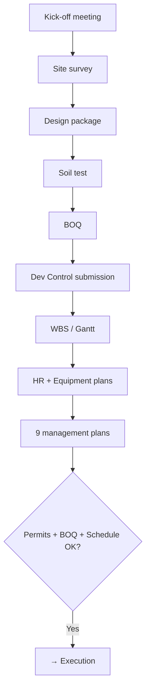


### B.2.1 Project kick-off meeting

| Attribute | Detail |
|-----------|--------|
| **Phase** | Project Planning |
| **Primary actors** | PM, Site Supervisor, Architect, Structural/MEP Engineers, QS, Procurement, Client (optional) |
| **System forms** | `FORM_KICKOFF_MEETING` — **Document 2** |
| **Inputs** | Signed charter, project record |
| **Outputs** | Kick-off minutes; action items synced to task list |
| **Approval gate** | PM publishes minutes within 48h |
| **Automations** | Overdue kick-off actions → PM alert |

**User stories**

- **US-PLAN-01:** As **PM**, I want a kick-off agenda with attendees, site condition notes, and action items so that the team aligns on scope and dates.
- **US-PLAN-02:** As **Site Supervisor**, I want my responsibilities and start date recorded so that I know when to mobilize.
- **US-PLAN-03:** As **team member**, I want action items assigned to me with due dates so that nothing is lost after the meeting.


<details open>
<summary><strong>Embedded source document / table</strong></summary>

## Document 2: Project Kick-Off Meeting (Template)

**Source:** https://docs.google.com/document/d/10bdHJsinTIBQhSrPsPeL9PsrnkwjcMtyJek0cNC2jRA/edit

### Header fields

- PROJECT KICK-OFF MEETING
- PROJECT NAME: *(blank)*
- PROJECT MANAGER: *(blank)*
- DATE OF MEETING: *(blank)*
- LOCATION / DATE / TIME: *(blank table rows)*
- MINUTE PREPARED BY: *(blank)*

### 1. Attendees Present

| NAME | PROJECT ROLE | EMAIL | PHONE NO. |
|------|--------------|-------|-----------|
| *(20 blank rows for attendees)* | | | |

### 2. Agenda Items

| Agenda Item | Notes | Remark |
|-------------|-------|--------|
| Introduction | | |
| Background of the project: project designs and doc | | |
| Site condition | | |
| Setting out | | |
| Temp. store on site | | |
| Clearance and excavation work | | |
| Start date | | |
| Key milestone schedules | | |
| Completion date | | |
| Other Observation | | |

### 3. Action Items

| ACTION ITEM | ACTIONED BY | DUE DATE |
|-------------|-------------|----------|
| *(25 blank rows)* | | |

### Next Meeting

| DATE | TIME |
|------|------|
| *(blank)* | *(blank)* |

---

</details>


### B.2.2 Site survey & requirements harvest

| Attribute | Detail |
|-----------|--------|
| **Phase** | Project Planning |
| **Primary actors** | PM, Site Supervisor, Architect, Surveyor, Client |
| **System forms** | `FORM_SITE_SURVEY` |
| **Inputs** | Site visit, client interviews |
| **Outputs** | Requirements document linked to project |
| **Approval gate** | PM approval |
| **Automations** | Requirements complete → notify Architect |

**User stories**

- **US-PLAN-04:** As **PM**, I want to record land size, floors, quality tier, and aesthetics so that design brief is complete.
- **US-PLAN-05:** As **Architect**, I want structured client requirements so that I can start drawings.


### B.2.3 Design package & planning document uploads (Architectural + Structural + M&E + TDP + C of O)

| Attribute | Detail |
|-----------|--------|
| **Phase** | Project Planning |
| **Primary actors** | Architect, Structural Engineer, M/E Engineers, PM, Client |
| **System forms** | `FORM_TDP`, `FORM_C_OF_O`, `FORM_ARCHITECTURAL_DESIGN`, `FORM_STRUCTURAL_DESIGN`, `FORM_ME_DESIGN`, `FORM_DESIGN_PACKAGE` (bundle) — see **A.7.1** |
| **Inputs** | Site survey requirements; land title (C of O copy); consultant deliverables |
| **Outputs** | Versioned, attachable planning documents on the project; approved drawing set |
| **Approval gate** | Lead Architect + SE sign-off before Dev Control; C of O on file where land-owned |
| **Automations** | New drawing / TDP upload → notify PM and site |

**User stories**

- **US-PLAN-06:** As **Architect**, I want to upload drawing versions and track approvals so that site always uses approved docs.
- **US-PLAN-07:** As **Structural Engineer**, I want to certify feasibility before Dev Control submission.
- **US-PLAN-08:** As **PM**, I want MEP / M&E (water, AC, electric, waste) included in design phase—not added later.
- **US-PLAN-08a:** As **PM**, I want to attach **TDP**, **copy of C of O**, **Architectural**, **Structural**, and **M&E** designs as planning documents so that all planning inputs live on the project record.


### B.2.4 Soil investigation

| Attribute | Detail |
|-----------|--------|
| **Phase** | Project Planning |
| **Primary actors** | PM, Structural Engineer, QS |
| **System forms** | `FORM_SOIL_TEST` — attachable planning document (A.7.1) |
| **Inputs** | Site location, building load class |
| **Outputs** | Soil test report document (file attachment on project) |
| **Approval gate** | SE approval; **gate for foundation tasks on multi-storey** |
| **Automations** | Soil test overdue → block foundation WBS tasks |

**User stories**

- **US-PLAN-09:** As **SE**, I want soil bearing capacity recorded so that foundation design is correct for multi-storey loads.


### B.2.5 Bill of Quantities (BOQ)

| Attribute | Detail |
|-----------|--------|
| **Phase** | Project Planning |
| **Primary actors** | QS, PM, Finance, Procurement |
| **System forms** | `FORM_BOQ` *(draft — awaiting Abraham template)* — attachable planning document (A.7.1) |
| **Inputs** | Approved designs (Arch / Structural / M&E / TDP) |
| **Outputs** | BOQ v1 approved → project budget baseline (file + structured lines) |
| **Approval gate** | CEO/PM approval on BOQ |
| **Automations** | BOQ approved → enable material planning |

**User stories**

- **US-PLAN-10:** As **QS**, I want BOQ line items with materials, labour, units, and rates so that budget and procurement are driven from one source.
- **US-PLAN-11:** As **PM**, I want BOQ total as estimated budget (not final) so that monitoring has a baseline.


### B.2.6 Development Control / FCDA submission

| Attribute | Detail |
|-----------|--------|
| **Phase** | Project Planning |
| **Primary actors** | PM, Architect, Client, Dev Control (external) |
| **System forms** | `FORM_DEV_CONTROL_SUBMISSION` |
| **Inputs** | Drawing package / TDP, BOQ, soil test, C of O copy (as required) |
| **Outputs** | Permit approval document |
| **Approval gate** | **HARD GATE:** No Execution without approval |
| **Automations** | Permit expiry approaching → PM alert |

**User stories**

- **US-PLAN-12:** As **PM**, I want to track permit submission and approval reference so that construction is legally gated.
- **US-PLAN-13:** As **System**, I want to block Execution until Dev Control approval is uploaded.


### B.2.7 WBS, schedule & Gantt

| Attribute | Detail |
|-----------|--------|
| **Phase** | Project Planning |
| **Primary actors** | PM, Site Supervisor, Task Owners (Surveyor, Bldr, MEP, Engr) |
| **System forms** | `FORM_WORK_SCHEDULE` — **Sheet 1 (Guzape — 101 tasks)** |
| **Inputs** | BOQ sections, design phases |
| **Outputs** | Published project schedule; Gantt view |
| **Approval gate** | PM publishes schedule |
| **Automations** | Task overdue → notify owner + PM |

**User stories**

- **US-PLAN-14:** As **PM**, I want WBS with task owner, dates, duration, and % done so that every activity has accountability.
- **US-PLAN-15:** As **Task Owner**, I want to see my assigned tasks and due dates so that I can plan daily/weekly work.
- **US-PLAN-16:** As **PM**, I want PMT flags on payment milestone tasks so that IVC links to schedule.


<details open>
<summary><strong>Embedded source document / table</strong></summary>

## Sheet 1: Project Work Schedule — Luxury Duplex, Guzape

**Source:** https://docs.google.com/spreadsheets/d/1cs0q9y9IFGOyqo0Vp4MH8GS0r6WN7YPHrekGba3RtDw/edit#gid=92457743  
**Raw CSV:** `GUZAPE_LUXURY_DUPLEX_WORK_SCHEDULE.csv`  
### Sheet header

| Field | Value |
|-------|-------|
| PROJECT TITLE | CONSTRUCTION OF LUXURY DUPLEX, GUZAPE |
| NAME OF CLIENT | MR. EMMANUEL DIFFA |
| PREPARED BY | ABRAHAM A. LAUCARIE (PROJECT MGR) |
| PROJECT START DATE | 7/3/2026 |

### Column structure

- WBS NUMBER
- TASK TITLE
- TASK OWNER
- START DATE
- DUE DATE
- DURATION IN DAYS
- DAILY DURATION IN HRS
- % DONE
- PMT (payment milestone flag)
- 1-Month Sprint Goal
- Weekly Gantt columns: WEEK 1–4 (S M T W T F S × 4 weeks)

### Phases summary

| Phase | WBS | Description | Task count |
|-------|-----|-------------|------------|
| 1 | 1.00–1.24 | Mobilization to site & Substructural work | 24 tasks |
| 2 | 2.00–2.10 | Construction of Basement | 10 tasks |
| 3 | 3.00–3.11 | Construction of Ground floor | 11 tasks |
| 4 | 4.00–4.11 | Construction of first floor | 11 tasks |
| 5 | 5.00–5.15 | Construction of Pent floor | 15 tasks |
| 6 | 6.00–6.25 | Finishing and external works | 24 tasks (dates TBD) |

### Full task table (every WBS row)

**Source:** https://docs.google.com/spreadsheets/d/1cs0q9y9IFGOyqo0Vp4MH8GS0r6WN7YPHrekGba3RtDw/edit#gid=92457743

| WBS | Task Title | Owner | Start | Due | Duration (days) | Hrs/day | % Done |
|-----|------------|-------|-------|-----|-----------------|---------|--------|
| 1.00 | Phase 1: Mobilization to site & Substructural work |  |  |  |  |  |  |
| 1.01 | Engagement of stakeholders:Devt control, Soil test, redesign, processing approval etc | PM | 7-Mar-2026 | 8-Jul-2026 | 123 | 8 | 100% |
| 1.02 | clearing, levelling and removal of debris | Team | 13-Mar-2026 | 8-Jul-2026 | 3 | 8 | 100% |
| 1.03 | setting out | Surveyor | 13-Mar-2026 | 8-Jul-2026 | 2 | 8 | 75% |
| 1.04 | topsoil excavation | Bldr | 13-Mar-2026 | 8-Jul-2026 | 1 | 8 | 80%% |
| 1.05 | borehole activation, temporay site and storage |  | 7-Mar-2026 | 14-Mar-2026 | 8 | 8 | 95% |
| 1.06 | supply cement and other material | PM | 14-Mar-2026 | 15-Mar-2026 | 2 | 8 |  |
| 1.07 | column base excavation |  | 08-Jul-2026 | 12-Jul-2026 | 5 | 8 |  |
| 1.08 | Blinding of columns footing | Engr & Bldr | 13-Jul-2026 | 14-Jul-2026 | 2 | 8 |  |
| 1.09 | Foot plate reinforcement Laying | Team | 14-Jul-2026 | 15-Jul-2026 | 2 | 8 |  |
| 1.10 | levelling and realignment of columns | Surveyor | 15-Jul-2026 | 16-Jul-2026 | 2 | 8 |  |
| 1.11 | formwork for columns bases |  | 16-Jul-2026 | 19-Jul-2026 | 4 | 8 |  |
| 1.12 | Casting of concrete | Engr & Bldr | 20-Jul-2026 | 21-Jul-2026 | 2 | 8 |  |
| 1.13 | Trench excavation | Bldr | 22-Jul-2026 | 25-Jul-2026 | 4 | 8 |  |
| 1.14 | Blinding of foundation trenches | Engr & Bldr | 26-Jul-2026 | 27-Jul-2026 | 2 | 8 |  |
| 1.15 | blockwork in foundation | Bldr | 27-Jul-2026 | 1-Aug-2026 | 6 | 8 |  |
| 1.16 | backfilling/compaction of laterite | Bldr | 2-Aug-2026 | 3-Aug-2026 | 2 | 8 |  |
| 1.17 | formwork to column | Bldr | 2-Aug-2026 | 6-Aug-2026 | 5 | 8 |  |
| 1.18 | Concreting of columns | Engr & Bldr | 6-Aug-2026 | 7-Aug-2026 | 2 | 8 |  |
| 1.19 | Plinth beam work | Engr | 7-Aug-2026 | 11-Aug-2026 | 5 | 8 |  |
| 1.20 | backfilling/compaction of laterite and hard-core layers | Bldr | 12-Aug-2026 | 19-Aug-2026 | 8 | 8 |  |
| 1.21 | formwork to bed/slab | Bldr | 20-Aug-2026 | 21-Aug-2026 | 2 | 8 |  |
| 1.22 | fixing of pipes and sleeves | MEP | 21-Aug-2026 | 23-Aug-2026 | 3 | 8 |  |
| 1.23 | Laying of DPM/Leather | Bldr | 24-Aug-2026 | 24-Aug-2026 | 1 | 8 |  |
| 1.24 | Casting/concreting of slab (DPC) | Bldr | 25-Aug-2026 | 25-Aug-2026 | 1 | 8 |  |
| 2.00 | Phase 2 : Construction of Basement |  |  |  |  |  |  |
| 2.01 | Setting out, blockwork to window/lintel level | Arch & Bldr | 26-Aug-2026 | 1-Sep-2026 | 7 | 8 |  |
| 2.02 | Extension of reinforcement  for columns, lintels and lift shaft | Engr & Bldr | 1-Sep-2026 | 8-Sep-2026 | 8 | 8 |  |
| 2.03 | formwork for columns, lintels and lift shaft | Bldr | 5-Sep-2026 | 10-Sep-2026 | 6 | 8 |  |
| 2.04 | Casting of columns,lintels and lift shaft | Engr & Bldr | 11-Sep-2026 | 12-Sep-2026 | 2 | 8 |  |
| 2.05 | Block work after lintel to beams | Bldr | 13-Sep-2026 | 20-Sep-2026 | 8 | 8 |  |
| 2.06 | Formwork for beams, slab and staircase | Bldr | 21-Sep-2026 | 4-Oct-2026 | 14 | 8 |  |
| 2.07 | Reinforcement work for beams, slab and staircase | Engr & Bldr | 5-Oct-2026 | 19-Oct-2026 | 15 | 8 |  |
| 2.08 | First fix piping/sleeves plumbing | MEP | 18-Oct-2026 | 23-Oct-2026 | 6 | 8 |  |
| 2.09 | First fix piping/sleeves electrical | MEP | 18-Oct-2026 | 23-Oct-2026 | 6 | 8 |  |
| 2.10 | Concreting/casting of beams and slab | Bldr | 25-Oct-2026 | 25-Oct-2026 | 1 | 8 |  |
| 3.00 | Phase 3: Construction of Ground floor |  |  |  |  |  |  |
| 3.01 | Setting out, blockwork to window/lintel level | Arch & Bldr | 28-Oct-2026 | 11-Nov-2026 | 15 | 8 |  |
| 3.02 | Extension of reinforcement  for columns, lintels and lift shaft | Engr & Bldr | 12-Nov-2026 | 19-Nov-2026 | 8 | 8 |  |
| 3.03 | formwork to columns, lintels and lift shaft | Bldr | 14-Nov-2026 | 24-Nov-2026 | 11 | 8 |  |
| 3.04 | Casting of columns,lintels and lift shaft | Engr & Bldr | 25-Nov-2026 | 26-Nov-2026 | 2 | 8 |  |
| 3.05 | Block work after lintel to beams | Bldr | 26-Nov-2026 | 2-Dec-2026 | 7 | 8 |  |
| 3.06 | Formwork for beams, slab and staircase g/floor | Bldr | 3-Dec-2026 | 17-Dec-2026 | 15 | 8 |  |
| 3.07 | Unboarding of basement slab bottom formwork | Bldr | 15-Dec-2026 | 20-Dec-2026 | 6 | 8 |  |
| 3.08 | Reinforcement work for beams, slab and staircase | Engr & Bldr | 21-Dec-2026 | 4-Jan-2027 | 15 | 8 |  |
| 3.09 | First fix piping/sleeves plumbing | MEP | 3-Jan-2027 | 8-Jan-2027 | 6 | 8 |  |
| 3.10 | First fix piping/sleeves electrical | MEP | 3-Jan-2027 | 8-Jan-2027 | 6 | 8 |  |
| 3.11 | Concreting/casting  of slab | Bldr | 10-Jan-2027 | 10-Jan-2027 | 1 | 8 |  |
| 4.00 | Phase 4: Construction of first floor |  |  |  |  |  |  |
| 4.01 | Setting out, blockwork to window/lintel level | Arch & Bldr | 14-Jan-2027 | 28-Jan-2027 | 15 | 8 |  |
| 4.02 | Extension of reinforcement  for columns, lintels and lift shaft | Engr & Bldr | 29-Jan-2027 | 5-Feb-2027 | 8 | 8 |  |
| 4.03 | formwork for columns, lintels and lift shaft | Bldr | 31-Jan-2027 | 10-Feb-2027 | 11 | 8 |  |
| 4.04 | Casting of columns,lintels and lift shaft | Engr & Bldr | 11-Feb-2027 | 12-Feb-2027 | 2 | 8 |  |
| 4.05 | Block work after lintel to beams | Bldr | 13-Feb-2027 | 20-Feb-2027 | 8 | 8 |  |
| 4.06 | Unboarding of g/floor slab bottom formwork | Bldr | 4-Feb-2027 | 9-Feb-2027 | 6 | 8 |  |
| 4.07 | Formwork for beams, slab and staircase g/floor | Bldr | 19-Feb-2027 | 5-Mar-2027 | 15 | 8 |  |
| 4.08 | Reinforcement work for beams, slab and staircase | Engr & Bldr | 6-Mar-2027 | 20-Mar-2027 | 15 | 8 |  |
| 4.09 | First fix piping/sleeves plumbing | MEP | 21-Mar-2027 | 26-Mar-2027 | 6 | 8 |  |
| 4.10 | First fix piping/sleeves electrical | MEP | 21-Mar-2027 | 26-Mar-2027 | 6 | 8 |  |
| 4.11 | Concreting/casting  of slab | Bldr | 27-Mar-2027 | 27-Mar-2027 | 1 | 8 |  |
| 5.00 | Phase 5: Construction of Pent floor |  |  |  |  |  |  |
| 5.01 | Setting out, blockwork to window/lintel level | Arch & Bldr | 30-Mar-2027 | 7-Apr-2027 | 9 | 8 |  |
| 5.02 | Extension of reinforcement  for columns, lintels and lift shaft | Engr & Bldr | 8-Apr-2027 | 15-Apr-2027 | 8 | 8 |  |
| 5.03 | formwork for columns, lintels and lift shaft | Bldr | 13-Apr-2027 | 19-Apr-2027 | 7 | 8 |  |
| 5.04 | Casting of columns,lintels and lift shaft | Engr & Bldr | 20-Apr-2027 | 20-Apr-2027 | 1 | 8 |  |
| 5.05 | Block work after lintel to beams | Bldr | 24-Apr-2027 | 30-Apr-2027 | 7 | 8 |  |
| 5.06 | Unboarding of first/floor slab bottom formwork | Bldr | 18-May-2027 | 23-May-2027 | 6 | 8 |  |
| 5.07 | Formwork for beams, roof slab/beam | Bldr | 30-Apr-2027 | 8-May-2027 | 9 | 8 |  |
| 5.08 | Reinforcement work for beams, roof slab | Engr & Bldr | 9-May-2027 | 16-May-2027 | 8 | 8 |  |
| 5.09 | First fix piping/sleeves plumbing | MEP | 15-May-2027 | 20-May-2027 | 6 | 8 |  |
| 5.10 | First fix piping/sleeves electrical | MEP | 15-May-2027 | 20-May-2027 | 6 | 8 |  |
| 5.11 | Concreting/casting  of slab | Bldr | 23-May-2027 | 23-May-2027 | 1 | 8 |  |
| 5.12 | waterproofing of roof slabs | Bldr | 27-May-2027 | 31-May-2027 | 5 | 8 |  |
| 5.13 | Roof work and roofing | Bldr | 1-Jun-2027 | 11-Jun-2027 | 11 | 8 |  |
| 5.14 | Maintenance work | Bldr | 10-Jun-2027 | 12-Jun-2027 | 3 | 8 |  |
| 5.15 | Plastering | Bldr | 13-Jun-2027 | 2-Jul-2027 | 20 | 8 |  |
| 6.00 | Phase 6: Finishing and external works |  |  |  |  |  |  |
| 6.01 | Retaining wall fence work |  | TBD | TBD |  |  |  |
| 6.02 | HVAC system proc & installation |  | TBD | TBD |  |  |  |
| 6.03 | 2nd fix electrical |  | TBD | TBD |  |  |  |
| 6.04 | 2nd fix plumbing |  | TBD | TBD |  |  |  |
| 6.05 | Scafolding |  | TBD | TBD |  |  |  |
| 6.06 | External staircase |  | TBD | TBD |  |  |  |
| 6.07 | waterproofing of slabs |  | TBD | TBD |  |  |  |
| 6.08 | Glazed windows and curtain walling |  | TBD | TBD |  |  |  |
| 6.09 | Railing |  | TBD | TBD |  |  |  |
| 6.11 | ceiling installation work |  | TBD | TBD |  |  |  |
| 6.12 | Swimming pool |  | TBD | TBD |  |  |  |
| 6.13 | External works |  | TBD | TBD |  |  |  |
| 6.14 | Biodigester, chambers & plumbing work |  | TBD | TBD |  |  |  |
| 6.15 | Borehole connection |  | TBD | TBD |  |  |  |
| 6.16 | Screeding of wall & painting |  | TBD | TBD |  |  |  |
| 6.17 | Solar water heater installation |  | TBD | TBD |  |  |  |
| 6.18 | Dressing and tiling |  | TBD | TBD |  |  |  |
| 6.19 | Fixing of doors |  | TBD | TBD |  |  |  |
| 6.20 | fix sanitary wares |  | TBD | TBD |  |  |  |
| 6.21 | wiring/electrical fittings |  | TBD | TBD |  |  |  |
| 6.22 | Power supply/connection |  | TBD | TBD |  |  |  |
| 6.23 | Smart device automation |  | TBD | TBD |  |  |  |
| 6.24 | Installation of lift, testing & commissioning |  | TBD | TBD |  |  |  |
| 6.25 | Furnishing |  | TBD | TBD |  |  |  |

---

</details>


### B.2.8 Labour schedule, material schedule & personnel plan

| Attribute | Detail |
|-----------|--------|
| **Phase** | Project Planning |
| **Primary actors** | PM, Site Supervisor, QS, Procurement, HR |
| **System forms** | `FORM_LABOUR_SCHEDULE` — **Sheet 5**; `FORM_MATERIAL_SCHEDULE`; `FORM_PERSONNEL_LOG` |
| **Inputs** | WBS labour requirements; BOQ material lines |
| **Outputs** | Labour schedule sheet; material schedule (attachable); personnel log enabled |
| **Approval gate** | PM approval |
| **Automations** | Material schedule approved → feed Procurement indents |

**User stories**

- **US-PLAN-17:** As **PM**, I want gang-level labour planning (trade, gang leader, dates, cost) so that manpower is budgeted.
- **US-PLAN-17a:** As **QS / PM**, I want a **material schedule** (linked to BOQ) attachable as a planning document so that procurement and site know what to order and when.
- **US-PLAN-18:** As **Supervisor**, I want a personnel log to track who was on site each day *(verbal — draft form)*.


<details open>
<summary><strong>Embedded source document / table</strong></summary>

## Sheet 5: Labour Schedule (Template)

**Source:** https://docs.google.com/spreadsheets/d/1X7dl3M0MUvHuRdZ7oC5g_JpVsE29J2wiH83udJhvvCE/edit#gid=633049430

**Title:** LABOUR SCHEDULE

### Header fields

| Field | Value |
|-------|-------|
| PROJECT TITLE | *(blank)* |
| PROJECT PHASE | *(blank)* |
| PROJECT MANAGER | *(blank)* |
| SHEET NO | *(blank)* |
| DATE | *(blank)* |

### Column headers (no data rows in source)

| S/N | DESCRIPTION OF WORK | TEAM (carpenters, plumbers, bricklayers etc) | GANG LEADER | NO. IN A GANG | DATE WORK START | DATE WORK END | COST/DAY OR HR | TOTAL AMOUNT | SUPERVISED/PAID BY | REMARK |

---

</details>


### B.2.9 Stakeholder register & communication plan

| Attribute | Detail |
|-----------|--------|
| **Phase** | Project Planning |
| **Primary actors** | PM, Client, Admin |
| **System forms** | `FORM_STAKEHOLDER_REGISTER` |
| **Inputs** | Charter stakeholders, team roster |
| **Outputs** | Stakeholder register; client portal access provisioned |
| **Approval gate** | PM publishes comms plan |
| **Automations** | Report due date → auto-remind PM |

**User stories**

- **US-PLAN-19:** As **PM**, I want every stakeholder with comms frequency (client weekly/monthly) so that progress reports auto-route correctly.
- **US-PLAN-20:** As **Client**, I want progress photos in the portal instead of WhatsApp so that updates are structured and archived.


### B.2.10 Management plans bundle (9–10 plans)

| Attribute | Detail |
|-----------|--------|
| **Phase** | Project Planning |
| **Primary actors** | PM, HSE, Procurement, QS, Site Supervisor |
| **System forms** | Quality Plan, Procurement Plan, Safety Plan, Comms Plan |
| **Inputs** | BOQ, charter risks, vendor directory |
| **Outputs** | Published management plans checklist |
| **Approval gate** | PM sign-off on all plans |
| **Automations** | Missing plan → warn before Execution start |

**User stories**

- **US-PLAN-21:** As **PM**, I want quality, procurement, safety, and communication plans linked to the project so that Execution follows one playbook.


### B.2.11 Daily / weekly / monthly planning rhythm

| Attribute | Detail |
|-----------|--------|
| **Phase** | Project Planning → Execution (ongoing) |
| **Primary actors** | Site Supervisor, PM, CEO (monthly) |
| **System forms** | Planning Infographic — **Document 3** |
| **Inputs** | Published schedule, site constraints |
| **Outputs** | Daily/weekly/monthly plan records |
| **Approval gate** | Supervisor completes daily plan before site work |
| **Automations** | Monday → weekly plan prompt; 1st of month → monthly review prompt |

**User stories**

- **US-PLAN-22:** As **Supervisor**, I want daily planning checklist (TBT, materials, targets) so that site execution stays disciplined.
- **US-PLAN-23:** As **PM**, I want weekly lookahead (2–6 weeks) and monthly budget/cash-flow review built into the system.


<details open>
<summary><strong>Embedded source document / table</strong></summary>

## Document 3: Daily, Weekly & Monthly Planning — Plan Today, Achieve Tomorrow

**Source:** https://docs.google.com/document/d/1VkPIl8Xj9mdExkmDwNbGPTOBcBFgVZOFfSwcAKqMItI/edit  
**Format:** Image-based infographic (plain-text export is empty; content extracted from embedded PNG via HTML export)  
**Company:** TRIPLE A REALTY PROJECTS LTD.  
**Image asset:** `DAILY_WEEKLY_MONTHLY_PLANNING.png` | Full write-out: `DAILY_WEEKLY_MONTHLY_PLANNING.txt`

### Header

**DAILY, WEEKLY & MONTHLY PLANNING**  
**PLAN TODAY – ACHIEVE TOMORROW**

### 1. Daily Planning

**Focus:** Today's Work Execution

**Objective:** Ensure daily tasks are completed safely, on time, and with quality.

**Key Activities:**
- Review daily work targets with the team
- Check manpower, materials, tools & equipment availability
- Discuss site constraints & solutions
- Ensure safety briefing (TBT) is done
- Monitor work progress throughout the day
- Record progress, issues & rectifications
- Daily clean-up & housekeeping

**Output:** Daily progress achieved & updated records

**Slogan:** Plan Your Work, Work Your Plan

### 2. Weekly Planning

**Focus:** Short Term Coordination

**Objective:** Coordinate resources and activities to meet weekly targets.

**Key Activities:**
- Review and update lookahead plan (2–6 weeks)
- Break down weekly targets into daily activities
- Check material requirement and indents
- Review manpower deployment & productivity
- Coordinate with subcontractors & consultants
- Review drawings, approvals & inspections
- Identify risks and plan mitigation

**Output:** Weekly plan & resource allocation for the week

**Slogan:** Coordinate Today, Complete On Time

### 3. Monthly Planning

**Focus:** Long Term Control & Forecasting

**Objective:** Plan ahead for resources, budgets, and milestones.

**Key Activities:**
- Review overall project schedule & milestones
- Prepare/Update Monthly Work Plan
- Estimate material, manpower & equipment for the month
- Review budget, cash flow & commitments
- Monitor progress vs plan & take corrective actions
- Review risks, approvals & dependencies
- Management review meeting & reporting

**Output:** Monthly plan, forecast, report & corrective actions

**Slogan:** Plan Ahead, Stay Ahead

### Key Takeaway

- Daily Planning keeps the team focused.
- Weekly Planning ensures coordination and resource alignment.
- Monthly Planning drives control, forecasting, and project success.

### Closing Quote

**Abraham A. Laucarie — PM:** "Good Planning Today, Better Results Tomorrow"

---

</details>


### B.2.12 Professional ethics acknowledgement

| Attribute | Detail |
|-----------|--------|
| **Phase** | Project Planning (onboarding) → Execution |
| **Primary actors** | All site roles: Supervisor, Engineers, Artisans |
| **System forms** | Ethics Infographic — **Infographic 2** |
| **Inputs** | User account, site assignment |
| **Outputs** | Signed ethics acknowledgement on file |
| **Approval gate** | **Gate:** No site assignment without acknowledgement |
| **Automations** | First site assignment → force ethics modal |

**User stories**

- **US-PLAN-24:** As **Supervisor**, I must acknowledge the 10 ethics principles before I am assigned to a site so that Triple A standards are enforced.


<details open>
<summary><strong>Embedded source document / table</strong></summary>

## Infographic 2: Professional Ethics — Every Site Supervisor, Builder & Project Mgr/Engr Should Follow

```
# OUR PROFESSIONAL ETHICS — EVERY SITE SUPERVISOR, BUILDER & PROJECT MGR/ENGR SHOULD FOLLOW
# Source: Abraham upload (Triple A infographic, Sep 2026)
# Company: TRIPLE A REALTY PROJECTS LTD.
# Attributed quote: Abraham A. Laucarie — PM
# Propa3 module mapping: Team Charter, HSE, Site Tracker onboarding, compliance training

================================================================================
HEADER
================================================================================
Company: TRIPLE A REALTY PROJECTS LTD.
Title: OUR PROFESSIONAL ETHICS EVERY SITE SUPERVISOR, BUILDER & PROJECT MGR/ENGR SHOULD FOLLOW

================================================================================
10 PROFESSIONAL ETHICS PRINCIPLES
================================================================================

1. PRIORITIZE PUBLIC SAFETY
   Protect the lives, health, and welfare of the public above all else.

2. BE HONEST & TRANSPARENT
   Never falsify reports, test results, or project data.

3. MAINTAIN PROFESSIONAL COMPETENCE
   Continuously improve your technical knowledge and skills.

4. FOLLOW CODES & STANDARDS
   Always comply with applicable engineering codes and regulations.

5. ENSURE QUALITY WORKMANSHIP
   Never compromise quality for cost or schedule.

6. RESPECT ENVIRONMENTAL SUSTAINABILITY
   Minimize environmental impact and promote sustainable construction.

7. AVOID CONFLICTS OF INTEREST
   Make decisions based on professional judgment, not personal gain.

8. RESPECT CONFIDENTIAL INFORMATION
   Protect client and project information unless disclosure is legally required.

9. TREAT EVERYONE FAIRLY
   Respect clients, contractors, workers, and colleagues without discrimination.

10. TAKE RESPONSIBILITY
    Admit mistakes, correct them promptly, and learn from them.

================================================================================
CLOSING QUOTE
================================================================================
Author: ABRAHAM A. LAUCARIE — PM

Quote:
"A great site engineer/supervisor is measured not only by technical expertise
but also by integrity, responsibility, and ethical decision making"

================================================================================
RELATION TO EXISTING TEAM CHARTER
================================================================================
These 10 ethics align with and extend planning/TEAM_CHARTER.md. Consider
embedding as mandatory acknowledgement for: Foreman, Engineer, PM, Site Supervisor
roles on first login or site assignment.
```

</details>


---

# B.3 PROJECT EXECUTION

**Phase goal:** Physical construction with daily reporting, inspections, and gated concrete pours.  
**Phase owner:** Site Supervisor (under PM)  
**Phase exit gate:** All WBS tasks complete → Commissioning

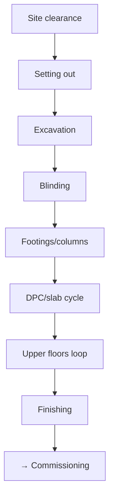


### B.3.1 Mobilization & site clearance

| Attribute | Detail |
|-----------|--------|
| **Phase** | Project Execution |
| **Primary actors** | Site Supervisor, PM, Logistics, Equipment operators |
| **System forms** | WBS Phase 1 tasks, Daily Log §4 Machinery |
| **Inputs** | Approved schedule, permits |
| **Outputs** | WBS tasks 1.01–1.02 updated; daily log started |
| **Approval gate** | Permit check |
| **Automations** | First daily log reminder 06:00 |

**User stories**

- **US-EXEC-01:** As **Supervisor**, I want to log site clearance with machinery used so that daily reports capture mobilization.


### B.3.2 Setting out & excavation

| Attribute | Detail |
|-----------|--------|
| **Phase** | Project Execution |
| **Primary actors** | Surveyor, Site Supervisor, Structural Engineer, Builders |
| **System forms** | WBS 1.03–1.13; Inspection §2 Excavation |
| **Inputs** | Approved structural drawings |
| **Outputs** | Excavation checklist complete |
| **Approval gate** | Supervisor + Surveyor verification |
| **Automations** | None |

**User stories**

- **US-EXEC-02:** As **Surveyor**, I want setting-out recorded against approved drawings so that wall positions match design.
- **US-EXEC-03:** As **Supervisor**, I want excavation depth verified before blinding.


### B.3.3 Foundation → DPC slab cycle

| Attribute | Detail |
|-----------|--------|
| **Phase** | Project Execution |
| **Primary actors** | Builder, Iron bender, Carpenter, MEP, Structural Engineer, Supervisor |
| **System forms** | WBS 1.07–1.24, 2.x; Inspection §3–6 |
| **Inputs** | Structural drawings, soil test |
| **Outputs** | DPC level achieved; curing logged |
| **Approval gate** | Pre-pour checklist before each slab pour |
| **Automations** | Slab pour event → notify media team |

**User stories**

- **US-EXEC-04:** As **Builder**, I want blinding, footings, blockwork, MEP sleeves, and DPC pour tracked in WBS so that sequence is auditable.
- **US-EXEC-05:** As **MEP**, I want sleeve installation recorded before each slab pour.


### B.3.4 Upper floor construction loop

| Attribute | Detail |
|-----------|--------|
| **Phase** | Project Execution |
| **Primary actors** | Builder, MEP, Structural Engineer, Supervisor, Subcontractors |
| **System forms** | WBS Phases 2–5 (Sheet 1) |
| **Inputs** | Lower floor complete |
| **Outputs** | Floor-by-floor % complete |
| **Approval gate** | Pre-pour gate each slab |
| **Automations** | Milestone % → client portal |

**User stories**

- **US-EXEC-06:** As **PM**, I want each floor cycle (blockwork → beams → slab → MEP) repeated per WBS phases 2–5 so that multi-storey progress rolls up.


### B.3.5 Daily site reporting

| Attribute | Detail |
|-----------|--------|
| **Phase** | Project Execution |
| **Primary actors** | Site Supervisor (create), PM (approve), Store Manager (read materials), Client (photos via portal) |
| **System forms** | `FORM_DAILY_SITE_LOG` — **Sheet 4** |
| **Inputs** | Daily activities, manpower, materials on site |
| **Outputs** | Approved daily log; ref code AAA/GZP/…; photos |
| **Approval gate** | Supervisor signature required; PM approval locks record |
| **Automations** | 18:00 missing log → alert; incident flag → HSE draft |

**User stories**

- **US-EXEC-07:** As **Supervisor**, I want the 10-section daily log offline on mobile so that I can submit before leaving site.
- **US-EXEC-08:** As **PM**, I want to approve logs within 24h so that data feeds milestones and client updates.
- **US-EXEC-09:** As **Store Manager**, I want material received/consumed balances so that stock stays accurate.


<details open>
<summary><strong>Embedded source document / table</strong></summary>

## Sheet 4: Site Activities Daily Reporting Sheet

**Source:** https://docs.google.com/spreadsheets/d/1hNPIA27_bTspeRtQTttIyrOY6C3NYQgr6JJPOXU60x4/edit#gid=1309351182

**Title:** SITE ACTIVITIES DAILY REPORTING SHEET  
**Start Time:** 9am | **End Time:** *(blank)*

### 1. Project Details

| Field | Value |
|-------|-------|
| Project Name | Construction of 6 bedroom luxurious duplex |
| Project Location | Guzape |
| Site Supervisor(s) | Bldr Theo and Jesse |
| Ref. Code | AAA/GZP/530/JULY/2026/0I |
| Date | *(blank)* |

### 2. Daily Activities Tracker

| To do | Ongoing | Done | Progress (%) | Remark/Note |
|-------|---------|------|--------------|-------------|
| Laying of basket | FALSE | FALSE | | |
| excavation | FALSE | FALSE | | |
| *(6 blank rows)* | FALSE | FALSE | | |

### 3. Manpower

| Category | No. of Persons | Remark |
|----------|----------------|--------|
| Skilled Workers | | |
| Iron benders | | |
| Carpenters | | |
| Mason | | |
| Plumber | | |
| Electrician | | |
| Unskilled Workers | | |
| Supervisors/Staff | | |

### 4. Machinery Used

| Equipment | No. of Units/Hours | Remark |
|-----------|-------------------|--------|
| Excavator | | |
| Mixer | | |
| Vibrator | | |
| Crane | | |
| Other Equipment | | |

### 5. Material Received/Consumed

| Material | Received (Qty) | Consumed (Qty) | Balance | Remark |
|----------|----------------|----------------|---------|--------|
| Cement | | | | |
| Steel | | | | |
| 20mm | | | | |
| 16mm | | | | |
| 12mm | | | | |
| 10mm | | | | |
| 8mm | | | | |
| Sand | | | | |
| Aggregate | | | | |
| Block/Bricks | | | | |
| 9'' | | | | |
| 6'' | | | | |
| Tiles | | | | |
| Others: | | | | |

### 6. Quality Checks

| Check | Value |
|-------|-------|
| Slump Test | FALSE |
| Cube Castng | FALSE |
| Reinforcement | TRUE |
| Concrete Inspection | TRUE |
| Others: | *(blank)* |

### 7. Safety Observations

| Check | Value |
|-------|-------|
| PPE Complinace | TRUE |
| Toolbox talk | FALSE |
| Incidents/Near Misses | TRUE |

### 8. Issues & Delays

| Issue | Value |
|-------|-------|
| Material shortage | FALSE |
| Equipment Breakdown | FALSE |
| Weather Delay | TRUE |
| Other Issues | *(blank)* |

### 9. Plan for Next Day

- Schedule Activities: *(blank)*
- Material Requirement: *(blank)*
- Manpower Requirement: *(blank)*

### 10. Signatures

| Site Supervisor/Mgr | Project Manager | Consultant (if required) |
|---------------------|-----------------|--------------------------|
| ____________________ | _____________________ | __________________ |
| Date________________ | Date________________ | Date________________ |

---

</details>


### B.3.6 Pre-concrete pour approval

| Attribute | Detail |
|-----------|--------|
| **Phase** | Project Execution |
| **Primary actors** | Site Supervisor, Structural Engineer, Site Manager, MEP, Dev Control (inform) |
| **System forms** | `FORM_PRE_POUR_CHECKLIST` |
| **Inputs** | Formwork, reinforcement, MEP complete |
| **Outputs** | Signed pre-pour approval; pour event logged |
| **Approval gate** | **HARD GATE:** No pour without pass + signatures |
| **Automations** | Fail item → block pour + notify SE |

**User stories**

- **US-EXEC-10:** As **Supervisor**, I want a pre-pour checklist I cannot skip so that bad pours are prevented.
- **US-EXEC-11:** As **SE**, I want digital sign-off on reinforcement/formwork/MEP before pour.


<details open>
<summary><strong>Embedded source document / table</strong></summary>


#### Pre-Concrete Pour Internal Control (verbal — authoritative)

| Category | Check items |
|----------|-------------|
| Drawing | Approved drawings on site; slab thickness; beam sizes/position/level; design changes approved by SE |
| Formwork | Complete, aligned, soffit level, thickness, supported, braced, props, beam support, cleaned, load-safe |
| Reinforcement | Diameter, grade, spacing, main/distribution/top/bottom/beam, lap length, anchorage, tied, spacers, cover |
| MEP | Openings, conduits, plumbing/drainage sleeves, floor drains, unapproved openings closed |
| Site readiness | Clean area; cement/sand/aggregate/water; mixer/vibrator/manpower; weather forecast; media assigned |
| Safety | Safe access; PPE; formwork stability; no unauthorized personnel below |
| Approvals | Dev Control; SE; site manager; all inspections complete; defects corrected; signatures |


</details>


### B.3.7 Phase inspection log (20 categories)

| Attribute | Detail |
|-----------|--------|
| **Phase** | Project Execution |
| **Primary actors** | Site Supervisor, PM, Dev Control Rep, Engineers |
| **System forms** | `FORM_PHASE_INSPECTION` — **Document 4** |
| **Inputs** | Completed phase work |
| **Outputs** | Signed inspection sections; general approval row |
| **Approval gate** | Dev Control / PM / Supervisor signatures per section |
| **Automations** | Failed item → NCR draft |

**User stories**

- **US-EXEC-12:** As **Supervisor**, I want phase checklists (foundation, slab, MEP, etc.) with Yes/No and remarks so that QC is traceable.
- **US-EXEC-13:** As **PM**, I want inspection sign-off before next phase unlocks.


<details open>
<summary><strong>Embedded source document / table</strong></summary>

## Document 4: Internal Control Process for Comprehensive Building Construction Inspection and Approval Log

**Source:** https://docs.google.com/document/d/1A_vmdL0SPma0AQviYKqqTnr3EA4olm_5OsI2PgRADUM/edit

### Header fields

- Project Name: ______________________________________________________________
- Site Location: _____________________________________________________________
- Site Supervisor(s)/Mgr Name: ___________________________________________________________
- Overall Inspection Date (Start): _____________________________________________

Each section below uses columns: **Status (☐ Yes ☐ No) | Inspection Item | Remarks / Notes**  
Each section ends with: **Date Inspected / Inspector Name / Signature**

### 1. Pre-Construction Checklist

1. Land survey completed
2. Soil investigation report approved
3. Building plan approved
4. Building permits obtained
5. Utility connections arranged
6. Site fencing and signage installed
7. Site office and storage ready

### 2. Excavation Checklist

1. Layout verified
2. Excavation depth checked
3. Soil condition inspected
4. Dewatering arranged (if required)
5. Excavation safety maintained

### 3. Foundation Checklist

1. PCC level checked
2. Anti-termite treatment done
3. Reinforcement as per drawings
4. Cover blocks installed
5. Formwork alignment checked
6. Concrete grade approved
7. Cube samples collected
8. Proper curing started

### 4. Column Checklist

1. Starter bars checked
2. Reinforcement spacing verified
3. Verticality checked
4. Cover maintained
5. Formwork tight and aligned
6. Concrete vibrated properly

### 5. Beam Checklist

1. Bottom & top reinforcement checked
2. Stirrup spacing verified
3. Development length provided
4. Beam dimensions correct
5. Openings coordinated

### 6. Slab Checklist

1. Shuttering level checked
2. Reinforcement spacing correct
3. Electrical conduits installed
4. Plumbing sleeves provided
5. Cover blocks placed
6. Concrete poured and vibrated
7. Curing started

### 7. Masonry Checklist

1. Brick quality approved
2. Mortar ratio correct
3. Verticality maintained
4. Joint thickness uniform
5. Lintel level checked
6. Masonry curing completed

### 8. Plastering Checklist

1. Surface cleaned
2. Plaster thickness checked
3. Corners aligned
4. No hollow areas
5. Proper curing done

### 9. Waterproofing Checklist

1. Surface prepared
2. Membrane/coating applied correctly
3. Ponding test completed
4. No leakage observed

### 10. Flooring Checklist

1. Base level checked
2. Tile alignment correct
3. Joint spacing uniform
4. Hollow tiles avoided
5. Finished surface cleaned

### 11. Doors & Windows Checklist

1. Frame alignment checked
2. Fixing secure
3. Shutter operation smooth
4. Hardware installed
5. Sealant applied

### 12. Painting Checklist

1. Surface prepared
2. Primer applied
3. Required coats completed
4. Shade approved
5. No cracks or peeling

### 13. Electrical Checklist

1. Conduits installed
2. Wiring tested
3. Earthing completed
4. DB installed
5. MCB/RCCB tested
6. Light and power points working

### 14. Plumbing Checklist

1. Pipe pressure test completed
2. Drainage slope checked
3. Leak test passed
4. Fixtures installed
5. Water supply functioning

### 15. Fire Fighting Checklist

1. Fire pipes installed
2. Hydrants tested
3. Sprinklers operational
4. Fire alarm tested
5. Exit signage installed

### 16. Finishing Checklist

1. All defects rectified
2. Silicone sealing completed
3. Cleaning completed
4. Touch-up painting done

### 17. External Works Checklist

1. Compound wall completed
2. Roads and pavements finished
3. Drainage completed
4. Landscaping completed
5. Parking marked

### 18. Quality Control (QC) Checklist

1. Material approvals
2. Cube test results
3. Slump test records
4. Inspection reports
5. NCRs closed

### 19. Safety Checklist

1. PPE used
2. Scaffolding inspected
3. Fire extinguishers available
4. First aid kit available
5. Tool-box talks conducted

### 20. Handover Checklist

1. Snag list closed
2. As-built drawings submitted
3. O&M manuals submitted
4. Test certificates handed over
5. Completion certificate obtained
6. Occupancy certificate obtained
7. Client handover completed

### General Inspection and Approval By

| Devt Control Rep. | Project Manager | Site Supervisor/Mgr |
|-------------------|-----------------|---------------------|
| ________________________ | ________________________ | ________________________ |

---

</details>


### B.3.8 Construction checklist reference (107 items)

| Attribute | Detail |
|-----------|--------|
| **Phase** | Project Execution / QC |
| **Primary actors** | Site Supervisor, PM, QC Team |
| **System forms** | Construction Checklist — **Infographic 1** |
| **Inputs** | Active construction phase |
| **Outputs** | Phase-appropriate checklist instance |
| **Approval gate** | Supervisor completes per phase |
| **Automations** | None |

**User stories**

- **US-EXEC-14:** As **QC**, I want the full 107-item checklist available by phase so that inspections align with Triple A standards.


<details open>
<summary><strong>Embedded source document / table</strong></summary>

## Infographic 1: All Types Checklist in Building Construction

```
# ALL TYPES CHECKLIST IN BUILDING CONSTRUCTION
# Source: Abraham upload (infographic image, Sep 2026)
# Company context: Triple A Realty Projects Ltd.
# Propa3 module mapping: Site Tracker QC, Milestones, Inspection Checklists, Handover/Snag

================================================================================
TITLE
================================================================================
ALL TYPES CHECKLIST IN BUILDING CONSTRUCTION

================================================================================
1. PRE-CONSTRUCTION CHECKLIST
================================================================================
- Land survey completed
- Soil investigation report approved
- Building plan approved
- Building permits obtained
- Utility connections arranged
- Site fencing and signage installed
- Site office and storage ready

================================================================================
2. EXCAVATION CHECKLIST
================================================================================
- Layout verified
- Excavation depth checked
- Soil condition inspected
- Dewatering arranged (if required)
- Excavation safety maintained

================================================================================
3. FOUNDATION CHECKLIST
================================================================================
- PCC level checked
- Anti-termite treatment done
- Reinforcement as per drawings
- Cover blocks installed
- Formwork alignment checked
- Concrete grade approved
- Cube samples collected
- Proper curing started

================================================================================
4. COLUMN CHECKLIST
================================================================================
- Starter bars checked
- Reinforcement spacing verified
- Verticality checked
- Cover maintained
- Formwork tight and aligned
- Concrete vibrated properly

================================================================================
5. BEAM CHECKLIST
================================================================================
- Bottom & top reinforcement checked
- Stirrup spacing verified
- Development length provided
- Beam dimensions correct
- Openings coordinated

================================================================================
6. SLAB CHECKLIST
================================================================================
- Shuttering level checked
- Reinforcement spacing correct
- Electrical conduits installed
- Plumbing sleeves provided
- Cover blocks placed
- Concrete poured and vibrated
- Curing started

================================================================================
7. MASONRY CHECKLIST
================================================================================
- Brick quality approved
- Mortar ratio correct
- Verticality maintained
- Joint thickness uniform
- Lintel level checked
- Masonry curing completed

================================================================================
8. PLASTERING CHECKLIST
================================================================================
- Surface cleaned
- Plaster thickness checked
- Corners aligned
- No hollow areas
- Proper curing done

================================================================================
9. WATERPROOFING CHECKLIST
================================================================================
- Surface prepared
- Membrane/coating applied correctly
- Ponding test completed
- No leakage observed

================================================================================
10. FLOORING CHECKLIST
================================================================================
- Base level checked
- Tile alignment correct
- Joint spacing uniform
- Hollow tiles avoided
- Finished surface cleaned

================================================================================
11. DOORS & WINDOWS CHECKLIST
================================================================================
- Frame alignment checked
- Fixing secure
- Shutter operation smooth
- Hardware installed
- Sealant applied

================================================================================
12. PAINTING CHECKLIST
================================================================================
- Surface prepared
- Primer applied
- Required coats completed
- Shade approved
- No cracks or peeling

================================================================================
13. ELECTRICAL CHECKLIST
================================================================================
- Conduits installed
- Wiring tested
- Earthing completed
- DB installed
- MCB/RCCB tested
- Light and power points working

================================================================================
14. PLUMBING CHECKLIST
================================================================================
- Pipe pressure test completed
- Drainage slope checked
- Leak test passed
- Fixtures installed
- Water supply functioning

================================================================================
15. FIRE FIGHTING CHECKLIST
================================================================================
- Fire pipes installed
- Hydrants tested
- Sprinklers operational
- Fire alarm tested
- Exit signage installed

================================================================================
16. FINISHING CHECKLIST
================================================================================
- All defects rectified
- Silicone sealing completed
- Cleaning completed
- Touch-up painting done

================================================================================
17. EXTERNAL WORKS CHECKLIST
================================================================================
- Compound wall completed
- Roads and pavements finished
- Drainage completed
- Landscaping completed
- Parking marked

================================================================================
18. QUALITY CONTROL (QC) CHECKLIST
================================================================================
- Material approvals
- Cube test results
- Slump test records
- Inspection reports
- NCRs closed

================================================================================
19. SAFETY CHECKLIST
================================================================================
- PPE used
- Scaffolding inspected
- Fire extinguishers available
- First aid kit available
- Tool-box talks conducted

================================================================================
20. HANDOVER CHECKLIST
================================================================================
- Snag list closed
- As-built drawings submitted
- O&M manuals submitted
- Test certificates handed over
- Completion certificate obtained
- Occupancy certificate obtained
- Client handover completed

================================================================================
TOTAL CHECKLIST ITEMS: 107 (across 20 categories)
================================================================================
```

</details>


---

# B.4 PROCUREMENT

**Phase goal:** Source, deliver, store, and issue materials with vetted vendors — and (per Master BRD) run full **Goods / Services / Works** procurement.  
**Phase owner:** Procurement Officer + Store Manager (Logistics supports)  
**Runs:** Planned in Planning; active throughout Execution  

> **Master BRD expansion:** Three procurement categories, fee rules (2.5% services / ~10% works), PR→PO→GRN, artisan photo requests, and warehouse vs external paths are specified in detail in **[Part I](#part-i-procurement-goods-services-works)** and **[Part J](#part-j-artisan-registration--kyc)**. Section B.4 below retains the project-linked materials/vendor workflow with Sheet 7 embedded.


### B.4.1 Vendor directory & quality records

| Attribute | Detail |
|-----------|--------|
| **Phase** | Procurement |
| **Primary actors** | Procurement, PM, Store Manager, QS |
| **System forms** | `FORM_VENDOR` — **Sheet 7** |
| **Inputs** | Quality management plan |
| **Outputs** | Vendor master list |
| **Approval gate** | Procurement maintains list |
| **Automations** | None |

**User stories**

- **US-PROC-01:** As **Procurement**, I want trusted vendors with reliability ratings so that quality sourcing is repeatable.
- **US-PROC-02:** As **PM**, I want block/steel/cement vendors pre-approved so that site indents use quality suppliers.


<details open>
<summary><strong>Embedded source document / table</strong></summary>

## Sheet 7: Vendor/Supplier Directory

**Source:** https://docs.google.com/spreadsheets/d/1MzeBUsH-GHSxCDdXjlOyOlP5qtlpW-8oN9VSHjKlBZ8/edit#gid=1543234896

### All vendor rows

| BUSINESS NAME/NAME | PRODUCT/SERVICES | PRODUCT PRICE | LOCATION/ADDRESS | CONTACT | Reliability | Notes |
|------------------|------------------|---------------|------------------|---------|-------------|-------|
| Topstar | Reinforcement bar | ABJ 16mm @ 2700 | Gudu FCT High Court | 8035664678 | 5 stars | 10/24/2025 |
| MC | Block | | APO RESETTLEMENT AREA | | 4 stars | |
| Labaran | Cement | | Dei dei | | 3 stars | |
| Stone leader | Marble and granite | | Dei Dei | | 5 stars | |
| Emmax electrical | Electrical fittings | | Gudu | | 4 star | |
| Coleman (Cynthia) | Cables | | Mabushi | | 5 stars | |
| Chinedum | Pool tiles | | Dei Dei | | 5 stars | |
| El-Premium | Magnetic track light and chandelier, Magnetic track light | | Gudu | | 4 stars | |
| Eagle home | Plumbing fittings | | Utako Abuja | | | |

---

</details>


### B.4.2 Material requirement planning

| Attribute | Detail |
|-----------|--------|
| **Phase** | Procurement / Planning |
| **Primary actors** | PM, QS, Procurement |
| **System forms** | BOQ, Weekly planning (Doc 3) |
| **Inputs** | BOQ, 2–6 week lookahead |
| **Outputs** | Material requirement forecast |
| **Approval gate** | PM review |
| **Automations** | Stock below reorder → indent suggestion |

**User stories**

- **US-PROC-03:** As **PM**, I want material requirements derived from BOQ and schedule lookahead so that orders happen before stock-outs.


### B.4.3 Material request (indent)

| Attribute | Detail |
|-----------|--------|
| **Phase** | Procurement / Execution |
| **Primary actors** | Site Supervisor, PM, Store Manager, Procurement |
| **System forms** | `FORM_MATERIAL_REQUEST` *(draft)* |
| **Inputs** | Daily log material needs, BOQ ref |
| **Outputs** | Approved indent → PO or stock issue |
| **Approval gate** | PM approval required |
| **Automations** | Urgent indent → SMS/notify Procurement |

**User stories**

- **US-PROC-04:** As **Supervisor**, I want to raise a material indent from site so that PM can approve and store can fulfill.
- **US-PROC-05:** As **PM**, I want to approve/reject indents so that spending is controlled.


### B.4.4 Logistics & delivery

| Attribute | Detail |
|-----------|--------|
| **Phase** | Procurement |
| **Primary actors** | Logistics Officer, Vendor, Store Manager |
| **System forms** | Delivery note *(draft)* |
| **Inputs** | Approved PO |
| **Outputs** | Delivery record with qty, date, condition |
| **Approval gate** | Store Manager receipt sign-off |
| **Automations** | Delivery overdue → alert Logistics + PM |

**User stories**

- **US-PROC-06:** As **Logistics**, I want to coordinate vendor → site/stock delivery so that materials arrive on planned days.


### B.4.5 Storage, stacking & stock ledger

| Attribute | Detail |
|-----------|--------|
| **Phase** | Procurement / Execution |
| **Primary actors** | Store Manager, Site Supervisor |
| **System forms** | Stock ledger, Daily Log §5 |
| **Inputs** | Deliveries, daily log consumption |
| **Outputs** | Running balance per material per site |
| **Approval gate** | Negative balance → alert |
| **Automations** | Daily log consumed > stock → alert Store |

**User stories**

- **US-PROC-07:** As **Store Manager**, I want receipt/issue ledger so that daily log consumed qty reconciles.
- **US-PROC-08:** As **Supervisor**, I want storage condition notes so that damaged materials are rejected.


---

# B.5 PROJECT MONITORING & CONTROLLING

**Phase goal:** Measure progress, control scope/cost/time, pay for performance.  
**Phase owner:** Project Manager + QS + Finance  
**Runs:** Throughout Execution; intensifies at milestones

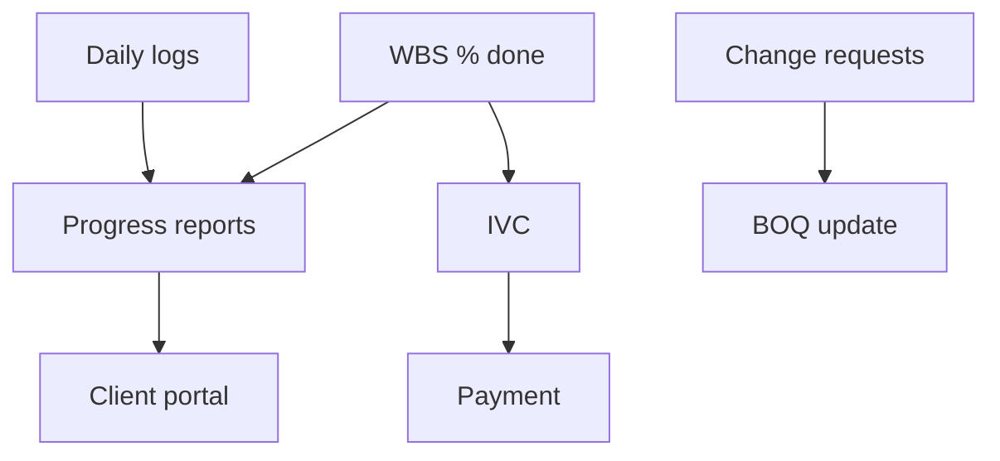


### B.5.1 Progress reporting (daily / weekly / monthly / milestone)

| Attribute | Detail |
|-----------|--------|
| **Phase** | Project Monitoring & Controlling |
| **Primary actors** | PM, Site Supervisor, Client, CEO |
| **System forms** | `FORM_PROGRESS_REPORT` — **Sheet 3 (Rockvilla example)** |
| **Inputs** | Daily logs, WBS %, photos |
| **Outputs** | Published stakeholder report |
| **Approval gate** | PM publishes; CEO optional review |
| **Automations** | Report overdue → PM alert |

**User stories**

- **US-MON-01:** As **PM**, I want to publish progress reports with photos, completed/ongoing/upcoming tasks, and risks so that clients get open-book updates.
- **US-MON-02:** As **Client**, I want milestone reports on my chosen frequency (weekly/monthly) in the portal—not WhatsApp.


<details open>
<summary><strong>Embedded source document / table</strong></summary>

## Sheet 3: Progress Report — 4-Bedroom Duplex, Rockvilla Guzape (May 2024)

**Source:** https://docs.google.com/spreadsheets/d/1t7vnqfWMWOJGJGZvDhmmQsGgyw2UoiG5C-LK9SC9SN4/edit#gid=153838149

**Project Title:** CONSTRUCTION OF A DETACHED 4-BEDROOM DUPLEX, ROCKVILLA ESTATE, GUZAPE, ABUJA  
**Prepared by:** Abraham Laucarie (Project Mgr)  
**Date:** 9th May, 2024

### Summary (full text)

The construction project commenced on the 27th of February, 2024; we have within the last 10 weeks constructed the basement of the building; and completed formwork, plumbing, electrical, and reinforced concrete work on the ground floor slab. However, we had issues with the initial Architectural and structural designs of the building elements: building orientation, a column falling in an open space in the sitting room, and the rainy season affecting our activity thereby slowing the on-time delivery of tasks and reaching a milestone as scheduled. We managed these issues by redesigning both drawings and employing more workforce to speed up our activities. Our next activity includes blockwork to window/lintel, the extension of columns and lift shaft, first-floor reinforcement work, plumbing 1st fixes, electrical 1st fixes, and casting of the concrete slab. This report also includes top risks and issues that have arisen and how we intend to take action.

### Project Team

| Role | Name |
|------|------|
| Project Manager | Abraham Laucarie |
| Project Architect | Albert Bundi |
| Builder | Theophilus Gabriel |

### Completed Tasks and Milestones

| Description | Date | Status | Owner | Comments |
|-------------|------|--------|-------|----------|
| site preparation, and erection of columns and retaining wall | March 13 | Completed | Project Team | Solid column footing and bases to provide good structural stability to the building |
| Foundation work and casting of concrete slab | April 11 | Completed | Project Team | |
| Construction of basement | April 24 | Completed | Project Team | |
| casting of ground floor slab | May 4 | Completed | Project Team | |

### Upcoming Tasks and Milestones

| Description | Date | Status | Owner | Comments |
|-------------|------|--------|-------|----------|
| Block work | May 12 | Ongoing | Project Team | 50% achieved as at today |
| Extension of column reinforcement and Lift shaft | May 10 | Upcoming | Iron bender | 40% achieved as at today |
| Removal of wooden slab support | May 25 | Upcoming | Carpenter | |

### Top Risks and Issues

| Issue | Impact | Action | Owner |
|-------|--------|--------|-------|
| It was observed at the site that some of the Y20 column starters bar are not aligned with the blockwork | distorted appearance of the wall | Cranking to adjust the columns to align with the thickness of the block | Iron bender |
| The sunk borehole has no water and frequent challenge of tanker drivers deliverying water on time | delay in completing task, cost of buying water | Sinking a new borehole with adequate water | PM |
| steep slope at the rear side of the building which makes it difficult for the retaining wall fence construction | Delaying sand filling and stabilizing the affected area | Collaborating with the contractor to come up with a more workable solution | PM |

---

</details>


### B.5.2 Change request log

| Attribute | Detail |
|-----------|--------|
| **Phase** | Project Monitoring & Controlling |
| **Primary actors** | PM, Client, CEO, Architect/SE (if structural), Dev Control (if required) |
| **System forms** | `FORM_CHANGE_LOG` — **Sheet 6** |
| **Inputs** | Change event on site or in design |
| **Outputs** | Approved/rejected change; BOQ/schedule/invoice updates |
| **Approval gate** | Minor→PM; Major→Client; Structural→Dev Control may be required |
| **Automations** | Approved change → variation invoice draft |

**User stories**

- **US-MON-03:** As **PM**, I want every change logged with justification and cost/time impact so that scope creep is controlled.
- **US-MON-04:** As **Client**, I want to approve major changes before work proceeds.
- **US-MON-05:** As **PM**, I want minor changes approvable by me alone when impact is low.


<details open>
<summary><strong>Embedded source document / table</strong></summary>

## Sheet 6: Project Change Log — Mix-Use Dev Jikwoyi (Template)

**Source:** https://docs.google.com/spreadsheets/d/177YOTEbN-UXxXe0Dcr2lYllJbU-ZAe_0QFGjyai3PqU/edit#gid=1128708620

**Title:** PROJECT CHANGE LOG FOR THE CONSTRUCTION OF MIX-USE DEVT, JIKWOYI, ABUJA

### Column headers (no data rows in source)

| CHANGE ID | DATE OF REVISION | ORIGINATOR/REQUESTER | CHANGE DESCRIPTION | JUSTIFICATION | REVISED BY | STATUS (approved, in review, rejected) | APPROVED BY | IMPACT (Scope/Time/Cost) |

Example impact values noted in sheet: e.g High/med/low

---

</details>


### B.5.3 Interim Valuation Certificate (IVC)

| Attribute | Detail |
|-----------|--------|
| **Phase** | Project Monitoring & Controlling |
| **Primary actors** | PM, Site Supervisor, Subcontractor, Finance, QS |
| **System forms** | `FORM_IVC` — **Document 6** |
| **Inputs** | Subcontract scope, WBS % measurement |
| **Outputs** | IVC with recommendation; payment queue |
| **Approval gate** | PM/Supervisor recommendation before finance release |
| **Automations** | IVC submitted → finance notification |

**User stories**

- **US-MON-06:** As **PM**, I want IVC tied to measured % work so that we only pay for performance.
- **US-MON-07:** As **Subcontractor**, I want to see mobilization and milestone payment stages clearly.
- **US-MON-08:** As **Finance**, I want payment history per IVC so that audit trail is complete.


<details open>
<summary><strong>Embedded source document / table</strong></summary>

## Document 6: Completion/Milestone Interim Valuation Certificate (Template)

**Source:** https://docs.google.com/document/d/1__euQ9vbz68low1mlAXjZKvj5xNxg0kf3Gt11tu3wRs/edit

### Project Details

| Field | Value |
|-------|-------|
| S/N | *(blank)* |
| Description of task/work | *(blank)* |
| Subcontractor Name | *(blank)* |
| Account Details | *(blank)* |
| Scope of work/statement of work | *(blank)* |
| Contract Reference | *(blank)* |
| Contract Amount | *(blank)* |
| Delivery period (in days/weeks) | *(blank)* |
| Start Date | *(blank)* |
| End Date | *(blank)* |

### Payment Details

| S/N | Stages of work | Measured work achieved (%) | Amount paid (N) | % paid | Date paid | COMMENT ON PERFORMANCE |
|-----|----------------|---------------------------|-----------------|--------|-----------|------------------------|
| | Mobilization fee | | | | | |
| | 1st milestone | | | | | |
| | 2nd milestone | | | | | |
| | 3rd milestone | | | | | |
| | 4th milestone | | | | | |
| | 5th milestone | | | | | |

**General Recommendation:** *(blank)*

**Signatures:**

| PROJECT MGR | SUPERVISOR | SUB-CONTRACTOR |
|-------------|------------|----------------|
| ------------------------- | ------------------------- | ----------------------------- |

---

</details>


### B.5.4 Client & purchaser finance monitoring

| Attribute | Detail |
|-----------|--------|
| **Phase** | Project Monitoring & Controlling / Property |
| **Primary actors** | Finance, Sales, Client/Purchaser, PM |
| **System forms** | `FORM_PURCHASER_INSTALMENT` — **Sheet 2**; `FORM_INVOICE` |
| **Inputs** | Sales contract, payment proofs |
| **Outputs** | Instalment ledger; outstanding balance |
| **Approval gate** | Finance verifies payments |
| **Automations** | Missed instalment → notify Sales + Client |

**User stories**

- **US-MON-09:** As **Finance**, I want purchaser instalment tracking against contract price so that sales cash flow is visible.
- **US-MON-10:** As **Purchaser**, I want to see my 6-month schedule and balance in the portal.


<details open>
<summary><strong>Embedded source document / table</strong></summary>

## Sheet 2: Purchaser Instalment Inflow (6-Month Schedule)

**Source:** https://docs.google.com/spreadsheets/d/1S2jFj5bEalL--CGcR-VLFpvixee4W0D7F_V0wqJkJQI/edit#gid=462068672

**Title:** TRIPLE REALTY PROJECTS LIMITED — PURCHASER INSTALMENT INFLOW (6-MONTH SCHEDULE)  
**Note on sheet:** All amounts in Naira (₦). Blue/yellow cells are inputs — edit freely; black cells are formulas.

### Default payment schedule (% of contract price due each month)

| Month 1 | Month 2 | Month 3 | Month 4 | Month 5 | Month 6 | Total |
|---------|---------|---------|---------|---------|---------|-------|
| 20.0% | 15.0% | 15.0% | 15.0% | 15.0% | 20.0% | 100.0% |

### Purchaser rows (full data)

| S/N | Purchaser Name | Unit / Plot No. | Contract Price (₦) | Month 1 | Month 2 | Month 3 | Month 4 | Month 5 | Month 6 | Total Collected (₦) | Balance Outstanding (₦) |
|-----|----------------|-----------------|---------------------|---------|---------|---------|---------|---------|---------|---------------------|---------------------------|
| 1 | Sample Purchaser A | Block A - Plot 01 | 25,000,000 | 5,000,000 | 3,750,000 | 3,750,000 | 3,750,000 | 3,750,000 | 5,000,000 | 25,000,000 | - |
| 2 | Sample Purchaser B | Block A - Plot 02 | 25,000,000 | 5,000,000 | 3,750,000 | 3,750,000 | 3,750,000 | 3,750,000 | 5,000,000 | 25,000,000 | - |
| 3 | Sample Purchaser C | Block B - Plot 05 | 30,000,000 | 6,000,000 | 4,500,000 | 4,500,000 | 4,500,000 | 4,500,000 | 6,000,000 | 30,000,000 | - |
| 4 | Sample Purchaser D | Block B - Plot 06 | 30,000,000 | 6,000,000 | 4,500,000 | 4,500,000 | 4,500,000 | 4,500,000 | 6,000,000 | 30,000,000 | - |
| 5 | Sample Purchaser E | Block C - Plot 10 | 22,000,000 | 4,400,000 | 3,300,000 | 3,300,000 | 3,300,000 | 3,300,000 | 4,400,000 | 22,000,000 | - |
| | **TOTAL MONTHLY INFLOW** | | **132,000,000** | **26,400,000** | **19,800,000** | **19,800,000** | **19,800,000** | **19,800,000** | **26,400,000** | **132,000,000** | - |

---

</details>


### B.5.5 Invoicing & variations

| Attribute | Detail |
|-----------|--------|
| **Phase** | Project Monitoring & Controlling / Finance |
| **Primary actors** | Finance, PM, Client |
| **System forms** | `FORM_INVOICE` — **Document 5 (Solar hybrid example)** |
| **Inputs** | Contract, approved changes, milestones |
| **Outputs** | Invoice PDF; outstanding balance |
| **Approval gate** | PM confirms work; Finance issues |
| **Automations** | Variation approved → auto-suggest invoice line |

**User stories**

- **US-MON-11:** As **Finance**, I want invoices with variation lines (V-01, V-02) linked to change log so that billing matches scope.


<details open>
<summary><strong>Embedded source document / table</strong></summary>

## Document 5: Invoice — Solar Hybrid Power System

**Source:** https://docs.google.com/document/d/1UDofiF5iNtYl-N7pGCKJYM7ASg1eHvE0x6lmy1r4J6s/edit

**Issuer:** A. LAUCARIE CONSULTING  
**Document type:** INVOICE  
**Invoice No:** AAA/2026/SOL-084  
**Date:** July 1, 2026  
**Contract Ref:** CC/2025/1104

### Client / Bill To

Madam Taiwo Peace Mawo  
River park Estate, Lugbe,  
Abuja

### Project Location / Details

4 bedroom Semi-duplex Residential  
River Park Estate, Lugbe, Abuja

### Line Items

**Original Contract Base Scope:**  
Supply, delivery, installation, testing, and commissioning of a premium 5KVA, 48V Solar Hybrid Power System complete with 5kwh lithium battery with 6 solar panels.

| Qty | Unit Price | Total |
|-----|------------|-------|
| 1 | 2,780,000.00 | 2,780,000.00 |

**Approved Variation V-01 (Specification Change):**  
Upgrade from standard 5KVA, 48V to 6KVA, 48V Hybrid inverter and upgrade from 550W panels to 590W High-Efficiency Monocrystalline Panels

| Type | Amount |
|------|--------|
| LS | 100,000.00 |

### Financial Summary

- Original Amount Quoted (Base Contract Value): ₦2,780,000.00
- Total Contract Material & Inflation Variance: +₦100,000.00
- Revised Total Contract Value: *(blank in source)*
- Less: Total Amount Paid to Date (Milestone 1 & 2): *(blank in source)*
- Outstanding Net Balance Due: *(blank in source)*

### Payment Terms & Technical Notes

1. All variations listed above were communicated.
2. Payment of the outstanding net balance is due within 24 hours from the time of completion and handover work

---

</details>


### B.5.6 Performance & corrective action

| Attribute | Detail |
|-----------|--------|
| **Phase** | Project Monitoring & Controlling |
| **Primary actors** | PM, CEO, Site Supervisor |
| **System forms** | Monthly planning (Doc 3), Progress reports |
| **Inputs** | Schedule baseline, actual % |
| **Outputs** | Corrective action log |
| **Approval gate** | CEO review on major slippage |
| **Automations** | Schedule slip > threshold → CEO alert |

**User stories**

- **US-MON-12:** As **PM**, I want monthly progress vs plan with corrective actions so that delays are managed openly.


---

# B.6 PROJECT CLOSURE

**Phase goal:** Commission, hand over, settle payments, learn lessons.  
**Phase owner:** Project Manager  
**Phase exit gate:** Retrospective complete → project `closed`

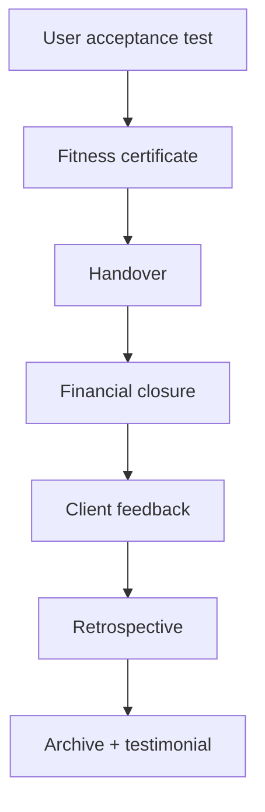


### B.6.1 User acceptance test (UAT) & commissioning

| Attribute | Detail |
|-----------|--------|
| **Phase** | Project Closure |
| **Primary actors** | PM, Client, MEP subcontractors, Site Supervisor |
| **System forms** | `FORM_UAT` *(draft — derived from verbal + closeout features)* |
| **Inputs** | Practical completion achieved |
| **Outputs** | UAT record; snag list |
| **Approval gate** | All critical items pass |
| **Automations** | UAT fail → snag ticket |

**User stories**

- **US-CLOSE-01:** As **Client**, I want to test every component (doors, lift, solar, AC, pool) with Triple A so that I know the building works.
- **US-CLOSE-02:** As **PM**, I want UAT items recorded pass/fail so that snags are tracked to completion.


### B.6.2 Fitness-for-use certification & handover

| Attribute | Detail |
|-----------|--------|
| **Phase** | Project Closure |
| **Primary actors** | PM, Client, CEO |
| **System forms** | `FORM_FITNESS_CERTIFICATE` *(draft)* |
| **Inputs** | UAT pass |
| **Outputs** | Signed fitness certificate |
| **Approval gate** | Client + contractor signatures |
| **Automations** | Certificate issued → client portal download |

**User stories**

- **US-CLOSE-03:** As **PM**, I want a fitness certificate issued after UAT so that handover is formal.


### B.6.3 Project closeout report

| Attribute | Detail |
|-----------|--------|
| **Phase** | Project Closure |
| **Primary actors** | PM, Client, CEO |
| **System forms** | `FORM_CLOSEOUT_REPORT` — **Document 7 (Guzape / Mrs Araba Agbenyenku)** |
| **Inputs** | UAT, as-built docs, photos |
| **Outputs** | Closeout report PDF |
| **Approval gate** | Client acknowledges receipt |
| **Automations** | None |

**User stories**

- **US-CLOSE-04:** As **PM**, I want a closeout narrative with accomplishments by floor/zone and open items so that handover is documented.


<details open>
<summary><strong>Embedded source document / table</strong></summary>

## Document 7: Project Closeout Report — Luxurious Detached Duplex, Guzape

**Source:** https://docs.google.com/document/d/1WGG2AXP5YzVI5x6Mer6-kSGV9NzQNvjEMkVcsLU1b7g/edit  
**Date:** 29-10-2025  
**Author:** Abraham A. Laucarie

| Field | Value |
|-------|-------|
| Project Developer | Messrs Triple A Realty Projects Ltd |
| Project Client | Mrs Araba Agbenyenku |
| Project Duration | 5th March, 2024 – 25th September, 2025 |

### Executive Summary

The team designed and managed the construction a fully detached hilltop house, equisitively and luxuriously built with smart features on land sitting on about 700 square meters.

The construction project started on 5th March 2024 and was completed on the 25th Sept 2025 spanning a period a little over 18 months. The project went slightly over budget, but stayed on schedule. The team encountered major issues with the mechanical and electrical installations and customer satisfaction that still need to be addressed.

### Key Accomplishments / Features

**Basement**

- Cinema
- Well-equipped gym
- Guest charlet
- Maid's room
- Laundry
- Store
- Electric/inverter room

**Ground Floor**

- Visitor's toilet
- Spacious living room
- Dining area
- Kitchen with pantry

**First Floor**

- Family lounge
- 2 children's room all equipped with luxury and modern toilet facilities such as large ceiling showers, bathtub, and countertop vanity set, concealed wc

**Pent Floor**

- Master's bedroom with king-size bed and sofa, walk-in closet, exquisite toilet with concealed WC, large ceiling showers, bathtub, inbuilt Bluetooth and speakers wall mirrors, spacious balcony for events like birthdays decorated with colorful light and hanging flowers

**Additional Facilities**

- 4 passenger elevator with 4 stops connected to all the floors and powered also by inverter
- Fabricated carport made of high quality steel and roofed solar panels
- Bio digester for soil and waste disposal
- A total of 30KVA solar powered hybrid inverter and 50 kilo watts lithium batteries
- 100KVA diesel powered generating set with purpose built soundproof box to reduce noise and smoke pollution
- 300 litres capacity solar water heater
- Central air conditioning system with all outdoor units at the roof top
- Well designed and constructed swimming pool for both children and adults
- Outdoor wooden pergola
- decorated wall bricks, flowers, and water fountain
- External floor finished with stamped concrete and resin stone
- Electric fence and automatic control entrance gate

### Open Items

- Continue to monitor the mechanical and electrical installations like inverters, servicing of lift etc
- Continue to improve

### Signatures

| CONTRACTOR | CLIENT |
|------------|--------|
| For: Triple A Realty Projects Ltd | *(blank)* |

---

</details>


### B.6.4 Financial closure

| Attribute | Detail |
|-----------|--------|
| **Phase** | Project Closure |
| **Primary actors** | Finance, PM, CEO |
| **System forms** | IVC finals, Invoice ledger |
| **Inputs** | Outstanding payment report |
| **Outputs** | Financial closure sign-off |
| **Approval gate** | **HARD GATE:** Unpaid subs block `closed` status |
| **Automations** | Outstanding > 0 → block closure wizard |

**User stories**

- **US-CLOSE-05:** As **Finance**, I want all subcontractor, vendor, and worker payments settled before project close so that no liabilities remain.
- **US-CLOSE-06:** As **CEO**, I want financial closure checklist signed off.


### B.6.5 Retrospective, lessons learned & testimonial

| Attribute | Detail |
|-----------|--------|
| **Phase** | Project Closure |
| **Primary actors** | PM, All team, Client, CEO |
| **System forms** | `FORM_RETROSPECTIVE` — **Document 8**; `FORM_CLIENT_SATISFACTION` |
| **Inputs** | Project history, challenges log |
| **Outputs** | Archived lessons; optional testimonial |
| **Approval gate** | Retrospective meeting complete |
| **Automations** | Project closed → add lessons to org knowledge base |

**User stories**

- **US-CLOSE-07:** As **PM**, I want a retrospective with what worked/didn't/lucky so that future projects improve.
- **US-CLOSE-08:** As **Client**, I want to give feedback/testimonial for Triple A credibility.


<details open>
<summary><strong>Embedded source document / table</strong></summary>

## Document 8: Retrospective (Template)

**Source:** https://docs.google.com/document/d/1YsNRK4JN0PTpXA-wK2AEJPW2pXN0yv1orDCPxm-yMdg/edit

- **Title:** Retrospective: Project Name
- **Date:** *(blank)*
- **Owner:** *(blank)*
- **Collaborators:** *(blank)*

### Project Summary

[Write up a short summary of the project, could be large or small or just point to a project planning doc. Objectives, Sponsors/Stakeholders, etc.]

| Field | Value |
|-------|-------|
| Project Status | *(blank)* |
| Project Goals and Objectives | *(blank)* |
| Duration of project | *(blank)* |
| Team | *(blank)* |
| Link to Project Doc(s) | *(blank)* |
| Methodology | *(blank)* |
| Project Resources | *(blank)* |

### Lessons Learned

**Things that went well:**

- *(blank bullet)*

**Things that need improvement:**

- *(blank bullet)*

**Where we got lucky:**

- *(blank bullet)*

### Action Items

| Action Item | Type [tool, process, team] | Owner | Links |
|-------------|---------------------------|-------|-------|
| *(blank row)* | | | |

### Next Steps and Future Considerations

### Project Timeline

| Date Achieved | Milestones |
|---------------|------------|
| April 12–April 30 | *(blank)* |
| May 3–June 11 | *(blank)* |
| June 10–15 | *(blank)* |
| June 21–August 16 | *(blank)* |
| June 21–July 19 | *(blank)* |
| July 5–July 30 | *(blank)* |
| September 6 | *(blank)* |

---

</details>


---

## B.7 User story index (quick reference)

| ID | Role | Summary |
|----|------|---------|
| US-INIT-01–13 | Sales, PM, Client, Admin | Lead → proposal → charter → sign-off |
| US-PLAN-01–24 | PM, design team, Supervisor | Kick-off through plans, schedule, ethics |
| US-EXEC-01–14 | Supervisor, engineers, QC | Build sequence, daily logs, inspections, pour gate |
| US-PROC-01–08 | Procurement, Store, Logistics | Vendors → indent → deliver → stock |
| US-MON-01–12 | PM, Finance, Client, Sub | Progress, changes, IVC, instalments |
| US-CLOSE-01–08 | PM, Client, Finance, CEO | UAT → handover → retrospective |


---

# Part C: Appendix — Full Verbatim Extractions

> Complete copy for search/audit. Primary placement is in **Part B** workflow steps above.

# Part 1: Google Docs

## Document 1: Development of Mixed Use Commercial Plaza and Serviced Apartments at Jikwoyi, Abuja

**Source:** https://docs.google.com/document/d/1UwL6nBAia3YoozePdP9NdNXeKe4S1Ufpa9u-cQpga8I/edit  
**Date on document:** September 2ND, 2025  
**Document Status:** Draft | In Review | Approved

### Executive Summary

To design, develop, and deliver a high-quality, mixed-use commercial development, featuring contemporary shopping mall and premium serviced apartments, strategically designed to meet the growing demand for integrated urban lifestyles in a suburb.

### Project Goal (SMART)

- Develop a vibrant lifestyle destination that attracts locals, travelers and urban professionals seeking comfort, convenience, and luxury in the suburb, strategically offering a diverse mix of shopping, entertainment, and services to enhance consumer experience 200% higher than the competitors within the first month of commissioning.
- Maximize land use efficiency by integrating commercial and residential components that generate steady and diversified revenue streams in excess of N140m per annum

### Deliverables

- Architectural and engineering design
- A total lettable/usable commercial space of 800 square metres comprising various uses.
- Completed comfortable and luxurious 12 units of studio apartments and 3units mezzanine bedroom
- Outdoor swimming pool
- Marketing and sales plan for apartment and commercial spaces
- Facility management and maintenance plan

### Business Case / Background

**Why are we doing this?**

The proposed Jikwoyi construction project is a strategically planned mixed-use development designed to meet the growing demand for integrated residential and commercial facility in the suburban district of Abuja. With increasing urban migration and population growth in Abuja's periphery, the project aims to provide sustainable, modern, and secure living spaces combined with accessible retail, entertainment, and office facilities/banking hall.

### Benefits, Costs, and Budget

**Benefits:**

- Diversified stream of revenue from both commercial space and short/long let apartments with income targeted in excess of N140m per annum.

**Costs:**

- Price of land and construction cost estimated at N800m
- marketing and annual facility management at N40m per annum

**Estimated Budget:**

- N600M -800M

### Project Timeline

- 24 to 30 months from design to full operation

### Risk & Constraints

- Delays in regulatory approvals from Devt control.
- Fluctuations in construction material cost.
- Power and water supply reliability.
- Environmental factors such as rainfall and traffic impact on logistics of materials

### Scope and Exclusion

**In-Scope:**

- Design and construction of apartments (15 units).
- Development of a commercial mall (~800 sqm).
- Infrastructure for parking, access roads, drainage, water supply, electricity, and security.
- Landscaping, recreation areas, and community amenities (e.g., lounge, play areas).

**Out-of-Scope:**

- Addition or changes to the approved designed or specification
- Government-funded infrastructure such as street light beyond the project boundary

### Project Team / Stakeholders

- **Project Sponsor:** J POS Integrated Services Ltd.
- **Project Developer:** Triple A Realty Projects Ltd
- **Key Partners:** Local area council (AMAC), urban planning authorities (FCDA), financial institutions, construction subcontractors, utility service providers.
- **End Users:** apartment customers, retail and whole business owners, shoppers, and office occupants.
- **Project Lead:** Abraham A. Laucarie
- **Project Team:** Architect, Structural Engineers, M & E Engineers, Builders, Quantity Surveyors, Financial Analyst, Human Resources Specialist, Renewable energy experts.
- **Additional Stakeholders:** Local chief or Community head, former occupants of the property

### Measuring Success

**What is acceptable:**

- Timely completion within estimated timeframe of 30 months.
- 80% apartment occupancy rate and 80% commercial lease within 6 months of launch.
- Positive annual ROI of between 15 – 25% within the first 5–7 years.
- High satisfaction rates from users and commercial tenants.

---

## Document 2: Project Kick-Off Meeting (Template)

**Source:** https://docs.google.com/document/d/10bdHJsinTIBQhSrPsPeL9PsrnkwjcMtyJek0cNC2jRA/edit

### Header fields

- PROJECT KICK-OFF MEETING
- PROJECT NAME: *(blank)*
- PROJECT MANAGER: *(blank)*
- DATE OF MEETING: *(blank)*
- LOCATION / DATE / TIME: *(blank table rows)*
- MINUTE PREPARED BY: *(blank)*

### 1. Attendees Present

| NAME | PROJECT ROLE | EMAIL | PHONE NO. |
|------|--------------|-------|-----------|
| *(20 blank rows for attendees)* | | | |

### 2. Agenda Items

| Agenda Item | Notes | Remark |
|-------------|-------|--------|
| Introduction | | |
| Background of the project: project designs and doc | | |
| Site condition | | |
| Setting out | | |
| Temp. store on site | | |
| Clearance and excavation work | | |
| Start date | | |
| Key milestone schedules | | |
| Completion date | | |
| Other Observation | | |

### 3. Action Items

| ACTION ITEM | ACTIONED BY | DUE DATE |
|-------------|-------------|----------|
| *(25 blank rows)* | | |

### Next Meeting

| DATE | TIME |
|------|------|
| *(blank)* | *(blank)* |

---

## Document 3: Daily, Weekly & Monthly Planning — Plan Today, Achieve Tomorrow

**Source:** https://docs.google.com/document/d/1VkPIl8Xj9mdExkmDwNbGPTOBcBFgVZOFfSwcAKqMItI/edit  
**Format:** Image-based infographic (plain-text export is empty; content extracted from embedded PNG via HTML export)  
**Company:** TRIPLE A REALTY PROJECTS LTD.  
**Image asset:** `DAILY_WEEKLY_MONTHLY_PLANNING.png` | Full write-out: `DAILY_WEEKLY_MONTHLY_PLANNING.txt`

### Header

**DAILY, WEEKLY & MONTHLY PLANNING**  
**PLAN TODAY – ACHIEVE TOMORROW**

### 1. Daily Planning

**Focus:** Today's Work Execution

**Objective:** Ensure daily tasks are completed safely, on time, and with quality.

**Key Activities:**
- Review daily work targets with the team
- Check manpower, materials, tools & equipment availability
- Discuss site constraints & solutions
- Ensure safety briefing (TBT) is done
- Monitor work progress throughout the day
- Record progress, issues & rectifications
- Daily clean-up & housekeeping

**Output:** Daily progress achieved & updated records

**Slogan:** Plan Your Work, Work Your Plan

### 2. Weekly Planning

**Focus:** Short Term Coordination

**Objective:** Coordinate resources and activities to meet weekly targets.

**Key Activities:**
- Review and update lookahead plan (2–6 weeks)
- Break down weekly targets into daily activities
- Check material requirement and indents
- Review manpower deployment & productivity
- Coordinate with subcontractors & consultants
- Review drawings, approvals & inspections
- Identify risks and plan mitigation

**Output:** Weekly plan & resource allocation for the week

**Slogan:** Coordinate Today, Complete On Time

### 3. Monthly Planning

**Focus:** Long Term Control & Forecasting

**Objective:** Plan ahead for resources, budgets, and milestones.

**Key Activities:**
- Review overall project schedule & milestones
- Prepare/Update Monthly Work Plan
- Estimate material, manpower & equipment for the month
- Review budget, cash flow & commitments
- Monitor progress vs plan & take corrective actions
- Review risks, approvals & dependencies
- Management review meeting & reporting

**Output:** Monthly plan, forecast, report & corrective actions

**Slogan:** Plan Ahead, Stay Ahead

### Key Takeaway

- Daily Planning keeps the team focused.
- Weekly Planning ensures coordination and resource alignment.
- Monthly Planning drives control, forecasting, and project success.

### Closing Quote

**Abraham A. Laucarie — PM:** "Good Planning Today, Better Results Tomorrow"

---

## Document 4: Internal Control Process for Comprehensive Building Construction Inspection and Approval Log

**Source:** https://docs.google.com/document/d/1A_vmdL0SPma0AQviYKqqTnr3EA4olm_5OsI2PgRADUM/edit

### Header fields

- Project Name: ______________________________________________________________
- Site Location: _____________________________________________________________
- Site Supervisor(s)/Mgr Name: ___________________________________________________________
- Overall Inspection Date (Start): _____________________________________________

Each section below uses columns: **Status (☐ Yes ☐ No) | Inspection Item | Remarks / Notes**  
Each section ends with: **Date Inspected / Inspector Name / Signature**

### 1. Pre-Construction Checklist

1. Land survey completed
2. Soil investigation report approved
3. Building plan approved
4. Building permits obtained
5. Utility connections arranged
6. Site fencing and signage installed
7. Site office and storage ready

### 2. Excavation Checklist

1. Layout verified
2. Excavation depth checked
3. Soil condition inspected
4. Dewatering arranged (if required)
5. Excavation safety maintained

### 3. Foundation Checklist

1. PCC level checked
2. Anti-termite treatment done
3. Reinforcement as per drawings
4. Cover blocks installed
5. Formwork alignment checked
6. Concrete grade approved
7. Cube samples collected
8. Proper curing started

### 4. Column Checklist

1. Starter bars checked
2. Reinforcement spacing verified
3. Verticality checked
4. Cover maintained
5. Formwork tight and aligned
6. Concrete vibrated properly

### 5. Beam Checklist

1. Bottom & top reinforcement checked
2. Stirrup spacing verified
3. Development length provided
4. Beam dimensions correct
5. Openings coordinated

### 6. Slab Checklist

1. Shuttering level checked
2. Reinforcement spacing correct
3. Electrical conduits installed
4. Plumbing sleeves provided
5. Cover blocks placed
6. Concrete poured and vibrated
7. Curing started

### 7. Masonry Checklist

1. Brick quality approved
2. Mortar ratio correct
3. Verticality maintained
4. Joint thickness uniform
5. Lintel level checked
6. Masonry curing completed

### 8. Plastering Checklist

1. Surface cleaned
2. Plaster thickness checked
3. Corners aligned
4. No hollow areas
5. Proper curing done

### 9. Waterproofing Checklist

1. Surface prepared
2. Membrane/coating applied correctly
3. Ponding test completed
4. No leakage observed

### 10. Flooring Checklist

1. Base level checked
2. Tile alignment correct
3. Joint spacing uniform
4. Hollow tiles avoided
5. Finished surface cleaned

### 11. Doors & Windows Checklist

1. Frame alignment checked
2. Fixing secure
3. Shutter operation smooth
4. Hardware installed
5. Sealant applied

### 12. Painting Checklist

1. Surface prepared
2. Primer applied
3. Required coats completed
4. Shade approved
5. No cracks or peeling

### 13. Electrical Checklist

1. Conduits installed
2. Wiring tested
3. Earthing completed
4. DB installed
5. MCB/RCCB tested
6. Light and power points working

### 14. Plumbing Checklist

1. Pipe pressure test completed
2. Drainage slope checked
3. Leak test passed
4. Fixtures installed
5. Water supply functioning

### 15. Fire Fighting Checklist

1. Fire pipes installed
2. Hydrants tested
3. Sprinklers operational
4. Fire alarm tested
5. Exit signage installed

### 16. Finishing Checklist

1. All defects rectified
2. Silicone sealing completed
3. Cleaning completed
4. Touch-up painting done

### 17. External Works Checklist

1. Compound wall completed
2. Roads and pavements finished
3. Drainage completed
4. Landscaping completed
5. Parking marked

### 18. Quality Control (QC) Checklist

1. Material approvals
2. Cube test results
3. Slump test records
4. Inspection reports
5. NCRs closed

### 19. Safety Checklist

1. PPE used
2. Scaffolding inspected
3. Fire extinguishers available
4. First aid kit available
5. Tool-box talks conducted

### 20. Handover Checklist

1. Snag list closed
2. As-built drawings submitted
3. O&M manuals submitted
4. Test certificates handed over
5. Completion certificate obtained
6. Occupancy certificate obtained
7. Client handover completed

### General Inspection and Approval By

| Devt Control Rep. | Project Manager | Site Supervisor/Mgr |
|-------------------|-----------------|---------------------|
| ________________________ | ________________________ | ________________________ |

---

## Document 5: Invoice — Solar Hybrid Power System

**Source:** https://docs.google.com/document/d/1UDofiF5iNtYl-N7pGCKJYM7ASg1eHvE0x6lmy1r4J6s/edit

**Issuer:** A. LAUCARIE CONSULTING  
**Document type:** INVOICE  
**Invoice No:** AAA/2026/SOL-084  
**Date:** July 1, 2026  
**Contract Ref:** CC/2025/1104

### Client / Bill To

Madam Taiwo Peace Mawo  
River park Estate, Lugbe,  
Abuja

### Project Location / Details

4 bedroom Semi-duplex Residential  
River Park Estate, Lugbe, Abuja

### Line Items

**Original Contract Base Scope:**  
Supply, delivery, installation, testing, and commissioning of a premium 5KVA, 48V Solar Hybrid Power System complete with 5kwh lithium battery with 6 solar panels.

| Qty | Unit Price | Total |
|-----|------------|-------|
| 1 | 2,780,000.00 | 2,780,000.00 |

**Approved Variation V-01 (Specification Change):**  
Upgrade from standard 5KVA, 48V to 6KVA, 48V Hybrid inverter and upgrade from 550W panels to 590W High-Efficiency Monocrystalline Panels

| Type | Amount |
|------|--------|
| LS | 100,000.00 |

### Financial Summary

- Original Amount Quoted (Base Contract Value): ₦2,780,000.00
- Total Contract Material & Inflation Variance: +₦100,000.00
- Revised Total Contract Value: *(blank in source)*
- Less: Total Amount Paid to Date (Milestone 1 & 2): *(blank in source)*
- Outstanding Net Balance Due: *(blank in source)*

### Payment Terms & Technical Notes

1. All variations listed above were communicated.
2. Payment of the outstanding net balance is due within 24 hours from the time of completion and handover work

---

## Document 6: Completion/Milestone Interim Valuation Certificate (Template)

**Source:** https://docs.google.com/document/d/1__euQ9vbz68low1mlAXjZKvj5xNxg0kf3Gt11tu3wRs/edit

### Project Details

| Field | Value |
|-------|-------|
| S/N | *(blank)* |
| Description of task/work | *(blank)* |
| Subcontractor Name | *(blank)* |
| Account Details | *(blank)* |
| Scope of work/statement of work | *(blank)* |
| Contract Reference | *(blank)* |
| Contract Amount | *(blank)* |
| Delivery period (in days/weeks) | *(blank)* |
| Start Date | *(blank)* |
| End Date | *(blank)* |

### Payment Details

| S/N | Stages of work | Measured work achieved (%) | Amount paid (N) | % paid | Date paid | COMMENT ON PERFORMANCE |
|-----|----------------|---------------------------|-----------------|--------|-----------|------------------------|
| | Mobilization fee | | | | | |
| | 1st milestone | | | | | |
| | 2nd milestone | | | | | |
| | 3rd milestone | | | | | |
| | 4th milestone | | | | | |
| | 5th milestone | | | | | |

**General Recommendation:** *(blank)*

**Signatures:**

| PROJECT MGR | SUPERVISOR | SUB-CONTRACTOR |
|-------------|------------|----------------|
| ------------------------- | ------------------------- | ----------------------------- |

---

## Document 7: Project Closeout Report — Luxurious Detached Duplex, Guzape

**Source:** https://docs.google.com/document/d/1WGG2AXP5YzVI5x6Mer6-kSGV9NzQNvjEMkVcsLU1b7g/edit  
**Date:** 29-10-2025  
**Author:** Abraham A. Laucarie

| Field | Value |
|-------|-------|
| Project Developer | Messrs Triple A Realty Projects Ltd |
| Project Client | Mrs Araba Agbenyenku |
| Project Duration | 5th March, 2024 – 25th September, 2025 |

### Executive Summary

The team designed and managed the construction a fully detached hilltop house, equisitively and luxuriously built with smart features on land sitting on about 700 square meters.

The construction project started on 5th March 2024 and was completed on the 25th Sept 2025 spanning a period a little over 18 months. The project went slightly over budget, but stayed on schedule. The team encountered major issues with the mechanical and electrical installations and customer satisfaction that still need to be addressed.

### Key Accomplishments / Features

**Basement**

- Cinema
- Well-equipped gym
- Guest charlet
- Maid's room
- Laundry
- Store
- Electric/inverter room

**Ground Floor**

- Visitor's toilet
- Spacious living room
- Dining area
- Kitchen with pantry

**First Floor**

- Family lounge
- 2 children's room all equipped with luxury and modern toilet facilities such as large ceiling showers, bathtub, and countertop vanity set, concealed wc

**Pent Floor**

- Master's bedroom with king-size bed and sofa, walk-in closet, exquisite toilet with concealed WC, large ceiling showers, bathtub, inbuilt Bluetooth and speakers wall mirrors, spacious balcony for events like birthdays decorated with colorful light and hanging flowers

**Additional Facilities**

- 4 passenger elevator with 4 stops connected to all the floors and powered also by inverter
- Fabricated carport made of high quality steel and roofed solar panels
- Bio digester for soil and waste disposal
- A total of 30KVA solar powered hybrid inverter and 50 kilo watts lithium batteries
- 100KVA diesel powered generating set with purpose built soundproof box to reduce noise and smoke pollution
- 300 litres capacity solar water heater
- Central air conditioning system with all outdoor units at the roof top
- Well designed and constructed swimming pool for both children and adults
- Outdoor wooden pergola
- decorated wall bricks, flowers, and water fountain
- External floor finished with stamped concrete and resin stone
- Electric fence and automatic control entrance gate

### Open Items

- Continue to monitor the mechanical and electrical installations like inverters, servicing of lift etc
- Continue to improve

### Signatures

| CONTRACTOR | CLIENT |
|------------|--------|
| For: Triple A Realty Projects Ltd | *(blank)* |

---

## Document 8: Retrospective (Template)

**Source:** https://docs.google.com/document/d/1YsNRK4JN0PTpXA-wK2AEJPW2pXN0yv1orDCPxm-yMdg/edit

- **Title:** Retrospective: Project Name
- **Date:** *(blank)*
- **Owner:** *(blank)*
- **Collaborators:** *(blank)*

### Project Summary

[Write up a short summary of the project, could be large or small or just point to a project planning doc. Objectives, Sponsors/Stakeholders, etc.]

| Field | Value |
|-------|-------|
| Project Status | *(blank)* |
| Project Goals and Objectives | *(blank)* |
| Duration of project | *(blank)* |
| Team | *(blank)* |
| Link to Project Doc(s) | *(blank)* |
| Methodology | *(blank)* |
| Project Resources | *(blank)* |

### Lessons Learned

**Things that went well:**

- *(blank bullet)*

**Things that need improvement:**

- *(blank bullet)*

**Where we got lucky:**

- *(blank bullet)*

### Action Items

| Action Item | Type [tool, process, team] | Owner | Links |
|-------------|---------------------------|-------|-------|
| *(blank row)* | | | |

### Next Steps and Future Considerations

### Project Timeline

| Date Achieved | Milestones |
|---------------|------------|
| April 12–April 30 | *(blank)* |
| May 3–June 11 | *(blank)* |
| June 10–15 | *(blank)* |
| June 21–August 16 | *(blank)* |
| June 21–July 19 | *(blank)* |
| July 5–July 30 | *(blank)* |
| September 6 | *(blank)* |

---

# Part 2: Google Sheets

## Sheet 1: Project Work Schedule — Luxury Duplex, Guzape

**Source:** https://docs.google.com/spreadsheets/d/1cs0q9y9IFGOyqo0Vp4MH8GS0r6WN7YPHrekGba3RtDw/edit#gid=92457743  
**Raw CSV:** `GUZAPE_LUXURY_DUPLEX_WORK_SCHEDULE.csv`  
### Sheet header

| Field | Value |
|-------|-------|
| PROJECT TITLE | CONSTRUCTION OF LUXURY DUPLEX, GUZAPE |
| NAME OF CLIENT | MR. EMMANUEL DIFFA |
| PREPARED BY | ABRAHAM A. LAUCARIE (PROJECT MGR) |
| PROJECT START DATE | 7/3/2026 |

### Column structure

- WBS NUMBER
- TASK TITLE
- TASK OWNER
- START DATE
- DUE DATE
- DURATION IN DAYS
- DAILY DURATION IN HRS
- % DONE
- PMT (payment milestone flag)
- 1-Month Sprint Goal
- Weekly Gantt columns: WEEK 1–4 (S M T W T F S × 4 weeks)

### Phases summary

| Phase | WBS | Description | Task count |
|-------|-----|-------------|------------|
| 1 | 1.00–1.24 | Mobilization to site & Substructural work | 24 tasks |
| 2 | 2.00–2.10 | Construction of Basement | 10 tasks |
| 3 | 3.00–3.11 | Construction of Ground floor | 11 tasks |
| 4 | 4.00–4.11 | Construction of first floor | 11 tasks |
| 5 | 5.00–5.15 | Construction of Pent floor | 15 tasks |
| 6 | 6.00–6.25 | Finishing and external works | 24 tasks (dates TBD) |

### Full task table (every WBS row)

**Source:** https://docs.google.com/spreadsheets/d/1cs0q9y9IFGOyqo0Vp4MH8GS0r6WN7YPHrekGba3RtDw/edit#gid=92457743

| WBS | Task Title | Owner | Start | Due | Duration (days) | Hrs/day | % Done |
|-----|------------|-------|-------|-----|-----------------|---------|--------|
| 1.00 | Phase 1: Mobilization to site & Substructural work |  |  |  |  |  |  |
| 1.01 | Engagement of stakeholders:Devt control, Soil test, redesign, processing approval etc | PM | 7-Mar-2026 | 8-Jul-2026 | 123 | 8 | 100% |
| 1.02 | clearing, levelling and removal of debris | Team | 13-Mar-2026 | 8-Jul-2026 | 3 | 8 | 100% |
| 1.03 | setting out | Surveyor | 13-Mar-2026 | 8-Jul-2026 | 2 | 8 | 75% |
| 1.04 | topsoil excavation | Bldr | 13-Mar-2026 | 8-Jul-2026 | 1 | 8 | 80%% |
| 1.05 | borehole activation, temporay site and storage |  | 7-Mar-2026 | 14-Mar-2026 | 8 | 8 | 95% |
| 1.06 | supply cement and other material | PM | 14-Mar-2026 | 15-Mar-2026 | 2 | 8 |  |
| 1.07 | column base excavation |  | 08-Jul-2026 | 12-Jul-2026 | 5 | 8 |  |
| 1.08 | Blinding of columns footing | Engr & Bldr | 13-Jul-2026 | 14-Jul-2026 | 2 | 8 |  |
| 1.09 | Foot plate reinforcement Laying | Team | 14-Jul-2026 | 15-Jul-2026 | 2 | 8 |  |
| 1.10 | levelling and realignment of columns | Surveyor | 15-Jul-2026 | 16-Jul-2026 | 2 | 8 |  |
| 1.11 | formwork for columns bases |  | 16-Jul-2026 | 19-Jul-2026 | 4 | 8 |  |
| 1.12 | Casting of concrete | Engr & Bldr | 20-Jul-2026 | 21-Jul-2026 | 2 | 8 |  |
| 1.13 | Trench excavation | Bldr | 22-Jul-2026 | 25-Jul-2026 | 4 | 8 |  |
| 1.14 | Blinding of foundation trenches | Engr & Bldr | 26-Jul-2026 | 27-Jul-2026 | 2 | 8 |  |
| 1.15 | blockwork in foundation | Bldr | 27-Jul-2026 | 1-Aug-2026 | 6 | 8 |  |
| 1.16 | backfilling/compaction of laterite | Bldr | 2-Aug-2026 | 3-Aug-2026 | 2 | 8 |  |
| 1.17 | formwork to column | Bldr | 2-Aug-2026 | 6-Aug-2026 | 5 | 8 |  |
| 1.18 | Concreting of columns | Engr & Bldr | 6-Aug-2026 | 7-Aug-2026 | 2 | 8 |  |
| 1.19 | Plinth beam work | Engr | 7-Aug-2026 | 11-Aug-2026 | 5 | 8 |  |
| 1.20 | backfilling/compaction of laterite and hard-core layers | Bldr | 12-Aug-2026 | 19-Aug-2026 | 8 | 8 |  |
| 1.21 | formwork to bed/slab | Bldr | 20-Aug-2026 | 21-Aug-2026 | 2 | 8 |  |
| 1.22 | fixing of pipes and sleeves | MEP | 21-Aug-2026 | 23-Aug-2026 | 3 | 8 |  |
| 1.23 | Laying of DPM/Leather | Bldr | 24-Aug-2026 | 24-Aug-2026 | 1 | 8 |  |
| 1.24 | Casting/concreting of slab (DPC) | Bldr | 25-Aug-2026 | 25-Aug-2026 | 1 | 8 |  |
| 2.00 | Phase 2 : Construction of Basement |  |  |  |  |  |  |
| 2.01 | Setting out, blockwork to window/lintel level | Arch & Bldr | 26-Aug-2026 | 1-Sep-2026 | 7 | 8 |  |
| 2.02 | Extension of reinforcement  for columns, lintels and lift shaft | Engr & Bldr | 1-Sep-2026 | 8-Sep-2026 | 8 | 8 |  |
| 2.03 | formwork for columns, lintels and lift shaft | Bldr | 5-Sep-2026 | 10-Sep-2026 | 6 | 8 |  |
| 2.04 | Casting of columns,lintels and lift shaft | Engr & Bldr | 11-Sep-2026 | 12-Sep-2026 | 2 | 8 |  |
| 2.05 | Block work after lintel to beams | Bldr | 13-Sep-2026 | 20-Sep-2026 | 8 | 8 |  |
| 2.06 | Formwork for beams, slab and staircase | Bldr | 21-Sep-2026 | 4-Oct-2026 | 14 | 8 |  |
| 2.07 | Reinforcement work for beams, slab and staircase | Engr & Bldr | 5-Oct-2026 | 19-Oct-2026 | 15 | 8 |  |
| 2.08 | First fix piping/sleeves plumbing | MEP | 18-Oct-2026 | 23-Oct-2026 | 6 | 8 |  |
| 2.09 | First fix piping/sleeves electrical | MEP | 18-Oct-2026 | 23-Oct-2026 | 6 | 8 |  |
| 2.10 | Concreting/casting of beams and slab | Bldr | 25-Oct-2026 | 25-Oct-2026 | 1 | 8 |  |
| 3.00 | Phase 3: Construction of Ground floor |  |  |  |  |  |  |
| 3.01 | Setting out, blockwork to window/lintel level | Arch & Bldr | 28-Oct-2026 | 11-Nov-2026 | 15 | 8 |  |
| 3.02 | Extension of reinforcement  for columns, lintels and lift shaft | Engr & Bldr | 12-Nov-2026 | 19-Nov-2026 | 8 | 8 |  |
| 3.03 | formwork to columns, lintels and lift shaft | Bldr | 14-Nov-2026 | 24-Nov-2026 | 11 | 8 |  |
| 3.04 | Casting of columns,lintels and lift shaft | Engr & Bldr | 25-Nov-2026 | 26-Nov-2026 | 2 | 8 |  |
| 3.05 | Block work after lintel to beams | Bldr | 26-Nov-2026 | 2-Dec-2026 | 7 | 8 |  |
| 3.06 | Formwork for beams, slab and staircase g/floor | Bldr | 3-Dec-2026 | 17-Dec-2026 | 15 | 8 |  |
| 3.07 | Unboarding of basement slab bottom formwork | Bldr | 15-Dec-2026 | 20-Dec-2026 | 6 | 8 |  |
| 3.08 | Reinforcement work for beams, slab and staircase | Engr & Bldr | 21-Dec-2026 | 4-Jan-2027 | 15 | 8 |  |
| 3.09 | First fix piping/sleeves plumbing | MEP | 3-Jan-2027 | 8-Jan-2027 | 6 | 8 |  |
| 3.10 | First fix piping/sleeves electrical | MEP | 3-Jan-2027 | 8-Jan-2027 | 6 | 8 |  |
| 3.11 | Concreting/casting  of slab | Bldr | 10-Jan-2027 | 10-Jan-2027 | 1 | 8 |  |
| 4.00 | Phase 4: Construction of first floor |  |  |  |  |  |  |
| 4.01 | Setting out, blockwork to window/lintel level | Arch & Bldr | 14-Jan-2027 | 28-Jan-2027 | 15 | 8 |  |
| 4.02 | Extension of reinforcement  for columns, lintels and lift shaft | Engr & Bldr | 29-Jan-2027 | 5-Feb-2027 | 8 | 8 |  |
| 4.03 | formwork for columns, lintels and lift shaft | Bldr | 31-Jan-2027 | 10-Feb-2027 | 11 | 8 |  |
| 4.04 | Casting of columns,lintels and lift shaft | Engr & Bldr | 11-Feb-2027 | 12-Feb-2027 | 2 | 8 |  |
| 4.05 | Block work after lintel to beams | Bldr | 13-Feb-2027 | 20-Feb-2027 | 8 | 8 |  |
| 4.06 | Unboarding of g/floor slab bottom formwork | Bldr | 4-Feb-2027 | 9-Feb-2027 | 6 | 8 |  |
| 4.07 | Formwork for beams, slab and staircase g/floor | Bldr | 19-Feb-2027 | 5-Mar-2027 | 15 | 8 |  |
| 4.08 | Reinforcement work for beams, slab and staircase | Engr & Bldr | 6-Mar-2027 | 20-Mar-2027 | 15 | 8 |  |
| 4.09 | First fix piping/sleeves plumbing | MEP | 21-Mar-2027 | 26-Mar-2027 | 6 | 8 |  |
| 4.10 | First fix piping/sleeves electrical | MEP | 21-Mar-2027 | 26-Mar-2027 | 6 | 8 |  |
| 4.11 | Concreting/casting  of slab | Bldr | 27-Mar-2027 | 27-Mar-2027 | 1 | 8 |  |
| 5.00 | Phase 5: Construction of Pent floor |  |  |  |  |  |  |
| 5.01 | Setting out, blockwork to window/lintel level | Arch & Bldr | 30-Mar-2027 | 7-Apr-2027 | 9 | 8 |  |
| 5.02 | Extension of reinforcement  for columns, lintels and lift shaft | Engr & Bldr | 8-Apr-2027 | 15-Apr-2027 | 8 | 8 |  |
| 5.03 | formwork for columns, lintels and lift shaft | Bldr | 13-Apr-2027 | 19-Apr-2027 | 7 | 8 |  |
| 5.04 | Casting of columns,lintels and lift shaft | Engr & Bldr | 20-Apr-2027 | 20-Apr-2027 | 1 | 8 |  |
| 5.05 | Block work after lintel to beams | Bldr | 24-Apr-2027 | 30-Apr-2027 | 7 | 8 |  |
| 5.06 | Unboarding of first/floor slab bottom formwork | Bldr | 18-May-2027 | 23-May-2027 | 6 | 8 |  |
| 5.07 | Formwork for beams, roof slab/beam | Bldr | 30-Apr-2027 | 8-May-2027 | 9 | 8 |  |
| 5.08 | Reinforcement work for beams, roof slab | Engr & Bldr | 9-May-2027 | 16-May-2027 | 8 | 8 |  |
| 5.09 | First fix piping/sleeves plumbing | MEP | 15-May-2027 | 20-May-2027 | 6 | 8 |  |
| 5.10 | First fix piping/sleeves electrical | MEP | 15-May-2027 | 20-May-2027 | 6 | 8 |  |
| 5.11 | Concreting/casting  of slab | Bldr | 23-May-2027 | 23-May-2027 | 1 | 8 |  |
| 5.12 | waterproofing of roof slabs | Bldr | 27-May-2027 | 31-May-2027 | 5 | 8 |  |
| 5.13 | Roof work and roofing | Bldr | 1-Jun-2027 | 11-Jun-2027 | 11 | 8 |  |
| 5.14 | Maintenance work | Bldr | 10-Jun-2027 | 12-Jun-2027 | 3 | 8 |  |
| 5.15 | Plastering | Bldr | 13-Jun-2027 | 2-Jul-2027 | 20 | 8 |  |
| 6.00 | Phase 6: Finishing and external works |  |  |  |  |  |  |
| 6.01 | Retaining wall fence work |  | TBD | TBD |  |  |  |
| 6.02 | HVAC system proc & installation |  | TBD | TBD |  |  |  |
| 6.03 | 2nd fix electrical |  | TBD | TBD |  |  |  |
| 6.04 | 2nd fix plumbing |  | TBD | TBD |  |  |  |
| 6.05 | Scafolding |  | TBD | TBD |  |  |  |
| 6.06 | External staircase |  | TBD | TBD |  |  |  |
| 6.07 | waterproofing of slabs |  | TBD | TBD |  |  |  |
| 6.08 | Glazed windows and curtain walling |  | TBD | TBD |  |  |  |
| 6.09 | Railing |  | TBD | TBD |  |  |  |
| 6.11 | ceiling installation work |  | TBD | TBD |  |  |  |
| 6.12 | Swimming pool |  | TBD | TBD |  |  |  |
| 6.13 | External works |  | TBD | TBD |  |  |  |
| 6.14 | Biodigester, chambers & plumbing work |  | TBD | TBD |  |  |  |
| 6.15 | Borehole connection |  | TBD | TBD |  |  |  |
| 6.16 | Screeding of wall & painting |  | TBD | TBD |  |  |  |
| 6.17 | Solar water heater installation |  | TBD | TBD |  |  |  |
| 6.18 | Dressing and tiling |  | TBD | TBD |  |  |  |
| 6.19 | Fixing of doors |  | TBD | TBD |  |  |  |
| 6.20 | fix sanitary wares |  | TBD | TBD |  |  |  |
| 6.21 | wiring/electrical fittings |  | TBD | TBD |  |  |  |
| 6.22 | Power supply/connection |  | TBD | TBD |  |  |  |
| 6.23 | Smart device automation |  | TBD | TBD |  |  |  |
| 6.24 | Installation of lift, testing & commissioning |  | TBD | TBD |  |  |  |
| 6.25 | Furnishing |  | TBD | TBD |  |  |  |

---

## Sheet 2: Purchaser Instalment Inflow (6-Month Schedule)

**Source:** https://docs.google.com/spreadsheets/d/1S2jFj5bEalL--CGcR-VLFpvixee4W0D7F_V0wqJkJQI/edit#gid=462068672

**Title:** TRIPLE REALTY PROJECTS LIMITED — PURCHASER INSTALMENT INFLOW (6-MONTH SCHEDULE)  
**Note on sheet:** All amounts in Naira (₦). Blue/yellow cells are inputs — edit freely; black cells are formulas.

### Default payment schedule (% of contract price due each month)

| Month 1 | Month 2 | Month 3 | Month 4 | Month 5 | Month 6 | Total |
|---------|---------|---------|---------|---------|---------|-------|
| 20.0% | 15.0% | 15.0% | 15.0% | 15.0% | 20.0% | 100.0% |

### Purchaser rows (full data)

| S/N | Purchaser Name | Unit / Plot No. | Contract Price (₦) | Month 1 | Month 2 | Month 3 | Month 4 | Month 5 | Month 6 | Total Collected (₦) | Balance Outstanding (₦) |
|-----|----------------|-----------------|---------------------|---------|---------|---------|---------|---------|---------|---------------------|---------------------------|
| 1 | Sample Purchaser A | Block A - Plot 01 | 25,000,000 | 5,000,000 | 3,750,000 | 3,750,000 | 3,750,000 | 3,750,000 | 5,000,000 | 25,000,000 | - |
| 2 | Sample Purchaser B | Block A - Plot 02 | 25,000,000 | 5,000,000 | 3,750,000 | 3,750,000 | 3,750,000 | 3,750,000 | 5,000,000 | 25,000,000 | - |
| 3 | Sample Purchaser C | Block B - Plot 05 | 30,000,000 | 6,000,000 | 4,500,000 | 4,500,000 | 4,500,000 | 4,500,000 | 6,000,000 | 30,000,000 | - |
| 4 | Sample Purchaser D | Block B - Plot 06 | 30,000,000 | 6,000,000 | 4,500,000 | 4,500,000 | 4,500,000 | 4,500,000 | 6,000,000 | 30,000,000 | - |
| 5 | Sample Purchaser E | Block C - Plot 10 | 22,000,000 | 4,400,000 | 3,300,000 | 3,300,000 | 3,300,000 | 3,300,000 | 4,400,000 | 22,000,000 | - |
| | **TOTAL MONTHLY INFLOW** | | **132,000,000** | **26,400,000** | **19,800,000** | **19,800,000** | **19,800,000** | **19,800,000** | **26,400,000** | **132,000,000** | - |

---

## Sheet 3: Progress Report — 4-Bedroom Duplex, Rockvilla Guzape (May 2024)

**Source:** https://docs.google.com/spreadsheets/d/1t7vnqfWMWOJGJGZvDhmmQsGgyw2UoiG5C-LK9SC9SN4/edit#gid=153838149

**Project Title:** CONSTRUCTION OF A DETACHED 4-BEDROOM DUPLEX, ROCKVILLA ESTATE, GUZAPE, ABUJA  
**Prepared by:** Abraham Laucarie (Project Mgr)  
**Date:** 9th May, 2024

### Summary (full text)

The construction project commenced on the 27th of February, 2024; we have within the last 10 weeks constructed the basement of the building; and completed formwork, plumbing, electrical, and reinforced concrete work on the ground floor slab. However, we had issues with the initial Architectural and structural designs of the building elements: building orientation, a column falling in an open space in the sitting room, and the rainy season affecting our activity thereby slowing the on-time delivery of tasks and reaching a milestone as scheduled. We managed these issues by redesigning both drawings and employing more workforce to speed up our activities. Our next activity includes blockwork to window/lintel, the extension of columns and lift shaft, first-floor reinforcement work, plumbing 1st fixes, electrical 1st fixes, and casting of the concrete slab. This report also includes top risks and issues that have arisen and how we intend to take action.

### Project Team

| Role | Name |
|------|------|
| Project Manager | Abraham Laucarie |
| Project Architect | Albert Bundi |
| Builder | Theophilus Gabriel |

### Completed Tasks and Milestones

| Description | Date | Status | Owner | Comments |
|-------------|------|--------|-------|----------|
| site preparation, and erection of columns and retaining wall | March 13 | Completed | Project Team | Solid column footing and bases to provide good structural stability to the building |
| Foundation work and casting of concrete slab | April 11 | Completed | Project Team | |
| Construction of basement | April 24 | Completed | Project Team | |
| casting of ground floor slab | May 4 | Completed | Project Team | |

### Upcoming Tasks and Milestones

| Description | Date | Status | Owner | Comments |
|-------------|------|--------|-------|----------|
| Block work | May 12 | Ongoing | Project Team | 50% achieved as at today |
| Extension of column reinforcement and Lift shaft | May 10 | Upcoming | Iron bender | 40% achieved as at today |
| Removal of wooden slab support | May 25 | Upcoming | Carpenter | |

### Top Risks and Issues

| Issue | Impact | Action | Owner |
|-------|--------|--------|-------|
| It was observed at the site that some of the Y20 column starters bar are not aligned with the blockwork | distorted appearance of the wall | Cranking to adjust the columns to align with the thickness of the block | Iron bender |
| The sunk borehole has no water and frequent challenge of tanker drivers deliverying water on time | delay in completing task, cost of buying water | Sinking a new borehole with adequate water | PM |
| steep slope at the rear side of the building which makes it difficult for the retaining wall fence construction | Delaying sand filling and stabilizing the affected area | Collaborating with the contractor to come up with a more workable solution | PM |

---

## Sheet 4: Site Activities Daily Reporting Sheet

**Source:** https://docs.google.com/spreadsheets/d/1hNPIA27_bTspeRtQTttIyrOY6C3NYQgr6JJPOXU60x4/edit#gid=1309351182

**Title:** SITE ACTIVITIES DAILY REPORTING SHEET  
**Start Time:** 9am | **End Time:** *(blank)*

### 1. Project Details

| Field | Value |
|-------|-------|
| Project Name | Construction of 6 bedroom luxurious duplex |
| Project Location | Guzape |
| Site Supervisor(s) | Bldr Theo and Jesse |
| Ref. Code | AAA/GZP/530/JULY/2026/0I |
| Date | *(blank)* |

### 2. Daily Activities Tracker

| To do | Ongoing | Done | Progress (%) | Remark/Note |
|-------|---------|------|--------------|-------------|
| Laying of basket | FALSE | FALSE | | |
| excavation | FALSE | FALSE | | |
| *(6 blank rows)* | FALSE | FALSE | | |

### 3. Manpower

| Category | No. of Persons | Remark |
|----------|----------------|--------|
| Skilled Workers | | |
| Iron benders | | |
| Carpenters | | |
| Mason | | |
| Plumber | | |
| Electrician | | |
| Unskilled Workers | | |
| Supervisors/Staff | | |

### 4. Machinery Used

| Equipment | No. of Units/Hours | Remark |
|-----------|-------------------|--------|
| Excavator | | |
| Mixer | | |
| Vibrator | | |
| Crane | | |
| Other Equipment | | |

### 5. Material Received/Consumed

| Material | Received (Qty) | Consumed (Qty) | Balance | Remark |
|----------|----------------|----------------|---------|--------|
| Cement | | | | |
| Steel | | | | |
| 20mm | | | | |
| 16mm | | | | |
| 12mm | | | | |
| 10mm | | | | |
| 8mm | | | | |
| Sand | | | | |
| Aggregate | | | | |
| Block/Bricks | | | | |
| 9'' | | | | |
| 6'' | | | | |
| Tiles | | | | |
| Others: | | | | |

### 6. Quality Checks

| Check | Value |
|-------|-------|
| Slump Test | FALSE |
| Cube Castng | FALSE |
| Reinforcement | TRUE |
| Concrete Inspection | TRUE |
| Others: | *(blank)* |

### 7. Safety Observations

| Check | Value |
|-------|-------|
| PPE Complinace | TRUE |
| Toolbox talk | FALSE |
| Incidents/Near Misses | TRUE |

### 8. Issues & Delays

| Issue | Value |
|-------|-------|
| Material shortage | FALSE |
| Equipment Breakdown | FALSE |
| Weather Delay | TRUE |
| Other Issues | *(blank)* |

### 9. Plan for Next Day

- Schedule Activities: *(blank)*
- Material Requirement: *(blank)*
- Manpower Requirement: *(blank)*

### 10. Signatures

| Site Supervisor/Mgr | Project Manager | Consultant (if required) |
|---------------------|-----------------|--------------------------|
| ____________________ | _____________________ | __________________ |
| Date________________ | Date________________ | Date________________ |

---

## Sheet 5: Labour Schedule (Template)

**Source:** https://docs.google.com/spreadsheets/d/1X7dl3M0MUvHuRdZ7oC5g_JpVsE29J2wiH83udJhvvCE/edit#gid=633049430

**Title:** LABOUR SCHEDULE

### Header fields

| Field | Value |
|-------|-------|
| PROJECT TITLE | *(blank)* |
| PROJECT PHASE | *(blank)* |
| PROJECT MANAGER | *(blank)* |
| SHEET NO | *(blank)* |
| DATE | *(blank)* |

### Column headers (no data rows in source)

| S/N | DESCRIPTION OF WORK | TEAM (carpenters, plumbers, bricklayers etc) | GANG LEADER | NO. IN A GANG | DATE WORK START | DATE WORK END | COST/DAY OR HR | TOTAL AMOUNT | SUPERVISED/PAID BY | REMARK |

---

## Sheet 6: Project Change Log — Mix-Use Dev Jikwoyi (Template)

**Source:** https://docs.google.com/spreadsheets/d/177YOTEbN-UXxXe0Dcr2lYllJbU-ZAe_0QFGjyai3PqU/edit#gid=1128708620

**Title:** PROJECT CHANGE LOG FOR THE CONSTRUCTION OF MIX-USE DEVT, JIKWOYI, ABUJA

### Column headers (no data rows in source)

| CHANGE ID | DATE OF REVISION | ORIGINATOR/REQUESTER | CHANGE DESCRIPTION | JUSTIFICATION | REVISED BY | STATUS (approved, in review, rejected) | APPROVED BY | IMPACT (Scope/Time/Cost) |

Example impact values noted in sheet: e.g High/med/low

---

## Sheet 7: Vendor/Supplier Directory

**Source:** https://docs.google.com/spreadsheets/d/1MzeBUsH-GHSxCDdXjlOyOlP5qtlpW-8oN9VSHjKlBZ8/edit#gid=1543234896

### All vendor rows

| BUSINESS NAME/NAME | PRODUCT/SERVICES | PRODUCT PRICE | LOCATION/ADDRESS | CONTACT | Reliability | Notes |
|------------------|------------------|---------------|------------------|---------|-------------|-------|
| Topstar | Reinforcement bar | ABJ 16mm @ 2700 | Gudu FCT High Court | 8035664678 | 5 stars | 10/24/2025 |
| MC | Block | | APO RESETTLEMENT AREA | | 4 stars | |
| Labaran | Cement | | Dei dei | | 3 stars | |
| Stone leader | Marble and granite | | Dei Dei | | 5 stars | |
| Emmax electrical | Electrical fittings | | Gudu | | 4 star | |
| Coleman (Cynthia) | Cables | | Mabushi | | 5 stars | |
| Chinedum | Pool tiles | | Dei Dei | | 5 stars | |
| El-Premium | Magnetic track light and chandelier, Magnetic track light | | Gudu | | 4 stars | |
| Eagle home | Plumbing fittings | | Utako Abuja | | | |

---

# Part 3: Infographics

## Infographic 1: All Types Checklist in Building Construction

```
# ALL TYPES CHECKLIST IN BUILDING CONSTRUCTION
# Source: Abraham upload (infographic image, Sep 2026)
# Company context: Triple A Realty Projects Ltd.
# Propa3 module mapping: Site Tracker QC, Milestones, Inspection Checklists, Handover/Snag

================================================================================
TITLE
================================================================================
ALL TYPES CHECKLIST IN BUILDING CONSTRUCTION

================================================================================
1. PRE-CONSTRUCTION CHECKLIST
================================================================================
- Land survey completed
- Soil investigation report approved
- Building plan approved
- Building permits obtained
- Utility connections arranged
- Site fencing and signage installed
- Site office and storage ready

================================================================================
2. EXCAVATION CHECKLIST
================================================================================
- Layout verified
- Excavation depth checked
- Soil condition inspected
- Dewatering arranged (if required)
- Excavation safety maintained

================================================================================
3. FOUNDATION CHECKLIST
================================================================================
- PCC level checked
- Anti-termite treatment done
- Reinforcement as per drawings
- Cover blocks installed
- Formwork alignment checked
- Concrete grade approved
- Cube samples collected
- Proper curing started

================================================================================
4. COLUMN CHECKLIST
================================================================================
- Starter bars checked
- Reinforcement spacing verified
- Verticality checked
- Cover maintained
- Formwork tight and aligned
- Concrete vibrated properly

================================================================================
5. BEAM CHECKLIST
================================================================================
- Bottom & top reinforcement checked
- Stirrup spacing verified
- Development length provided
- Beam dimensions correct
- Openings coordinated

================================================================================
6. SLAB CHECKLIST
================================================================================
- Shuttering level checked
- Reinforcement spacing correct
- Electrical conduits installed
- Plumbing sleeves provided
- Cover blocks placed
- Concrete poured and vibrated
- Curing started

================================================================================
7. MASONRY CHECKLIST
================================================================================
- Brick quality approved
- Mortar ratio correct
- Verticality maintained
- Joint thickness uniform
- Lintel level checked
- Masonry curing completed

================================================================================
8. PLASTERING CHECKLIST
================================================================================
- Surface cleaned
- Plaster thickness checked
- Corners aligned
- No hollow areas
- Proper curing done

================================================================================
9. WATERPROOFING CHECKLIST
================================================================================
- Surface prepared
- Membrane/coating applied correctly
- Ponding test completed
- No leakage observed

================================================================================
10. FLOORING CHECKLIST
================================================================================
- Base level checked
- Tile alignment correct
- Joint spacing uniform
- Hollow tiles avoided
- Finished surface cleaned

================================================================================
11. DOORS & WINDOWS CHECKLIST
================================================================================
- Frame alignment checked
- Fixing secure
- Shutter operation smooth
- Hardware installed
- Sealant applied

================================================================================
12. PAINTING CHECKLIST
================================================================================
- Surface prepared
- Primer applied
- Required coats completed
- Shade approved
- No cracks or peeling

================================================================================
13. ELECTRICAL CHECKLIST
================================================================================
- Conduits installed
- Wiring tested
- Earthing completed
- DB installed
- MCB/RCCB tested
- Light and power points working

================================================================================
14. PLUMBING CHECKLIST
================================================================================
- Pipe pressure test completed
- Drainage slope checked
- Leak test passed
- Fixtures installed
- Water supply functioning

================================================================================
15. FIRE FIGHTING CHECKLIST
================================================================================
- Fire pipes installed
- Hydrants tested
- Sprinklers operational
- Fire alarm tested
- Exit signage installed

================================================================================
16. FINISHING CHECKLIST
================================================================================
- All defects rectified
- Silicone sealing completed
- Cleaning completed
- Touch-up painting done

================================================================================
17. EXTERNAL WORKS CHECKLIST
================================================================================
- Compound wall completed
- Roads and pavements finished
- Drainage completed
- Landscaping completed
- Parking marked

================================================================================
18. QUALITY CONTROL (QC) CHECKLIST
================================================================================
- Material approvals
- Cube test results
- Slump test records
- Inspection reports
- NCRs closed

================================================================================
19. SAFETY CHECKLIST
================================================================================
- PPE used
- Scaffolding inspected
- Fire extinguishers available
- First aid kit available
- Tool-box talks conducted

================================================================================
20. HANDOVER CHECKLIST
================================================================================
- Snag list closed
- As-built drawings submitted
- O&M manuals submitted
- Test certificates handed over
- Completion certificate obtained
- Occupancy certificate obtained
- Client handover completed

================================================================================
TOTAL CHECKLIST ITEMS: 107 (across 20 categories)
================================================================================
```

## Infographic 2: Professional Ethics — Every Site Supervisor, Builder & Project Mgr/Engr Should Follow

```
# OUR PROFESSIONAL ETHICS — EVERY SITE SUPERVISOR, BUILDER & PROJECT MGR/ENGR SHOULD FOLLOW
# Source: Abraham upload (Triple A infographic, Sep 2026)
# Company: TRIPLE A REALTY PROJECTS LTD.
# Attributed quote: Abraham A. Laucarie — PM
# Propa3 module mapping: Team Charter, HSE, Site Tracker onboarding, compliance training

================================================================================
HEADER
================================================================================
Company: TRIPLE A REALTY PROJECTS LTD.
Title: OUR PROFESSIONAL ETHICS EVERY SITE SUPERVISOR, BUILDER & PROJECT MGR/ENGR SHOULD FOLLOW

================================================================================
10 PROFESSIONAL ETHICS PRINCIPLES
================================================================================

1. PRIORITIZE PUBLIC SAFETY
   Protect the lives, health, and welfare of the public above all else.

2. BE HONEST & TRANSPARENT
   Never falsify reports, test results, or project data.

3. MAINTAIN PROFESSIONAL COMPETENCE
   Continuously improve your technical knowledge and skills.

4. FOLLOW CODES & STANDARDS
   Always comply with applicable engineering codes and regulations.

5. ENSURE QUALITY WORKMANSHIP
   Never compromise quality for cost or schedule.

6. RESPECT ENVIRONMENTAL SUSTAINABILITY
   Minimize environmental impact and promote sustainable construction.

7. AVOID CONFLICTS OF INTEREST
   Make decisions based on professional judgment, not personal gain.

8. RESPECT CONFIDENTIAL INFORMATION
   Protect client and project information unless disclosure is legally required.

9. TREAT EVERYONE FAIRLY
   Respect clients, contractors, workers, and colleagues without discrimination.

10. TAKE RESPONSIBILITY
    Admit mistakes, correct them promptly, and learn from them.

================================================================================
CLOSING QUOTE
================================================================================
Author: ABRAHAM A. LAUCARIE — PM

Quote:
"A great site engineer/supervisor is measured not only by technical expertise
but also by integrity, responsibility, and ethical decision making"

================================================================================
RELATION TO EXISTING TEAM CHARTER
================================================================================
These 10 ethics align with and extend planning/TEAM_CHARTER.md. Consider
embedding as mandatory acknowledgement for: Foreman, Engineer, PM, Site Supervisor
roles on first login or site assignment.
```

## Infographic 3: Daily, Weekly & Monthly Planning — Plan Today, Achieve Tomorrow

```
# DAILY, WEEKLY & MONTHLY PLANNING: PLAN TODAY – ACHIEVE TOMORROW
# Source: Google Doc #3 (image-based infographic) — https://docs.google.com/document/d/1VkPIl8Xj9mdExkmDwNbGPTOBcBFgVZOFfSwcAKqMItI/edit
# Extracted via HTML export (embedded PNG) — Sep 3, 2026
# Company: TRIPLE A REALTY PROJECTS LTD.
# Attributed quote: Abraham A. Laucarie — PM
# Propa3 module mapping: Site Tracker, Daily Reporting, Milestones, PM dashboards, planning workflows

================================================================================
HEADER
================================================================================
Company: TRIPLE A REALTY PROJECTS LTD.
Title: DAILY, WEEKLY & MONTHLY PLANNING
Subtitle: PLAN TODAY – ACHIEVE TOMORROW

================================================================================
1. DAILY PLANNING (Green column)
================================================================================
Focus: Today's Work Execution

Objective:
Ensure daily tasks are completed safely, on time, and with quality.

Key Activities:
- Review daily work targets with the team
- Check manpower, materials, tools & equipment availability
- Discuss site constraints & solutions
- Ensure safety briefing (TBT) is done
- Monitor work progress throughout the day
- Record progress, issues & rectifications
- Daily clean-up & housekeeping

Output:
Daily progress achieved & updated records

Slogan:
Plan Your Work, Work Your Plan

================================================================================
2. WEEKLY PLANNING (Blue column)
================================================================================
Focus: Short Term Coordination

Objective:
Coordinate resources and activities to meet weekly targets.

Key Activities:
- Review and update lookahead plan (2–6 weeks)
- Break down weekly targets into daily activities
- Check material requirement and indents
- Review manpower deployment & productivity
- Coordinate with subcontractors & consultants
- Review drawings, approvals & inspections
- Identify risks and plan mitigation

Output:
Weekly plan & resource allocation for the week

Slogan:
Coordinate Today, Complete On Time

================================================================================
3. MONTHLY PLANNING (Orange column)
================================================================================
Focus: Long Term Control & Forecasting

Objective:
Plan ahead for resources, budgets, and milestones.

Key Activities:
- Review overall project schedule & milestones
- Prepare/Update Monthly Work Plan
- Estimate material, manpower & equipment for the month
- Review budget, cash flow & commitments
- Monitor progress vs plan & take corrective actions
- Review risks, approvals & dependencies
- Management review meeting & reporting

Output:
Monthly plan, forecast, report & corrective actions

Slogan:
Plan Ahead, Stay Ahead

================================================================================
KEY TAKEAWAY
================================================================================
- Daily Planning keeps the team focused.
- Weekly Planning ensures coordination and resource alignment.
- Monthly Planning drives control, forecasting, and project success.

================================================================================
CLOSING QUOTE
================================================================================
Author: ABRAHAM A. LAUCARIE — PM
Quote: "Good Planning Today, Better Results Tomorrow"

================================================================================
SOURCE ASSETS
================================================================================
Image: google/docs/doc_03_image.png
HTML export: google/docs/doc_03.html
PDF export: google/docs/doc_03.pdf
Note: Plain-text export (doc_03.txt) is empty because the document content is a single embedded image, not selectable text.
```


---


---

# Part C-2: Property Documents Batch 2 (Sep 8, 2026)

# Abraham Property Docs — Batch 2 Extraction (Sep 8, 2026)

> Full extraction of 4 Google Docs made public Sep 8, 2026.  
> Status: **EXTRACTED — authoritative for Property Management forms listed below.**  
> Raw files: `google/docs/doc_09…12.{txt,html,pdf}` + named copies in `extractions/`.

---

## Document map

| # | Title | Google ID | Closes Part F rows |
|---|-------|-----------|-------------------|
| **Doc 9** | House/Property Inventory Condition (Move-in + Move-out) | `1dzfQ4g8nLyzZhJOqYeqarh8uNgzJpQHzCFGhsRKc2PE` | Move-in inspection · Move-out inspection |
| **Doc 10** | Offer Letter (example — 2-bed Guzape) | `1w2yKKi4kGugWxN-GOHvdx74yzv5VY09Ft04ekHOl2_A` | Offer letter fee structure |
| **Doc 11** | Proposal for Real Estate Property Management Services | `10RNOVkMsUYptSPWZnGl3Fb5gE5_O2ocNorAdxe1pLOY` | FM service scope · letting/management fees |
| **Doc 12** | Tenant Application — Personal Data | `1gyLTbxuBUdO2trPSeXGPlaYpLd9mLsPvwwJJXWcOALM` | Tenant application (confirms Part D FORM 4) |

---

## Doc 12 — Tenant Application (Personal Data) — EXTRACTED

**Matches Part D FORM 4 field-for-field.** Confirmed clauses:

1. Application is **not** a rental agreement and creates **no obligation** on Management or Landlord.
2. Applicant accepts paying **20% of the rental value** as **Agency and Legal fee** for professional services.

Fields 1–23: surname, other names, nationality, state of origin, marital status, phone, former residential address, reason(s) for vacating former place, permanent contact address, occupation, office/business address, type of property accepted, rent accepted, person responsible for rent payment, next of kin (+ phone, address, relationship), guarantor name, guarantor place of work/address, guarantor signature, guarantor phone, date of inspection.

---

## Doc 10 — Offer Letter — EXTRACTED (example instance)

**Entity:** A. Laucarie Consulting (Estate Surveyors & Valuers), Suite D15B Platinum Mega Plaza, Jahi, Abuja.  
**Example property:** 2 Bedroom Flat, Plot 32, 13 Road, ENL/FHA, Guzape District, Abuja.  
**Addressee example:** Kubai Miriam Lekwot.

### Fee / payment lines (system must support as offer components)

| Component | Example rule / amount | Payee account (example) |
|-----------|----------------------|-------------------------|
| Rent (per annum) | ₦6,000,000 | Landlord account (e.g. Patience Erima A. / Zenith) |
| Caution Fee (one-off) | ₦600,000 | Same landlord account |
| **Subtotal rent+caution** | ₦6,600,000 | |
| Management Fee | **5%** of rent (₦300,000) | Management entity (e.g. Silver Court / Fidelity) |
| Legal Fee | **5%** of rent (₦300,000) | Management entity |
| Service Charge (per annum) | ₦550,000 — covers External lights, Cleaning of compound, AEPB, Water, Security | Management entity |
| ENL Service Charge (estate-specific) | ₦200,000 — ENL Gate Pass, Estate Cleaning and Management | Management entity |
| **Subtotal fees+SC** | ₦1,350,000 | |
| Agency Fee | **10%** of rent (₦600,000) | A. A Laucarie Consulting / Taj Bank |

**Build rules from this example:**

- Offer letter supports **multiple settlement accounts** (landlord / management / agency).
- Service charge description is structured (line items of what SC covers).
- Estate-specific surcharge (e.g. ENL) is a separate optional line.
- **Fee reconciliation note:** Application form (Doc 12) accepts **20% Agency + Legal combined**. Offer letter shows Agency **10%** + Legal **5%** (=15%) plus Management **5%**. Do **not** collapse without client confirmation — implement configurable fee lines; default application clause remains 20% Agency+Legal acceptance; offer template uses separate % lines as in Doc 10.

---

## Doc 9 — House/Property Inventory Condition — EXTRACTED

**Single form covers Move-in AND Move-out.** Form No. field present.

### Header blocks

| Block | Fields |
|-------|--------|
| Landlord / Agent | Name, Address, Contact details |
| Tenant | Name/s, Address, Contact details |
| Property | Property address |
| Move-in inspection | Date of inventory inspection, Inspected by, Move-in date |
| Move-out inspection | Date of inventory inspection, Inspected by, Move-out date |
| Photographic/video evidence | Photo taken Y/N + date copy given to tenant; Video taken Y/N + date copy given to tenant |

### Declarations

**Move-in:** Inspected on {date}; true representation of condition; agreed by Landlord/Agent and Tenant/s. **Any discrepancies must be reported in writing within 7 days of receiving this inventory.** Signatures: Landlord/Agent name+signature; Tenant name+signature.

**Move-out:** Inspected on {date}; true representation. Landlord/Agent name+signature. If tenant/representative available: Tenant name+signature.

### Keys (Move-in | Move-out columns)

- Number of Front Door keys
- Number of Back Door Keys

### Meter information

| Utility | Meter Number | Move-in reading | Move-out reading |
|---------|--------------|-----------------|------------------|
| Electric | | | |
| Water | | | |

### Abbreviations (system reference list)

**Locations:** GF Ground Floor · FF First Floor · SF Second Floor  

**Defects / actions:** CC Complete Clean · PC Part Clean · RD Redecorate · PR Part Redecorate · SD Surface Damage · RP Repair · RPL Replace · BRR Beyond Reasonable Repair · ✓ Satisfactory condition  

**Default rule:** *All items are assumed to be clean and in good condition unless otherwise stated.*

### Inventory sections — each row: Move-in defects | Move-out defects | Comments | Cost

**Exterior Front:** Wall/fence · Gate · Water storage tank · Roofing · Guttering · Front door · Windows & Frames · Security lights · Refuse bin · Flowers  

**Porch:** Ceiling · Walls · Floor · Door/s · Window/s · Light fitting/s · Light bulb/s · Switches/sockets · Railings  

**Living Room:** Ceiling · Walls · Floor · Floor Covering · Doors · Windows · Light Fittings · Light Bulbs · Switches/Sockets · Water heater · Fire extinguishers · Air conditioners · Chair/s  

**Kitchen:** Ceiling · Walls · Floor · Floor Covering · Doors · Windows · Light Fittings · Light Bulbs · Switches/Sockets · Sink/Taps/Draining board · Worksurfaces/counter top · Smoke Extractor · Cabinets · Cooker (*source typo “Coker”*)  

**Bedroom 1 / 2 / 3:** Ceiling · Walls · Floor · Floor Covering · Doors/Windows · Curtains/Blinds (Bed 2–3) · Light Fittings · Light Bulbs · Air conditioners · Switches/Sockets · Wardrobe/s  

**Continuation table:** Room & Location + same four columns (extensible rooms).

### Closing signatures

Move-In Date + Landlord/Agent Signature + Tenant Signature  
Move-Out Date + Landlord/Agent Signature + Tenant Signature  
Note: photos (digital or otherwise) have been taken of the premises.

---

## Doc 11 — Property Management Services Proposal — EXTRACTED

**Example:** 4 units of 2-bedroom flat + 5-bedroom detached duplex at Dawaki, Abuja.  
**Date on sample:** 9th April, 2026.  
**Addressee example:** Lt Cmdr Sani Abdulateef.

### Service scope (product modules must cover)

1. **Tenant Acquisition and Screening** — advertising, showings, lease preparation, background checks  
2. **Rental Collection and Financial Management** — collect rent, financial reporting, prompt remittance  
3. **Property Maintenance and Repairs** — routine + prompt repairs  
4. **Tenancy/Lease Administration and Renewals** — lease admin, inspections, renewals  
5. **Comprehensive Financial Analysis and Reporting** — income statements, balance sheets, cash flow  

### Marketing strategy

- Digital advertising (rental platforms, social, other)  
- Targeted outreach (pre-screened tenants, local agents)  
- On-site “For Lease” signage  

### Professional fees (CONFIRMED from this doc)

| Fee | Rule |
|-----|------|
| **Letting Fee** | **10% of gross rent** paid for securing a **new tenant** (covers advertising, showings, background checks) |
| **Management Fee** | After securing tenant: **agreed percentage** (to be discussed) of **gross yearly rent collected** — day-to-day ops, rent collection, maintenance |

### Acceptance / authorization

Owner grants consent to: (1) advertise via all necessary media; (2) place banners/signage on premises; (3) collect professional fees in Section 3.  
Signatures: Owner + Manager + dates.

### Customer benefits (marketing copy — optional UI)

Enhanced property performance; time/effort savings; superior tenant relations; financial transparency.

---

## Gap reconciliation (Batch 2 → Part F)

| Part F item | Result |
|-------------|--------|
| Tenant application form | **EXTRACTED / CONFIRMED** (Doc 12 = Part D FORM 4) |
| Offer letter | **EXTRACTED** template structure + fee lines (Doc 10); not a blank template — use as schema + PDF layout |
| Move-in inspection | **EXTRACTED** (Doc 9) |
| Move-out inspection | **EXTRACTED** (same Doc 9 dual form) |
| Full tenant/FM/landlord agreement | Still **WAITING** (proposal Doc 11 is engagement proposal, not full tenancy/FM agreement) |
| Tenancy agreement | Still **WAITING** |
| Maintenance request / work order / invoice | Still **WAITING** |
| Service-charge statement / remittance form | Still **WAITING** (concepts confirmed; form templates not in this batch) |
| Agency/Legal % | Application **20%** Agency+Legal (Doc 12); Offer Agency **10%** + Legal **5%** + Mgmt **5%** (Doc 10); Letting **10%** (Doc 11). **Configurable — do not hard-code one number without reconciliation note** |

---

## Source URLs

1. https://docs.google.com/document/d/1dzfQ4g8nLyzZhJOqYeqarh8uNgzJpQHzCFGhsRKc2PE/edit  
2. https://docs.google.com/document/d/1w2yKKi4kGugWxN-GOHvdx74yzv5VY09Ft04ekHOl2_A/edit  
3. https://docs.google.com/document/d/10RNOVkMsUYptSPWZnGl3Fb5gE5_O2ocNorAdxe1pLOY/edit  
4. https://docs.google.com/document/d/1gyLTbxuBUdO2trPSeXGPlaYpLd9mLsPvwwJJXWcOALM/edit  


---

# Part D: Form Field Specs (Operational Forms)

## Document Registry

| # | Source File | System Module | App Feature ID | Status |
|---|---|---|---|---|
| 1 | `Guzape Site Daily activities Tracker - 15_7_26-1.pdf` | Engineer Portal / Construction | `FORM_DAILY_SITE_LOG` | **Authoritative** (replaces Adobe doc2 draft) |
| 2 | `PROJECT CHANGE LOG.xlsx` | Construction / Agile Variations | `FORM_PROJECT_CHANGE_LOG` | **Authoritative** |
| 3 | `invoice Triple A.docx` | Finance / Invoicing | `FORM_INVOICE` | **Authoritative** |
| 4 | `TENANT APPLICATION FORM.docx` | Rentals / CRM | `FORM_TENANT_APPLICATION` | **Authoritative** |
| 5 | `Estate Terrier 2.pdf` | Facility Management / Rentals | `MODULE_ESTATE_TERRIER` | **Authoritative** |
| 6 | `FOR SALE PROPERTIES TRIPLE A REALTY.pdf` | Property Listings | `MODULE_SALES_LISTINGS` | **Authoritative seed** |
| 7 | `Triple A PROJECT STRUCTURE.pdf` | Org / RBAC / Sites | `MODULE_ORG_STRUCTURE` | **Authoritative** |
| 8 | `Pix Payment System Research.docx` | Payments (Phase 2+ design ref) | `REF_PAYMENT_RAILS` | Reference only |
| 9 | `WhatsApp Image 2026-07-15.jpeg` | Branding | `ASSET_LOGO` | Logo asset |

---

## FORM 1: Site Tracker Module (Daily Site Log)

**Sample source:** `Guzape Site Daily activities Tracker - 15_7_26-1.pdf`  
**Module scope:** **All sites** — Jikwoyi, Mpape, Guzape I/II/III, Lugbe, and any future site  
**Sample is not the product** — it defines the exact form layout; every site uses the same module

### Header Fields

| Field | Type | Required | Example / Format |
|---|---|---|---|
| `start_time` | time | Yes | — |
| `end_time` | time | Yes | — |
| `project_name` | text | Yes | Construction of 6 bedroom luxurious duplex |
| `date` | date | Yes | Auto-default today |
| `project_location` | text | Yes | Guzape |
| `site_supervisors` | user[] / text | Yes | One or more names |
| `ref_code` | string (auto) | Yes | `AAA/GZP/530/JULY/2026/0I` |

**Ref code pattern:** `AAA/{SITE_CODE}/{PROJECT_NUM}/{MONTH}/{YEAR}/{SEQ}`  
- Generate server-side; foreman cannot edit  
- Example site codes: GZP=Guzape, JKW=Jikwoyi, MPP=Mpape, LGB=Lugbe

### Section 2: Daily Activities Tracker (repeatable rows)

| Column | Type | Notes |
|---|---|---|
| `activity` | text | Task description |
| `status_todo` | boolean | Mutually exclusive with ongoing/done OR use enum |
| `status_ongoing` | boolean | |
| `status_done` | boolean | |
| `progress_percent` | number 0–100 | |
| `remark_note` | text | |

**UI:** Kanban-style or row with status radio: **To do | Ongoing | Done**

### Section 3: Manpower

| Category | Sub-count field | Remark |
|---|---|---|
| Skilled Workers | `count` | |
| — Iron benders | `iron_benders` | Trade breakdown **required** |
| — Carpenters | `carpenters` | |
| — Mason | `masons` | |
| — Plumber | `plumbers` | |
| — Electrician | `electricians` | |
| Unskilled Workers | `unskilled` | |
| Supervisors/Staff | `supervisors` | |
| | `remark` | Per section |

### Section 4: Machinery Used (repeatable)

| Equipment | Default options | Units/Hours | Remark |
|---|---|---|---|
| Excavator | ✓ | number | text |
| Mixer | ✓ | number | text |
| Vibrator | ✓ | number | text |
| Crane | ✓ | number | text |
| Other Equipment | free text | number | text |

### Section 5: Material Received/Consumed (repeatable)

| Material | Default options | Received Qty | Consumed Qty | Balance (auto) | Remark |
|---|---|---|---|---|---|
| Cement | ✓ | number | number | `received - consumed` | |
| Steel | ✓ | | | | |
| Sand | ✓ | | | | |
| Aggregate | ✓ | | | | |
| Block/Bricks | ✓ | | | | |
| Tiles | ✓ | | | | |
| Others | free text | | | | |

**Automation:** Balance auto-calculated; negative balance → alert to Store Manager

### Section 6: Quality Checks (checkboxes)

- [ ] Slump Test
- [ ] Cube Casting *(PDF spells "Cube Castng")*
- [ ] Reinforcement Inspection
- [ ] Concrete Inspection
- [ ] Others: _________

### Section 7: Safety Observations (checkboxes)

- [ ] PPE Compliance *(PDF: "PPE Complinace")*
- [ ] Toolbox Talk
- [ ] Incidents / Near Misses → **if checked, auto-create HSE incident draft**

### Section 8: Issues & Delays (checkboxes + text)

- [ ] Material Shortage
- [ ] Equipment Breakdown
- [ ] Weather Delay
- [ ] Other Issues: _________

**Automation:** Any checked → immediate PM notification

### Section 9: Plan for Next Day

| Field | Type |
|---|---|
| `scheduled_activities` | textarea |
| `material_requirement` | textarea |
| `manpower_requirement` | textarea |

### Section 10: Signatures

| Role | Field | Required |
|---|---|---|
| Site Supervisor/Manager | signature + date | **Yes** |
| Project Manager | signature + date | PM approves within 24h |
| Consultant (if required) | signature + date | Optional |

### Mobile / Offline Requirements

- PWA offline queue
- Photo attachments per section
- GPS stamp on submit
- Refuse submit if supervisor signature missing

---

## FORM 2: Project Change Log (Jikwoyi)

**Source:** `PROJECT CHANGE LOG.xlsx`  
**Project binding:** Construction of Mix-Use Devt, **Jikwoyi, Abuja**  
**Module:** Agile variation register (links to `CHANGE_ORDER` workflow)

### Sheet Title
`PROJECT CHANGE LOG FOR THE CONSTRUCTION OF MIX-USE DEVT, JIKWOYI, ABUJA`

### Columns (exact headers)

| # | Column Header | Field Key | Type |
|---|---|---|---|
| 1 | CHANGE ID | `change_id` | string auto `CHG-JKW-{SEQ}` |
| 2 | DATE OF REVISION | `revision_date` | date |
| 3 | ORIGINATOR/REQUESTER | `originator` | user/text |
| 4 | CHANGE DESCRIPTION | `description` | text |
| 5 | JUSTIFICATION | `justification` | text |
| 6 | REVISED BY | `revised_by` | user |
| 7 | STATUS (approved, in review, rejected) | `status` | enum |
| 8 | APPROVED BY | `approved_by` | user |
| 9 | IMPACT (Scope/Time/Cost) | `impact_level` | enum: High / Med / Low |

### Workflow

```
Draft → In Review (PM) → Approved (CEO if High impact) → Rejected
                              ↓
                    Update BOQ / Schedule / Invoice
```

**Export:** Excel download matching original `.xlsx` layout

---

## FORM 3: Invoice (A. Laucarie Consulting format)

**Source:** `invoice Triple A.docx`  
**Entity on sample:** A. Laucarie Consulting (Abraham's consulting entity — may also invoice via Triple A Realty)  
**Module:** Finance → Invoices & Variations

### Header

| Field | Example | Auto-format |
|---|---|---|
| Issuing entity | A. LAUCARIE CONSULTING | Configurable per company entity |
| Invoice No | `AAA/2026/SOL-084` | `{PREFIX}/{YEAR}/{TYPE}-{SEQ}` |
| Date | July 1, 2026 | |
| Contract Ref | `CC/2025/1104` | Link to project contract |

### Client Block

| Field | Example |
|---|---|
| Client / Bill To | Madam Taiwo Peace Mawo |
| Address | River Park Estate, Lugbe, Abuja |

### Project Block

| Field | Example |
|---|---|
| Project Location / Details | 4 bedroom Semi-duplex Residential, River Park Estate, Lugbe, Abuja |

### Line Items Table

| Column | Type |
|---|---|
| Description of Works & Specifications | text |
| Qty | number |
| Unit | text (e.g. LS = lump sum) |
| Unit Price (₦) | currency |
| Total Amount (₦) | calculated |

### Variation Block (on same invoice)

| Field | Example |
|---|---|
| Variation ID | V-01 |
| Variation Title | Specification Change |
| Description | Upgrade 5KVA→6KVA inverter; 550W→590W panels |
| Amount | ₦100,000.00 |

### Summary Block

| Field | Calculation |
|---|---|
| Original Amount Quoted (Base Contract Value) | sum base lines |
| Total Contract Material & Inflation Variance | variations |
| Revised Total Contract Value | base + variations |
| Less: Total Amount Paid to Date (Milestone 1 & 2) | from payment ledger |
| **Outstanding Net Balance Due** | revised - paid |

### Payment Terms & Settlement

| Field | Content |
|---|---|
| Payment terms | e.g. "Due within 24 hours from completion and handover" |
| Bank Name | Polaris Bank Plc. |
| Account Name | A. A LAUCARIE CONSULTING |
| Account Number | 4091991156 |

**Note:** Triple A corporate bank details TBC — support **multiple settlement entities** in config.

### PDF Output
Replicate exact layout: header, dual-column line items, variation section, settlement routing footer.

---

## FORM 4: Tenant Application Form

**Source:** `TENANT APPLICATION FORM.docx` + Google Doc 12 (`1gyLTbxuBUdO2trPSeXGPlaYpLd9mLsPvwwJJXWcOALM`) — **EXTRACTED**  
**Module:** Rentals → Tenant Onboarding  
**Note:** Header says "TO BE FILLED IN TENANT'S HANDWRITING" — app supports digital fill + e-signature

### Personal Data Fields (exact numbering)

| # | Field Label | Field Key | Type |
|---|---|---|---|
| 1 | Surname | `surname` | text |
| 2 | Other Names | `other_names` | text |
| 3 | Nationality | `nationality` | text |
| 4 | State of Origin | `state_of_origin` | text |
| 5 | Marital Status | `marital_status` | select |
| 6 | Phone No. | `phone` | phone |
| 7 | Former Residential Address | `former_address` | textarea |
| 8 | Reason(s) for Vacating the former Place | `vacate_reason` | textarea |
| 9 | Permanent Contact Address | `permanent_address` | textarea |
| 10 | Occupation | `occupation` | text |
| 11 | Office/Business Address | `office_address` | textarea |
| 12 | Type of Property Accepted | `property_type_accepted` | text |
| 13 | Rent Accepted | `rent_accepted` | currency |
| 14 | Person to be Responsible for Rent Payment | `rent_payer` | text |
| 15 | Next of Kin | `next_of_kin_name` | text |
| 16 | Next of Kin Phone No | `next_of_kin_phone` | phone |
| 17 | Next of Kin Address | `next_of_kin_address` | textarea |
| 18 | Relationship | `next_of_kin_relationship` | text |
| 19 | Name of Guarantor | `guarantor_name` | text |
| 20 | Place of work/Address (Guarantor) | `guarantor_work_address` | textarea |
| 21 | Guarantor's Signature | `guarantor_signature` | signature |
| 22 | Guarantor Phone No | `guarantor_phone` | phone |
| 23 | Date of Inspection | `inspection_date` | date |

### Legal Clauses (display + mandatory accept)

**Clause 1:**
> I understand that this application is not a rental agreement and does not create any obligation on Mgt or Landlord.

**Clause 2:**
> This form shall serve as an acceptance to pay a total of **20% of the rental value** as Agency and Legal fee for the Professional services to be rendered.

### Automation on Submit

1. Create `tenant_application` record (status: Pending Review)
2. Calculate agency fee = `rent_accepted × 0.20`
3. Generate agency fee invoice
4. Notify property manager
5. On approval → create tenant profile → link to Estate Terrier unit

---

## MODULE 5: Estate Terrier (Rental Register)

**Source:** `Estate Terrier 2.pdf`  
**Title:** `ESTATE TERRIER FOR DAWAKI BLOCK OF FLAT`  
**Module:** Facility Management → Rental Ledger (per estate)

### Register Columns (exact)

| # | Column | Field Key | Type |
|---|---|---|---|
| 1 | S/NO | `serial_no` | int auto |
| 2 | TYPE OF PROPERTY | `property_type` | text |
| 3 | LOCATION OF PROPERTY | `location` | text |
| 4 | NAME OF TENANT | `tenant_name` | text → link tenant profile |
| 5 | TENANT PHONE CONTACT | `tenant_phone` | phone |
| 6 | RENT PAID/FIXED | `rent_paid_fixed` | enum: Paid / Fixed |
| 7 | RENT AMOUNT (N) | `rent_amount_ngn` | currency |
| 8 | MODE OF PAYMENT/TRANSACTION DETAILS | `payment_mode` | text |
| 9 | DATE PAID | `date_paid` | date |
| 10 | TENANCY START DATE | `tenancy_start` | date |
| 11 | TENANCY TERMINATION DATE | `tenancy_end` | date |
| 12 | CAUTION DEPOSIT | `caution_deposit` | currency |
| 13 | SERVICE CHARGE | `service_charge` | currency |
| 14 | RENTAL/MGT EXPENSES — DESCRIPTION | `expense_description` | text |
| 15 | RENTAL/MGT EXPENSES — AMOUNT | `expense_amount` | currency |
| 16 | AMOUNT NET RENTAL INCOME (N) | `net_rental_income` | **calculated** |

### Calculated Fields

```
net_rental_income = rent_amount - expense_amount
occupancy_rate = occupied_units / total_units (dashboard)
upcoming_terminations = tenancy_end within 60 days (alert)
```

### Estate Terrier Instances (expand per estate)

| Estate | Source | Status |
|---|---|---|
| Dawaki Block of Flats | Estate Terrier 2.pdf | Template created |
| *(others)* | TBC | Clone structure per estate |

---

## MODULE 6: Sales Listings Catalog

**Source:** `FOR SALE PROPERTIES TRIPLE A REALTY.pdf`  
**Seed data:** `data/LISTINGS_SEED.json` (80+ rows in source; seed file growing)  
**Full raw extract:** `extractions/FOR_SALE_PROPERTIES_TRIPLE_A_REALTY_pdf.txt`

### Listing Schema (from document columns)

| Field | Values |
|---|---|
| `location` | Area + estate name (e.g. Kapital Villa, Guzape) |
| `property_type` | 1BR Flat … 6BR Detached, Site & Services Plot, etc. |
| `finish` | `FF` (Fully Finished) / `SF` (Shell Finish) / `DPC` |
| `payment_plan` | Outright / 6 Months / 12 Months / 18 Months / Flexible / TBD / On request |
| `price_ngn` | Single price OR multi-tier |

### Multi-Tier Pricing (common in document)

Many listings have **three price points**:

| Plan | Field suffix |
|---|---|
| Outright | `price_outright_ngn` |
| 6 Months | `price_6m_ngn` |
| 12 Months | `price_12m_ngn` |
| 18 Months | `price_18m_ngn` |

**Example — Prime Villa Lifecamp 4BR Terrace:**
- Outright: ₦345,000,000
- 12 Months: ₦349,000,000
- 18 Months: ₦350,000,000

### Public Listing Card Display

- Show finish badge (FF/SF)
- Show payment plan options as tabs
- TBD → "Price on request" + Consultation CTA
- All listings link to CRM inquiry

---

## MODULE 7: Project Org Structure

**Source:** `Triple A PROJECT STRUCTURE.pdf`  
**Module:** RBAC + Site assignment

### Hierarchy (exact)

```
Client / Project Sponsor
└── Programme Manager / CEO
    ├── Project Quality Control Team
    ├── Procurement
    ├── Digital Marketing / Content Creators
    ├── Design Team
    │   ├── Architectural Design
    │   ├── Structural Design
    │   ├── Mechanical Design
    │   └── Electrical Design
    └── Project Site Teams ×4
        ├── JIKWOYI — Site Manager, Store/Stock Mgr, Supervisor 1, Supervisor 2, Artisans
        ├── MPAPE PLAZA — (same structure)
        ├── GUZAPE II VIDA SHELTER ESTATE — (same)
        └── GUZAPE III BOING ESTATE — (same)
```

### RBAC Mapping

| Org node | System role |
|---|---|
| Programme Manager/CEO | `ceo` |
| Site Manager | `project_manager` |
| Store/Stock Mgr | `store_manager` |
| Site Supervisor 1/2 | `foreman` |
| Artisans/Labourers | `artisan` |
| Architectural Design | `architect` |
| Structural Design | `structural_engineer` |
| Procurement | `procurement` |
| Digital Marketing | `marketing` |

**User assignment:** Each user has `primary_site_id` + optional `secondary_sites[]`

---

## REF 8: Pix Payment Research (Future Payments)

**Source:** `Pix Payment System Research.docx` (~41k chars)  
**Status:** Design reference — **not Brazil Pix implementation**  
**App takeaways for Nigeria Phase 2+:**

| Pix concept | Propa3 equivalent (build with code) |
|---|---|
| Instant settlement | Paystack transfer webhook → auto-verify |
| QR code payment | Generate dynamic QR per invoice (Naira bank QR standard when available) |
| Pix Cobrança (billing QR) | Client portal "Pay now" QR per installment |
| Alias directory (phone→account) | Store client phone as payment reference key |
| Recurring (Pix Automático) | Installment auto-debit scheduler (Paystack subscription) |
| 24/7 availability | Bank transfer proof upload works offline; verify business hours |

**Phase 1:** Bank transfer + proof upload (matches current invoice settlement routing)  
**Phase 2:** Paystack + optional QR on invoice PDF

---

## Logo Asset

**Source:** `WhatsApp Image 2026-07-15 at 23.19.46.jpeg`  
- Triple A Realty Projects Ltd logo (blue + grey three-A mountain/house icon)  
- Use on: app header, PDF headers, client portal, email templates

---

## Forms Still Awaited from Abraham

| Document | Draft until received |
|---|---|
| BOQ (project-specific) | `templates/BOQ_TEMPLATE.md` |
| Material request (signed version) | `templates/MATERIAL_REQUEST.md` |
| Allocation letter | `templates/ALLOCATION_LETTER.md` |
| Sales agreement | TBC |
| Triple A corporate bank details | Invoice uses Laucarie Consulting account for now |

**When received:** Add as `FORM_*` entries here; mark authoritative; update PDF generators.


---

# Part E: Team Roles & Org Structure

## 1. Company Profile

| Field | Detail |
|---|---|
| **Legal name** | Triple Realty Projects Limited |
| **Type** | Registered building and construction company |
| **HQ** | Abuja, Federal Capital Territory, Nigeria |
| **Specialisation** | Residential, commercial, mixed-use developments |
| **Standards** | Nigerian building codes, COREN standards, international best practices |
| **Service lines** | Land development, structural construction, finishing, **facility management** |
| **Workforce** | Licensed architects, engineers, artisans, logistics teams |

---

## 2. Vision, Mission & Core Values

### Vision
> "To be Abuja's most trusted and transformative construction company — building spaces that endure, communities that thrive, and a legacy of integrity."

### Mission
Deliver premium, sustainable construction in Abuja and across Nigeria through disciplined project management, skilled workmanship, and unwavering ethical standards — creating value for clients, employees, and communities.

### Core Values (Non-Negotiable)

| Value | Meaning for operations |
|---|---|
| **Authenticity** | Honest reporting on status, budgets, timelines. Full compliance with NESREA, FCDA, FCTA, Nigerian building standards. |
| **Accountability** | Own outcomes; document work; report accurately; identify problems early. |
| **Adaptability** | Respond to cost fluctuations, site changes, client needs, new regulations without compromising quality/safety. |
| **Collaboration / Teamwork** | Architects, engineers, foremen, artisans, logistics = equal stakeholders. |
| **Discipline** | Schedules, safety protocols, professional standards, contractual obligations. |

---

## 3. Site Roles — Full Definitions

### 3.1 Architects

**Overview:** Creative and technical leaders for design, spatial planning, aesthetic vision.

| Responsibility | Detail |
|---|---|
| Drawings & specs | Complete architectural documentation compliant with AEPB, FCDA, National Building Code |
| Coordination | Structural, mechanical, electrical engineers |
| Site visits | Verify construction matches approved designs |
| Client briefs | Structured revision processes |
| Standards | Accessibility, environmental sustainability |
| Change control | Register of design changes; approvals before site implementation |
| Regulatory | Interface with FCDA for site plan approvals |

**Accountability:**
- Report design discrepancies to PM within **24 hours**
- Client sign-off on major design variations before proceeding
- Retain all design correspondence and approvals in project file

---

### 3.2 Engineers (Structural, Mechanical, Electrical)

**Overview:** Safety, functionality, regulatory compliance via technical analysis and on-site supervision.

| Discipline | Key duties |
|---|---|
| **Structural** | Drawings/calculations (BS/EC + Nigerian codes); supervise foundations, columns, beams, slabs; certify structural integrity at milestones |
| **Mechanical** | HVAC, plumbing, fire suppression per Nigerian standards + AMMC guidelines |
| **Electrical** | Power, lighting, data per NERC, SON, NEC; earthing, load calc, installation safety |

**All engineers:** COREN-registered with valid practising licences.

| Cross-cutting | Detail |
|---|---|
| Certifications | Interim completion certificates at agreed milestones |
| Risk | Flag structural/system risks immediately to PM and Lead Architect |
| Materials | Never approve substandard materials/workmanship — document deviations formally |
| Reporting | Submit engineering certifications and inspection reports to project file on schedule |

---

### 3.3 Builders / Project Managers

**Overview:** Overall execution — time, cost, quality, team performance.

| Responsibility | Detail |
|---|---|
| Scheduling | MS Project, Primavera aligned to contract milestones |
| Site ops | Labour, subcontractors, equipment, materials |
| Meetings | Daily + weekly progress meetings; documented minutes and action items |
| Budget | Track expenditure; report variances to management **monthly** |
| Compliance | Approved designs, specs, Abuja building permits |
| Stakeholders | Client reps, consultants, regulators |
| HSE | Implement and enforce company HSE policy |

**Accountability:**
- Weekly project status reports to management and clients
- Escalate delays, budget overruns, safety concerns immediately — never conceal

---

### 3.4 Foremen / Site Supervisors

**Overview:** Frontline — translate designs into daily site reality.

| Responsibility | Detail |
|---|---|
| Daily ops | Assign tasks to artisans, labourers, subcontractors |
| Communication | Interpret drawings/specs/work instructions for workers |
| Quality | Daily inspections of workmanship and material usage |
| Safety | Enforce PPE; stop unsafe work immediately |
| Logging | **Daily site activity logs**, attendance, materials consumption diaries |
| Reporting | Progress/challenges at morning and close-of-day briefings to PM |
| Conflict | Manage worker conflicts; escalate unresolved issues |

**Accountability:**
- Complete and submit daily site logs **before leaving site each day**
- Immediate corrective action on defective work — no cover-ups

---

### 3.5 Store & Logistics Managers

**Overview:** Procurement, receipt, custody, issuance, tracking of materials/equipment/supplies.

| Responsibility | Detail |
|---|---|
| Inventory | Real-time stock via approved stock management system |
| Receiving | Inspect deliveries; verify qty/quality vs PO and specs before acceptance |
| Coordination | With PM and foremen for just-in-time availability |
| Issues | Report slow-moving, damaged, expired materials |
| Issuance | All material requests authorised by Foreman or PM |
| Suppliers | Manage supplier/logistics relationships; align delivery to timeline |
| Storage | Secure, organised stores; theft/weather protection |
| Reporting | **Monthly** stock reconciliation to management |

**Accountability:**
- Zero tolerance for unrecorded issuances or informal procurement
- Report theft/shortage/irregularity immediately and formally

---

### 3.6 Security Personnel

**Overview:** Protection of lives, property, materials, equipment.

| Responsibility | Detail |
|---|---|
| Access control | Authorised personnel, visitors, vehicles only |
| Logging | Visitor and vehicle log at gate (entry/exit times) |
| Patrols | Perimeter and key areas, especially overnight |
| Theft prevention | Report unauthorised removal of materials/equipment |
| Incidents | Calm response; alert management and emergency services |
| Comms | Working communication equipment; reachable during shifts |
| Visitors | No entry without PM/delegate authorisation |
| Law enforcement | Cooperate with Nigeria Police Force when required |

**Accountability:**
- Shift handover reports: incidents, observations, material movements
- Gratification/compromise of security = **immediate dismissal**

---

### 3.7 Artisans & Skilled Tradespeople

**Trades:** Masons, carpenters, welders, plumbers, electricians, tilers, painters, etc.

| Responsibility | Detail |
|---|---|
| Execution | Work to engineer/architect/foreman specifications |
| Briefing | Report to foreman daily for tasks and materials |
| Quality | Nigerian building norms + project specs |
| PPE | Helmets, boots, gloves, eye protection as required |
| Tools | Handle responsibly; report damage/malfunction/shortage |
| Competence | No tasks outside skill — seek foreman guidance |
| Housekeeping | Clean work areas; proper waste disposal |
| Mentoring | Support junior labourers and new team members |

**Accountability:**
- Complete tasks on time and quality, or communicate impediments proactively
- Never conceal defective work — transparent rework

---

## 4. Roles at a Glance (Quick Reference)

| Role | Core Responsibilities | Key Accountability |
|---|---|---|
| Architect | Design, drawings, regulatory approvals, client liaison | Design accuracy & code compliance |
| Structural Engineer | Structural integrity, calculations, site certification | Structural safety & COREN certification |
| M&E Engineer | Mechanical/electrical design and supervision | System safety & code compliance |
| Builder / PM | Scheduling, cost, quality, team management | On time & within budget |
| Foreman | Daily supervision, labour, quality checks | Workmanship standards & safety |
| Store Manager | Inventory, receipt, issuance control | Stock accuracy, zero material losses |
| Logistics Manager | Supply chain, delivery, suppliers | On-time material availability |
| Security | Access control, patrols, incident reporting | Site security & property protection |
| Mason | Blockwork, bricklaying, plastering, concrete finishing | Structural & finishing quality |
| Carpenter | Formwork, roof framing, doors/windows | Timber accuracy & structural fitness |
| Welder/Fabricator | Steelwork, grilles, gates, structural metalwork | Weld quality & structural integrity |
| Plumber | Plumbing, pipe laying, sanitary fittings | Leak-free, code-compliant installs |
| Electrician | Wiring, conduit, fittings | Electrical safety & code compliance |
| Tiler / Finisher | Tiling, screeding, surface prep | Aesthetic quality & adhesion |
| Painter | Prep, priming, painting, varnishing | Finish quality & material economy |

---

## 5. Code of Conduct & Professional Ethics

Applies to **all personnel** — permanent, contract, daily labour. Violations → disciplinary action up to termination.

### 5.1 Integrity & Honesty
- No falsified records, reports, invoices, timesheets
- Declare conflicts of interest (suppliers, subcontractors, clients) immediately
- No bribes, kickbacks, improper gifts, facilitation payments
- Whistleblower channel for fraud/corruption — no retaliation
- FCDA, AMMC, Urban Development interactions must be formal, documented, transparent

### 5.2 Health, Safety & Environment (HSE)
- Mandatory: Factory Act (Cap F1 LFN 2004), Nigerian Environmental Standards, company HSE policy
- PPE required at all times on active sites
- Heavy equipment, height work, hazardous materials — authorised and supervised only
- Accidents, near-misses, unsafe conditions → Foreman + PM immediately
- Compulsory HSE induction for all new site personnel
- No illegal dumping of soil, construction waste, or chemicals

### 5.3 Respect & Dignity
- Respect regardless of position, tribe, religion, gender
- Harassment (verbal, physical, sexual) = gross misconduct
- Disputes: Foreman → PM → HR — never physical confrontation

### 5.4 Professionalism on Site
- Punctual; no alcohol/controlled substances on site → immediate suspension
- Company-approved work attire + PPE
- No mobile phones during active construction (breaks only)
- No unauthorised visitors; all visitors signed in and escorted
- No social media of site/client/team without written management approval

### 5.5 Stewardship of Resources
- Tools, vehicles, equipment, materials — project use only
- Report damage/missing items to Store Manager + Foreman immediately
- Minimise material wastage; follow mixing ratios and methods
- Company vehicles: authorised licensed drivers only; obey traffic laws

### 5.6 Contractual & Legal Compliance
- National Building Code, COREN Act, Architects Registration Act, Abuja/FCT planning laws
- Subcontractors: valid NSITF registration, tax clearance, professional body memberships
- No construction without FCDA planning approval and building permit
- Client info, project financials, company strategy = confidential

---

## 6. Communication & Reporting Structure

| Frequency | Flow | Deliverable |
|---|---|---|
| **Daily** | Workers → Foreman → PM | Morning + close-of-day briefings |
| **Weekly** | PM → Management + Client | Written progress reports |
| **Monthly** | Store Manager → Management | Inventory reconciliation |
| **Monthly** | PM → Management | Financial progress report |
| **Immediate (same day)** | Any personnel → PM + HR | HSE incidents, security breaches, ethical concerns |

**Language:** Formal documentation in **English**. Pidgin/vernacular OK for task instructions; official docs English only.

---

## 7. Performance Standards & Review

- Formal performance reviews: **quarterly** + upon project completion
- KPIs set per role at project start: timelines, quality, safety, client satisfaction
- Recognition: Employee Recognition Programme, bonuses, career advancement
- Underperformance/misconduct: PIP → warning → suspension → termination (Nigerian Labour Act)

---

## 8. Disciplinary Policy

Progressive discipline per Nigerian Labour Act (Cap L1 LFN 2004) + internal HR Policy.

| Level | Trigger examples | Action |
|---|---|---|
| **Minor** | Lateness, careless waste, minor safety violations | Verbal warning, documented |
| **Moderate** | Repeated minor, insubordination, poor quality | Written warning / formal query |
| **Serious** | Record falsification, harassment, gross negligence, serious safety breach | Suspension pending investigation |
| **Gross misconduct** | Theft, bribery, substance abuse, violence, fraud, willful damage | Summary dismissal |

---

## 9. Commitment to Abuja & Nigeria

| Commitment | Detail |
|---|---|
| **Local sourcing** | Prefer Nigerian manufacturers/suppliers |
| **Local employment** | Preference for Abuja/FCT residents (unskilled/semi-skilled) |
| **Community engagement** | Proactive on noise, dust, traffic, access with host communities |
| **Tax compliance** | FIRS and FCT-IRS; subcontractors encouraged to comply |
| **Anti-corruption** | Zero tolerance; ICPC Act, EFCC Act; no procurement fraud |

---

## 10. Onboarding & Governance

- Charter acknowledgement signature required on onboarding
- Signed copy retained in personnel file
- Document subject to periodic review (last: 2026)

---

## 11. Regulatory & Standards Reference (Complete List)

For app compliance modules and document checklists:

| Body / Standard | Relevance |
|---|---|
| **FCDA** | Federal Capital Development Authority — planning approvals, site plans, building permits |
| **FCTA** | FCT Administration |
| **AEPB** | Abuja Environmental Protection Board — architectural compliance |
| **AMMC** | Abuja Metropolitan Management Council — mechanical systems |
| **NESREA** | Environmental compliance |
| **COREN** | Engineer registration & practising licences |
| **SON** | Standards Organisation of Nigeria — electrical/material standards |
| **NERC** | Power/electrical regulation |
| **National Building Code** | Construction standards |
| **Architects Registration Act** | Architect licensing |
| **Factory Act (Cap F1 LFN 2004)** | HSE |
| **Nigerian Labour Act (Cap L1 LFN 2004)** | HR, discipline |
| **NSITF** | Subcontractor social insurance registration |
| **FIRS / FCT-IRS** | Tax compliance |
| **ICPC / EFCC** | Anti-corruption |
| **BS/EC** | Structural engineering standards (British/Euro codes) |
| **NEC** | Electrical code |
| **NNQP** | Nigeria National Quality Policy (see REQUIREMENTS.md) |

---

## 12. App Development Implications

This charter defines **who uses what** in the construction/operations modules:

### User Roles for RBAC
```
Executive / Management
├── Project Manager / Builder
│   ├── Foreman / Site Supervisor
│   │   ├── Artisans (by trade: mason, carpenter, welder, plumber, electrician, tiler, painter)
│   │   └── General Labour
│   ├── Architects (design + site verification)
│   ├── Engineers — Structural / Mechanical / Electrical (COREN-licensed)
│   ├── Store Manager
│   ├── Logistics Manager
│   └── Security Personnel
├── HR (performance, discipline, onboarding charter ack)
└── Client Representative (read-only portal + sign-offs)
```

### Workflows to Digitise

| Charter requirement | App feature |
|---|---|
| Daily site logs before leaving site | Mobile daily report form (matches Document 2 in REQUIREMENTS.md) |
| Weekly PM status reports | Auto-generated from daily logs + dashboard |
| Monthly inventory reconciliation | Store module with stock alerts |
| Monthly financial progress | Finance module linked to budget variances |
| Material request authorisation (Foreman/PM) | Approval workflow on material requests |
| Design change register | Change order module with client sign-off |
| 24hr design discrepancy reporting | Incident/task escalation with SLA timer |
| Visitor & vehicle log | Security gate module + QR access control |
| Shift handover reports | Security shift log |
| HSE incidents same-day | Incident reporting with immediate PM+HR notification |
| COREN licence tracking | Engineer profile + expiry reminders |
| FCDA permit before construction | Project gate — block work without permit on file |
| Charter acknowledgement on onboarding | HR onboarding checklist + e-signature |
| Performance reviews quarterly | HR module KPI tracking |
| Whistleblower channel | Confidential ethics reporting (anonymous option) |
| Social media approval for site photos | Integration with Social Media Manager approval queue |

### KPIs by Role (for dashboards)

| Role | Sample KPIs |
|---|---|
| PM | On-time delivery %, budget variance %, client satisfaction |
| Foreman | Daily log completion rate, rework incidents, safety violations |
| Store Manager | Stock accuracy, unrecorded issuance = 0, reconciliation timeliness |
| Logistics | On-time delivery rate, supplier performance |
| Security | Incidents logged, visitor compliance, patrol completion |
| Engineers | Certification submission on schedule, open risk flags |
| Architect | Design change turnaround, discrepancy report SLA (24hr) |

### Data the App Must Capture (from charter)

- Design correspondence & approvals
- Engineering certifications & inspection reports
- Interim completion certificates
- Daily site activity logs, attendance, materials consumption
- Purchase orders vs delivery inspection records
- Visitor/vehicle logs
- Shift handover reports
- HSE induction attendance
- Performance review records
- Charter acknowledgement signatures
- Subcontractor NSITF, tax clearance, professional memberships


---

# Part G: Property Management

> **Source status:** CONFIRMED workflows & scoring (client clarification) · EXTRACTED tenant application partial (Part D FORM 4) · WAITING full FM–landlord–tenant agreement and remaining forms (Part F).  
> **Routes into PM:** (1) Company-developed property after construction handover · (2) External owner/landlord hands property to company to manage.

## G.1 Property management overview

Property management includes: rent collection; tenant administration; tenancy agreements; maintenance (routine + corrective); property administration; financial reporting / landlord remittance.

## G.2 Property master record

| Field group | Detail | Status |
|-------------|--------|--------|
| Property identity | Address, type, title docs, photos, GPS | CONFIRMED need |
| Multi-unit | One property → many units (e.g. 3-bed, 2-bed, 1-bed) | CONFIRMED |
| Per unit | Tenant, tenancy, rent, service charge, deposit, maintenance history, payment history | CONFIRMED |

**Data model rule:** `property` 1—N `unit` 1—N historical `tenancy`.

## G.3 Vacancy → marketing → tenant selection

```
Vacancy → Marketing → Tenant Selection → Offer → Agreement → Move-in → Occupied
```

Marketing channels (CONFIRMED examples): digital/online advertising; signpost on building; other approved channels. Platform must support **multiple** marketing methods.

## G.4 Tenant application — EXTRACTED (Doc 12 / Part D FORM 4)

> **Source:** Google Doc 12 — https://docs.google.com/document/d/1gyLTbxuBUdO2trPSeXGPlaYpLd9mLsPvwwJJXWcOALM/edit  
> **Status:** EXTRACTED — authoritative. Matches Part D FORM 4.

Prospective tenants complete an application/screening form (**Personal Data — to be filled in tenant's handwriting**; app supports digital fill + e-signature).

### G.4.1 Fields (exact)

| # | Field | Type |
|---|-------|------|
| 1 | Surname | text |
| 2 | Other Names | text |
| 3 | Nationality | text |
| 4 | State of Origin | text |
| 5 | Marital Status | select |
| 6 | Phone No. | phone |
| 7 | Former Residential Address | textarea |
| 8 | Reason(s) for Vacating the former Place | textarea → feeds Criterion 3 |
| 9 | Permanent Contact Address | textarea |
| 10 | Occupation | text |
| 11 | Office/Business Address | textarea |
| 12 | Type of Property Accepted | text |
| 13 | Rent Accepted | currency |
| 14 | Person to be Responsible for Rent Payment | text |
| 15–18 | Next of Kin · Phone · Address · Relationship | |
| 19–22 | Guarantor Name · Place of work/Address · Signature · Phone | |
| 23 | Date of Inspection | date |

### G.4.2 Mandatory acceptance clauses (EXTRACTED)

1. Application is **not** a rental agreement and creates **no obligation** on Mgt or Landlord.
2. Form serves as acceptance to pay a total of **20% of the rental value as Agency and Legal fee** for professional services.

### G.4.3 Applicant-facing vs internal (CONFIRMED)

| Layer | Content |
|-------|---------|
| Applicant-facing | Fields above + clauses |
| Internal evaluation | 4×0–10 FM scores (G.5), observations, investigations, landlord preferences — **not fully exposed** |

<details open>
<summary><strong>Embedded source — Doc 12 Tenant Application (verbatim)</strong></summary>


PERSONAL DATA
(TO BE FILLED IN TENANT’S HANDWRITING)
1. Surname:________________________________________________________
2. Other Names:_____________________________________________________
3. Nationality: ___________________________4. State of Origin:_______________________
5.   Marital Status: _________________________
6. Phone No._________________________________
7. Former Residential Address: _________________________________________________________
8. Reason(s) for Vacating the former Place____________________________________________
9. Permanent Contact Address: ________________________________________________________
10. Occupation: _____________________________________________________________________
11. Office/Business Address: __________________________________________________________
12. Type of Property Accepted: ________________________________________________________
13. Rent Accepted: __________________________________________________________________
14. Person to be Responsible for Rent Payment: ___________________________________________
15. Next of Kin: ________________________________ 16. Phone No_________________________
17. Next of Kin Address______________________________________________________________
18. Relationship: ____________________________________________________________________
19. Name of Guarantor: _______________________________________________________________
20. Place of work/Address: _____________________________________________________________
21. Guarantor’s Signature: ________________________22. Phone No__________________________
23. Date of Inspection: __________________________
I agree to the following statement:
1. I understand that this application is not a rental agreement and does not create any obligation on Mgt or Landlord.
2. This form shall serve as an acceptance to pay a total of 20% of the rental value as Agency and Legal fee for the Professional services to be rendered.

</details>

## G.5 Tenant selection scoring — CONFIRMED

> **Critical clarification:** Tenant does **not** assign their own scores. Application does **not** auto-score. Facility/property manager evaluates and assigns scores.

### G.5.1 Four criteria (each 0–10)

| # | Criterion | Evaluator considers | Score |
|---|-----------|---------------------|-------|
| 1 | **Compatibility of tenant/use with property** | Family size vs property size, intended use, suitability, pressure on facilities. Example: ~10 people for 2-bed → low score. System need not publish “max occupants” to applicants. | 0–10 |
| 2 | **Ability to pay** | Income/employment/business/expenses; may use market/income knowledge rather than invasive exact income disclosure. Example: low-paid security worker vs ₦5m/year rent → low score. Company may investigate/market-survey. | 0–10 |
| 3 | **Reason for vacating previous property** | Based on information obtained | 0–10 |
| 4 | **Guarantor** | Guarantor response/ability to attest character, reliability, care of property, meeting obligations | 0–10 |

Where: **0 = lowest**, **10 = highest**.

### G.5.2 Evaluation interface (CONFIRMED)

Authorised evaluator UI:

| Criterion | Score input |
|-----------|-------------|
| Property compatibility | 0–10 |
| Ability to pay | 0–10 |
| Previous residence / vacating reason | 0–10 |
| Guarantor | 0–10 |

**System calculates average:**

```
average = (C1 + C2 + C3 + C4) / 4
```

**WAITING — do not invent:** Interpretation of average (preferred / acceptable / reject bands); weighting; pass mark.

### G.5.3 Decision outcomes (CONFIRMED direction; names TBD)

```
Applicant → Evaluation → Scores → Average → Decision
```

Possible outcomes should ultimately include: **accepted** · **rejected** · **further review**. Exact status names/rules = WAITING.

## G.6 Offer letter → tenancy agreement — EXTRACTED offer schema (Doc 10)

> **Offer letter source:** Google Doc 10 — https://docs.google.com/document/d/1w2yKKi4kGugWxN-GOHvdx74yzv5VY09Ft04ekHOl2_A/edit  
> **Status:** EXTRACTED example instance → use as **offer letter schema + PDF layout**. Tenancy agreement body still WAITING.

### G.6.1 Offer letter workflow

1. After tenant **accepted** via evaluation → issue **Offer Letter**.
2. Offer specifies property, rent, caution, fees, service charges, payment accounts.
3. Tenant accepts / signs acceptance of terms.
4. Then execute **Tenancy Agreement** (WAITING full document) and FM–landlord–tenant agreement (WAITING).

### G.6.2 Offer line items (from Doc 10 example — Guzape 2-bed)

| Line | Rule from example | Notes |
|------|-------------------|-------|
| Rent (per annum) | Fixed amount | Paid to **landlord** account |
| Caution Fee | One-off (example 10% of rent) | Landlord account |
| Management Fee | **5%** of rent | Management entity account |
| Legal Fee | **5%** of rent | Management entity account |
| Service Charge (per annum) | Fixed; covers External lights, Cleaning, AEPB, Water, Security | Management entity |
| Estate Service Charge (optional) | e.g. ENL Gate Pass / Estate Cleaning / Management | Estate-specific |
| Agency Fee | **10%** of rent | A. A Laucarie Consulting account |

**Multi-account settlement (EXTRACTED):** system must support separate bank details for landlord, management entity, and agency on one offer.

### G.6.3 Fee reconciliation (do not silently merge)

| Source | Agency / Legal / Mgmt |
|--------|------------------------|
| Doc 12 application clause | **20%** of rental value as **Agency and Legal** (combined) |
| Doc 10 offer letter | Agency **10%** + Legal **5%** (+ Management **5%** separate) |
| Doc 11 PM proposal | **Letting Fee 10%** of gross rent for new tenant; Management Fee = **agreed %** of gross yearly rent |

→ Implement **configurable fee schedule per engagement**; display Doc 12 clause as mandatory acceptance on application; generate offer lines from configured schedule (defaulting to Doc 10 structure unless overridden).

<details open>
<summary><strong>Embedded source — Doc 10 Offer Letter example (verbatim)</strong></summary>


1. A. LAUCARIE CONSULTING 
                                           Estate Surveyors & Valuers
                                Suite D15B, Platinum Mega Plaza, Jahi, Abuja
                Tel: 09121061221, 08052538585


Kubai Miriam Lekwot,
Mogadishu Cantonment,
Abuja.


FORWARDING OF OFFER LETTER IN RESPECT OF 2 BEDROOM FLAT LOCATED PLOT 32, 13 ROAD, ENL/FHA, GUZAPE DISTRICT, ABUJA


Sequel to your verbal instruction to our firm: to scout and carry out inspection of a suitable 2-bedroom flat within a choice location to rent, we have the pleasure to communicate the offer under the following Terms and Conditions:
                                                                                                   N
 Rent: (Per annum)                                                                                6,000,000.00     
Caution Fee: (One-off Payment)                                                              600,000.00                               
 
                               Total                                                                      6,600,000.00                                                           
(Six Million Six Hundred Thousand Naira Only)
Payment to be made directly into the account below:
Account Name: Patience Erima A.
Account No: 1161957767
Bank: Zenith Bank Plc
  

                                                                
Management Fee (5%)                                                                               300,000.00                 
Legal Fee: (5%)                                                                             300,000.00
Service Charge: (Per annum)                                                                       550,000.00                                           
(Covers for External lights, Cleaning of the compound, AEPB, Water and Security)


ENL Service Charge:                                                                                    200,000.00 
(ENL Gate Pass, Estate Cleaning and Management)                                                                                              


Total:                                                                                                       1,350,000.00                                                                                              
(One Million, Three Hundred and Fifty Thousand Naira Only)
Payment to be made directly into the account below
Account Name: Silver Court
Account No: 5601322792
Bank: Fidelity Bank
  

Agency Fee (10%)                                                                                       600,000.00
(Six Hundred Thousand Naira Only)
Payment to be made directly to into the account below:
Account Name: A. A Laucarie Consulting
Account No:      0006789155
Bank:                 Taj Bank


We appreciate your confidence in us.  


Abraham A. Laucarie
Principal Head
1. A. Laucarie Consulting

</details>

## G.7 Move-in / Move-out inventory — EXTRACTED (Doc 9)

> **Source:** Google Doc 9 — https://docs.google.com/document/d/1dzfQ4g8nLyzZhJOqYeqarh8uNgzJpQHzCFGhsRKc2PE/edit  
> **Status:** EXTRACTED — **one form** covers Move-in **and** Move-out (`FORM_MOVE_IN_INSPECTION` + `FORM_MOVE_OUT_INSPECTION` share schema).  
> Form title: **HOUSE/PROPERTY INVENTORY CONDITION** · Form No.

### G.7.1 Header & evidence

| Block | Fields |
|-------|--------|
| Landlord / Agent | Name, Address, Contact |
| Tenant | Name/s, Address, Contact |
| Property | Property address |
| Move-in | Inventory inspection date, Inspected by, Move-in date |
| Move-out | Inventory inspection date, Inspected by, Move-out date |
| Evidence | Photographic Y/N + date copy to tenant; Video Y/N + date copy to tenant |

### G.7.2 Declarations & 7-day rule (EXTRACTED)

Move-in declaration: true representation of condition on inspection date; agreed by Landlord/Agent and Tenant/s.  
**Any discrepancies must be reported in writing within 7 days of receiving this inventory.**  
Move-out declaration + signatures (tenant optional if representative unavailable).

### G.7.3 Keys & meters

| Item | Move-in | Move-out |
|------|---------|----------|
| Number of Front Door keys | | |
| Number of Back Door Keys | | |
| Electric meter number + reading | | |
| Water meter number + reading | | |

### G.7.4 Abbreviations (system dictionary)

Locations: GF · FF · SF  
Defect codes: CC · PC · RD · PR · SD · RP · RPL · BRR · ✓ Satisfactory  
**Default:** All items assumed clean and in good condition unless otherwise stated.

### G.7.5 Room inventory matrix

Every line item has columns: **Move-in defects | Move-out defects | Comments | Cost**

| Section | Components |
|---------|------------|
| Exterior Front | Wall/fence, Gate, Water storage tank, Roofing, Guttering, Front door, Windows & Frames, Security lights, Refuse bin, Flowers |
| Porch | Ceiling, Walls, Floor, Door/s, Window/s, Light fitting/s, Light bulb/s, Switches/sockets, Railings |
| Living Room | Ceiling, Walls, Floor, Floor Covering, Doors, Windows, Light Fittings, Light Bulbs, Switches/Sockets, Water heater, Fire extinguishers, Air conditioners, Chair/s |
| Kitchen | Ceiling, Walls, Floor, Floor Covering, Doors, Windows, Light Fittings, Light Bulbs, Switches/Sockets, Sink/Taps/Draining board, Worksurfaces/counter top, Smoke Extractor, Cabinets, Cooker |
| Bedroom 1 | Ceiling, Walls, Floor, Floor Covering, Doors, Windows, Light Fittings, Light Bulbs, Air conditioners, Switches/Sockets, Wardrobe/s |
| Bedroom 2 | + Curtains/Blinds; Doors/Windows combined |
| Bedroom 3 | same pattern as Bedroom 2 |
| Continuation | Extensible Room & Location rows |

### G.7.6 Closing

Move-in / Move-out dates + Landlord/Agent + Tenant signatures; note that photos have been taken.

### G.7.7 Pre-move-in repairs gate (unchanged CONFIRMED)

Defect → estimate → landlord approval/funding → repair → verify → allow move-in (unless waiver).

<details open>
<summary><strong>Embedded source — Doc 9 Inventory Condition (verbatim)</strong></summary>


HOUSE/PROPERTY INVENTORY CONDITION          Form No.  
 
Landlord / Agent Details 
Name …………………………………………………………………………………… Address ………………………………………………………………………………… 
Contact details ………………………………………………………………………… 
	

	Tenant Details 
Name/s …………………………………………………………………………… 
Address …………………………………………………………………………… Contact details …………………………………………………………………… 
	 
Move in inspection 
Date of inventory inspection …………… 
Inspected by……………………


Move in date …………………………… 
	 
	Move out inspection 
Date of inventory inspection …………… 
Inspected by ………………………………


 Move out date ……………………………. 


	 
	Photographic/video evidence 
 
Photographic evidence taken   Y    N    
Date copy given to tenant ………………... 
 
Video evidence taken               Y    N    
Date copy given to tenant ………………… 
	 Property to Address………………………………………………………………………………………………………………… 
 
Move in declaration 
 
Property has been inspected on ………………… (date), and this document is a true representation of the condition of the property on this date.  This has been agreed by both Landlord/Agent and Tenant/s.  
Any discrepancies must be reported in writing within 7 days of receiving this inventory. 
 
Landlord/Agent name ………………………………..    Landlord/Agent signature ………… Tenant name …………………………………………….  Tenant signature ………………. 


	

	Move out declaration 
 
Property has been inspected on ………………… (date), and this document is a true representation of the condition of the property on this date.  
Landlord/Agent name ………………………………………… Landlord/Agent signature ……………………………………. 
If tenant or tenant representative available 
Tenant name …………………………………………………... 
Tenant signature ……………………………………………… 
	 
Keys 
                                                Move in    Move Out  
Number of Front Door keys  ………      ……… 
Number of Back Door Keys  ………      ……… 


	 
	                                                                                               
                                                                         


	 
 
                         Meter information                                                      Meter readings 
 
                       Meter Number                                                                                              Move in           Move Out 
        Electric         ……………………………………..                                                                          …………            …………   
        Water        ………………………………………..                                                                             …………           …………   
	 
 
 
 
	 
	 


	Abbreviations to be used while completing this document 
	Locations 
	Defects 
	GF – Ground Floor 
FF – First Floor  


SF-Second Floor 
	

	CC – Complete Clean 
PC – Part Clean 
RD – Redecorate 
PR – Part Redecorate 
	SD – Surface Damage  
RP – Repair                        RPL - Replace 
BRR – Beyond Reasonable Repair 
✓  - Satisfactory condition 
	 
Property Inventory   * All items are assumed to be clean and in good condition unless otherwise stated 
 
Exterior Front* 
 
	Move in defects 
	Move out defects 
	Comments (including number of items if necessary) 
	Cost 
	Wall / fence 
	 
	 
	 
	 
	Gate 
	 
	 
	 
	 
	Water storage tank 
	 
	 
	 
	 
	Roofing
	 
	 
	 
	 
	Guttering 
	 
	 
	 
	 
	Front door 
	 
	 
	 
	 
	Windows & Frames 
	 
	 
	 
	 
	Security lights 
	 
	 
	 
	 
	Refuse bin 
	 
	 
	 
	 
	flowers
	 
	 
	 
	 
	


 


Porch* 
 
	Move in defects 
	Move out defects 
	Comments (including number of items if necessary) 
	Cost 
	Ceiling 
	 
	 
	 
	 
	Walls 
	 
	 
	 
	 
	Floor 
	 
	 
	 
	 
	Door/s 
	 
	 
	 
	 
	Window/s 
	 
	 
	 
	 
	Light fitting/s 
	 
	 
	 
	 
	Light bulb/s 
	 
	 
	 
	 
	Switches/ sockets 
	 
	 
	 
	 
	Railings
	 
	 
	 
	 
	

Living Room* 


 
	Move in defects 
	Move out defects 
	Comments (including number of items if necessary) 
	Cost 
	Ceiling 
	 
	 
	 
	 
	Walls 
	 
	 
	 
	 
	Floor 
	 
	 
	 
	 
	Floor Covering 
	 
	 
	 
	 
	Doors 
	 
	 
	 
	 
	Windows
	 
	 
	 
	 
	Light Fittings 
	 
	 
	 
	 
	Light Bulbs 
	 
	 
	 
	 
	Switches/Sockets 
	 
	 
	 
	 
	Water heater
	 
	 
	 
	 
	Fire extinguishers
	 
	 
	 
	 
	Air conditioners 
	 
	 
	 
	 
	Chair/s 
	 
	 
	 
	 
	 


Kitchen* 
 
	Move in defects 
	Move out defects 
	Comments (including number of items if necessary) 
	Cost 
	Ceiling 
	 
	 
	 
	 
	Walls 
	 
	 
	 
	 
	Floor 
	 
	 
	 
	 
	Floor Covering 
	 
	 
	 
	 
	Doors
	 
	 
	 
	 
	Windows
	 
	 
	 
	 
	Light Fittings 
	 
	 
	 
	 
	Light Bulbs 
	 
	 
	 
	 
	Switches/ Sockets 
	 
	 
	 
	 
	Sink/Taps/ Draining board
	 
	 
	 
	 
	Worksurfaces/counter top
	 
	 
	 
	 
	Smoke Extractor  
	 
	 
	 
	 
	Cabinets 
	 
	 
	 
	 
	Coker 
	 
	 
	 
	 
	Bedroom 1* 
 
	Move in defects 
	Move out defects 
	Comments (including number of items if necessary) 
	Cost 
	Ceiling 
	 
	 
	 
	 
	Walls 
	 
	 
	 
	 
	Floor 
	 
	 
	 
	 
	Floor Covering 
	 
	 
	 
	 
	Doors 
	 
	 
	 
	 
	Windows
	 
	 
	 
	 
	Light Fittings 
	 
	 
	 
	 
	Light Bulbs 
	 
	 
	 
	 
	Air conditioners
	

	

	

	

	Switches/ Sockets 
	 
	 
	 
	 
	Wardrobe/s 
	 
	 
	 
	 
	


Bedroom 2* 
 
	Move in defects 
	Move out defects 
	Comments (including number of items if necessary) 
	Cost 
	Ceiling 
	 
	 
	 
	 
	Walls 
	 
	 
	 
	 
	Floor 
	 
	 
	 
	 
	Floor Covering 
	 
	 
	 
	 
	Doors/ Windows 
	 
	 
	 
	 
	Curtains/ Blinds 
	 
	 
	 
	 
	Light Fittings 
	 
	 
	 
	 
	Light Bulbs 
	 
	 
	 
	 
	Air conditioners
	

	

	

	

	Switches/ Sockets 
	 
	 
	 
	 
	Wardrobe/s 
	 
	 
	 
	 
	 
Bedroom 3* 
 
	Move in defects 
	Move out defects 
	Comments on condition (including number of items if necessary) 
	Cost 
	Ceiling 
	 
	 
	 
	 
	Walls 
	 
	 
	 
	 
	Floor 
	 
	 
	 
	 
	Floor Covering 
	 
	 
	 
	 
	Doors/ Windows 
	 
	 
	 
	 
	Curtains/ Blinds 
	 
	 
	 
	 
	Light Fittings 
	 
	 
	 
	 
	Light Bulbs 
	 
	 
	 
	 
	Air conditioners
	

	

	

	

	Switches/ Sockets 
	 
	 
	 
	 
	Wardrobe/s 
	 
	 
	 
	 
	  


Continuation table* 
Room & Location 
	Move in defects 
	Move out defects 
	Comments (including number of items if necessary) 
	Cost 
	 
	 
	 
	 
	 
	 
	 
	 
	 
	 
	 
	 
	 
	 
	 
	 
	 
	 
	 
	 
	 
	 
	 
	 
	 
	 
	 
	 
	 
	 
	 
	 
	 
	 
	 
	 
	 
	 
	 
	 
	 
Move-In                                                                         Move-Out
Date: _____________                                                                 Date: _____________
Landlord/Agent Signature: ___________________________                                 Landlord/Agent Signature Signature: ___________________________
Tenant Signature Signature: ___________________________                                Tenant Signature Signature: ___________________________
photos (digital or otherwise) have been taken of the premises.

</details>

## G.8 Pre-move-in repairs — CONTROL GATE (CONFIRMED)

```
Defect recorded → Required repair → Cost estimate → Submit to landlord
  → Landlord approval → Funds released → Repair completed → Verify
  → Allow move-in (unless authorised exception/waiver)
```

## G.9 Rent collection & multi-unit records

After repairs + move-in → rent collection begins.

**Remittance record:** amount collected; amount remitted to landlord; remittance date(s).

**Per tenancy (multi-unit):** property/unit (3-bed / 2-bed / 1-bed distinguishable); tenant; move-in date; contact; fixed rent; payment mode; tenancy commencement/expiry; service charge + period; caution deposit; agency fee; legal fee where charged.

## G.10 Financial recording

Capture: payment date; rent amount; gross amount; expenses.

**Rule:** Separate rent and expenses. Net remittance may be `Gross collected − approved expenses`. Exact accounting rules = WAITING confirmation from client financial documents.

## G.11 Routine maintenance

Planned activities to preserve quality (e.g. cleaning, security, scheduled maintenance). Frequencies mentioned: **daily · weekly · quarterly**. Support recurring maintenance schedules.

## G.12 Corrective maintenance journey (CONFIRMED)

```
Tenant reports problem
  → Photo + description + property/unit/tenant/date/component
  → FM triage
       ├─ Minor → remote guidance → resolved? → close
       └─ Technician required → inspect → scope → estimate → responsibility
            → Check available SERVICE CHARGE funds
                 ├─ Within funds → FM proceeds per approved process
                 └─ Exceeds funds → escalate to LANDLORD for approval/funding
            → Select artisan → notify → work → evidence
            → Tenant confirmation + feedback/rating
            → Invoice → payment → record SC expenditure
            → Landlord reporting per agreed frequency
```

### G.12.1 Service-charge funding rule — CONFIRMED

> **Not a fixed ₦ threshold.** Available **service charge / service levy** is the spending boundary. FM must not independently spend beyond available SC. Treatment of reserved/unspent SC = WAITING.

### G.12.2 Responsibility determination

FM determines: facility-management · landlord · tenant · other. Exact matrix = WAITING (from tenancy/FM agreement).

### G.12.3 Satisfaction & payment gate

After work: tenant confirms satisfactory completion; feedback; rating. Rating scale discussed as 1–5 style but must remain **configurable** until client confirms. **Payment must not release without required completion/confirmation controls.**

## G.13 Tenancy expiry / renewal (CONFIRMED reminders)

| Reminder | Timing |
|----------|--------|
| Reminder 1 | At least **3 months** before expiry |
| Reminder 2 | At least **1 month** before expiry |

Remind tenant to pay / renew.

**Non-renewal / holdover:** notice; inform consequences; recovery/possession may commence. Exact legal notices/wording/timelines beyond reminders = WAITING (tenancy/legal docs).

## G.14 Move-out inspection & deposit (CONFIRMED)

```
Move-out inspection
  → Retrieve original move-in inspection
  → Compare property + each component/space
  → Identify deterioration
  → Distinguish normal wear & tear vs tenant-caused damage
  → If tenant liable: apply caution deposit; if damage > deposit → seek additional payment
  → Produce closeout/settlement record
```

**Natural wear and tear** → not charged to tenant.  
**Tenant-caused damage / failure to maintain** → potentially chargeable.

---

## G.15 Property management engagement proposal — EXTRACTED (Doc 11)

> **Source:** Google Doc 11 — https://docs.google.com/document/d/10RNOVkMsUYptSPWZnGl3Fb5gE5_O2ocNorAdxe1pLOY/edit  
> **Status:** EXTRACTED — defines FM service package + letting/management fee model for owner engagement.  
> **Not** a substitute for the full tenant–FM–landlord agreement (still WAITING).

### G.15.1 Service modules (must exist in product)

1. Tenant Acquisition and Screening (advertising, showings, lease prep, background checks)
2. Rental Collection and Financial Management (collect, report, remit)
3. Property Maintenance and Repairs
4. Tenancy/Lease Administration and Renewals (incl. inspections)
5. Comprehensive Financial Analysis and Reporting (income statement, balance sheet, cash flow)

### G.15.2 Marketing channels (EXTRACTED)

Digital advertising · Targeted outreach · On-site “For Lease” signage.

Owner acceptance authorizes advertising + physical signage + fee collection.

### G.15.3 Professional fees (EXTRACTED)

| Fee | Rule |
|-----|------|
| Letting Fee | **10% of gross rent** for securing a **new tenant** |
| Management Fee | After new tenant secured: **agreed %** (negotiated) of **gross yearly rent collected** |

<details open>
<summary><strong>Embedded source — Doc 11 PM Services Proposal (verbatim)</strong></summary>


1. A. LAUCARIE CONSULTING 
                                           Estate Surveyors & Valuers
* Building Asset Valuation
* Construction Management
* Real Estate Investment Appraisal


* Property Development
* Property/Facility Management 
* Project Management
                                         


                                                                                    9th April, 2026
Lt Cmdr Sani Abdulateef
Defence Intelligence College,
Karu, Abuja.


Sir,


PROPOSAL FOR REAL ESTATE PROPERTY MANAGEMENT SERVICES IN RESPECT OF 4 UNITS OF 2 BEDROOM FLAT AND 5 BEDROOM DETACHED DUPLEX AT DAWAKI, ABUJA
We are pleased to submit this proposal to provide professional property management services for your property. Our goal is to maximize your investment’s performance through strategic marketing, rigorous tenant vetting, and proactive maintenance oversight.
1. A. Laucarie Consulting is a reputable and trusted property management firm with a proven track record. We specialize in managing residential, commercial, and industrial properties, ensuring optimal performance and maximizing returns on investment. 
Our comprehensive range of property management services includes: 
1. Tenant Acquisition and Screening: We employ rigorous tenant screening processes to attract high-quality tenants and minimize vacancy rates. Our team handles advertising, property showings, lease preparation, and tenant background checks. 
2. Rental Collection and Financial Management: We diligently collect rent payments on behalf of property owners, provide detailed financial reporting, and ensure prompt remittance of the payments.
3. Property Maintenance and Repairs: We oversee routine property maintenance and promptly address any repair issues, ensuring that properties are well-maintained and minimizing potential costly repairs. 
4. Tenancy/Lease Administration and Renewals: Our team handles lease administration, and inspections, to ensure smooth lease renewals, avoiding any potential disruptions or vacancies.
5. Comprehensive Financial Analysis and Reporting: We provide regular financial reports, including income statements, balance sheets, and cash flow statements, enabling property owners to make informed decisions regarding their investments
2. Marketing and Advertising Strategy
To secure high-quality tenants quickly, we propose a comprehensive marketing campaign that includes:
* Digital Advertising: Listing the property on high-traffic rental platforms, social media, and other channels.
* Targeted Outreach: Utilizing our network of pre-screened potential tenants and local agents.
* On-Site Signage: Placement of a professional "For Lease" banner or signage on the property to capture local foot and vehicle traffic.
Customer Benefits: By partnering with A. A. Laucarie Consulting for your property management needs, you can expect the following benefits:
1. Enhanced Property Performance: Our expertise and proactive approach ensure that your properties achieve maximum occupancy rates, optimized rental incomes, and reduced vacancies. 
2.  Time and Effort Savings: We handle the day-to-day operations, tenant management, and maintenance, freeing up your time to focus on other aspects of your business or personal life. 
3. Superior Tenant Relations: Our thorough tenant screening process and responsive approach contribute to positive tenant experiences, minimizing potential issues and maximizing client’s satisfaction. 
4. Financial Transparency: Detailed financial reporting allows you to make informed decisions, monitor property performance, and plan for future investments or expansions.
3. Proposed Professional Fees
Our fee structure is designed to align our success with yours. We propose the following standard industry rates:
* Letting Fee: 10% of the gross rent paid for securing a new tenant, which covers advertising costs, property showings, and background checks.
* Management Fee: Upon Securing a new tenant, subsequently, our fee will attract an agreed percentage (to be discussed) of the gross yearly rent collected. This covers day-to-day operations, rent collection and attending to maintenance issues that may arise.
Action Required: By signing this proposal, you grant A.A Laucarie Consulting express consent to advertise the property across these mediums and place physical signage on the premises.


Acceptance and Authorization
I, ______________________________ hereby accept this proposal and authorize A. A Laucarie Consulting to:
1. Advertise the property through all necessary media channels.
2. Place professional banners or signage on the property premises.
3. Collect the professional fees outlined in Section 3 for services rendered.
Owner Signature: ___________________________ Date: _______________


Manager Signature: __________________________ Date: _______________

</details>

---

# Part H: Property Sales

> **CONFIRMED:** listing categories, title types, Show Interest → CRM, propA3 vs external agent branching, **mandatory physical inspection**, post-inspection platform response.  
> **PROPOSED (not confirmed):** full pipeline from Offer onward — validate against forthcoming sales documents.  
> **WAITING:** listing/inspection/offer/agreement/commission/JV documents.

## H.1 Overview

Support marketing and sales for residential, commercial, and other applicable property types.

## H.2 Property categories (CONFIRMED discussion)

| Category | Types |
|----------|-------|
| Commercial | Vacant land; building |
| Residential | Vacant land; occupied land/property |

Preserve client terminology around “occupied land” until clarified. Data model: occupancy status field without silently renaming.

## H.3 Title documents (CONFIRMED examples; list configurable)

- C of O / Certificate of Occupancy;
- R of O / Right of Occupancy;
- no title document;
- other title types.

## H.4 Listing information (CONFIRMED capture list)

| Field | Notes |
|-------|-------|
| Property type | |
| Location / neighbourhood / neighbourhood character | |
| Density | **low · medium · high** (CONFIRMED) |
| Access road / road condition | |
| Year/date built | Where known |
| Coordinates | |
| Electricity / water / central sewage availability | |
| Property description | |
| Door type / window type | |
| Estate name / location name | |
| Photographs | |
| Title documents + other relevant documents | Attachments |
| Listing source | **propA3** vs **external agent** (CONFIRMED distinction) |
| Marketing purpose | Sale and/or **Joint Venture** |

Agents may submit/add properties under their care for sale or JV.

## H.5 Buyer interest → CRM (CONFIRMED)

```
Buyer clicks "Show Interest" on listing
  → CRM lead created
  → Identify: buyer · property · listing · source · responsible agent · listing ownership
  → Branch on listing source:
       ├─ propA3 listing → CRM → responsible agent → inspection request
       └─ External agent listing → CRM → notify external agent → initiate inspection
  → PHYSICAL INSPECTION (mandatory in both branches)
  → Platform response/update after inspection
  → Continue in CRM until sale
```

## H.6 Physical inspection — MANDATORY (CONFIRMED)

Regardless of propA3 or external agent listing, physical inspection **must** occur.

**Post-inspection platform response (CONFIRMED).** Proposed fields (subject to final confirmation): inspection date; inspector; buyer; property; attendance; observations; buyer feedback; level of interest; next action.

## H.7 Sales stages after inspection — PROPOSED ONLY

> Client stated process continues through CRM until sale. Exact stages after inspection **not fully explained**. Below is **industry-informed PROPOSED** — **NOT client-confirmed**. Do not treat as confirmed business process.

```
Buyer Interest → CRM Lead → Property Verification → Agent Assignment
  → Inspection Request → Inspection Scheduled → Physical Inspection
  → Inspection Response → Buyer Follow-up
  → [PROPOSED] Offer/Quotation → Negotiation → Offer Acceptance
  → Sale Agreement → Payment → Closing → Handover
```

Stages from Offer/Quotation onward = WAITING validation against client sales documents.

## H.8 Joint venture pathway (CONFIRMED need; fields WAITING)

Agents can add properties for **JV / Joint Venture** (owners want to partner with companies). Exact JV commercial info not fully specified.

**Proposed fields only (confirm against JV docs):** owner; property; title; location; proposed partnership; contribution; desired return/share; contact; supporting documents.

---

# Part I: Procurement — Goods / Services / Works

> **CONFIRMED:** Three categories · Goods workflow shape · payment normally before delivery · warehouse vs external · Services photo request · 2.5% on service fee excl. materials · 2.5% on professionals · Works ~10% of project cost · link Works → Project.  
> **WAITING:** PR/PO/GRN templates, supplier scoring, exact approval hierarchy, Goods fee %, VAT/tax treatment.

## I.1 Master category rule (CONFIRMED)

| Category | Examples | Client-stated charge |
|----------|----------|----------------------|
| **Goods** | Building materials (blocks, iron rods, paint, wood…); finishing (smart locks, devices…); bulk purchases | Not specified in this discussion |
| **Services** | Artisans (mason, carpenter, iron bender, welder, electrician, gypsum, solar installer…); professionals (architect, designer, SE…) | **2.5%** of service/professional fee |
| **Works** | Constructing a house; construction/project-execution technical works | **~10%** of total project cost |

For services involving materials: **2.5% applies to labour/service fee only — materials excluded.**

### I.1.1 Fee calculation examples (CONFIRMED logic)

**Services / artisans:**

```
Labour/service = ₦100,000
Materials      = ₦50,000
Chargeable base = ₦100,000
propA3 2.5%     = ₦2,500
```

**Professionals:** 2.5% × professional service amount.

**Works:**

```
Total project cost = ₦100,000,000
propA3 ~10%        = ₦10,000,000
```

Exact commercial/tax treatment = WAITING financial documents.

## I.2 Goods procurement workflow (CONFIRMED)

```
Need Identified
  → Purchase Requisition
  → Requirement Review
  → Supplier/OEM Matching
  → Quantity / MOQ / Price Evaluation
  → Purchase Order
  → PO Approval
  → PO Sent to Supplier (email)
  → Supplier Acceptance
  → Payment Arrangement  (payment normally BEFORE delivery — CONFIRMED)
  → Order / Shipment
  → Delivery Tracking (dispatch, expected days, actual, destination, status, delays)
  → Warehouse / Destination
  → Invoice Verification
  → Goods Verification (vs PO · invoice · qty · specs; record discrepancies)
  → Payment Confirmation
  → Supplier Performance Review (quality, delivery time, price, responsiveness, overall, satisfaction)
```

### I.2.1 Purchase requisition (CONFIRMED fields; template WAITING)

Item required; what; why; when; quantity; relevant details.

### I.2.2 Supplier / OEM database

OEMs; major suppliers; registered suppliers; warehouse goods; supply sources. Match requirements to suppliers. Scoring methodology = WAITING.

### I.2.3 Internal stock vs external

| Path | Flow |
|------|------|
| Internal | Warehouse → project / property / client |
| External | Supplier → warehouse / site / destination |

## I.3 Services procurement workflow (CONFIRMED)

```
Problem/Need Identified
  → Service Request
  → Photo + Description + item/component + work required
  → (Optional) suggested tools/materials/equipment — method WAITING
  → Select Artisan/Professional from registered list
  → Artisan Notified
  → Inspection/Assessment
  → Estimate
  → Funding/Approval (property SC rules or project budget as applicable)
  → Work Assigned
  → Work Completed
  → Completion Evidence
  → User Confirmation + Feedback/Rating   ← gate before payment
  → Invoice
  → Payment (apply 2.5% on service fee excl. materials where applicable)
  → Service Performance Record
```

## I.4 Works procurement (CONFIRMED link)

Construction/works record connects to: project; client; property/site; contractor/subcontractor; scope; contract; BOQ; milestones; valuation (IVC); payments.

```
Procurement → Works → Project → Property
```

Apply ~10% of total project cost as propA3 works/project service charge (commercial confirmation WAITING).

## I.5 Project cost accounting distinctions (CONFIRMED need)

System must distinguish:

| Concept | Meaning |
|---------|---------|
| Estimated cost | From BOQ estimate |
| Approved budget | Authorised baseline |
| Actual expenditure | Spent |
| Committed cost | POs/contracts open |
| Remaining budget | Budget − actual − committed (exact formula subject to finance procedures) |

Exact accounting implementation subject to client financial procedures (WAITING).

---

# Part J: Artisan Registration & KYC

> **CONFIRMED** identity/traceability fields. Exact guarantor form document = WAITING. Historical performance scoring rules = logical extension (TBD).

## J.1 Artisan / professional master profile

| Field | Required notes | Status |
|-------|----------------|--------|
| Full name | | CONFIRMED |
| Business name | Where applicable | CONFIRMED |
| CAC registration | Where applicable — do not assume every artisan has CAC | CONFIRMED |
| NIN / National Identity | | CONFIRMED |
| Voter's Card / other ID | Where applicable | CONFIRMED |
| Address / residence | | CONFIRMED |
| Business location | | CONFIRMED |
| Phone number | | CONFIRMED |
| Guarantor name | Traceability & accountability | CONFIRMED |
| Guarantor phone | | CONFIRMED |
| Relationship / guarantee details | As applicable | CONFIRMED concept; form WAITING |

Provide fields for these details rather than requiring every document for every artisan.

## J.2 Performance history (logical extension; scoring TBD)

Accumulate over time: jobs performed; property/project; service type; cost; completion time; quality; customer satisfaction; responsiveness; previous ratings; payment history.

---

# Part K: Cross-Module Integration

## K.1 Project ↔ Procurement

```
Project → Need 500 blocks → PR → Supplier → PO → Payment → Delivery → Verification → Project stock/use
Project → Need electrician → Service procurement → Artisan → Work → Completion → Payment
```

## K.2 Project ↔ Property

```
Client → Construction Project → Construction → Completion → Handover
  → Property created/registered (do not manually recreate)
  → Property Management and/or Sales
```

## K.3 Property ↔ Sales

Same property master: listed for sale; propA3 or external agent; JV; inspected; offered; sold.

## K.4 Property ↔ Property Management lifecycle

```
Vacant → Marketing → Tenant Selection → Tenancy → Occupied
  → Maintenance → Renewal → Move-out → Vacant → Re-marketing
```

## K.5 Property ↔ Maintenance ↔ Procurement

```
Broken electrical socket
  → Maintenance Request (+ photo)
  → Triage → Electrician Service Request → Estimate → SC check → Approval
  → Work → Tenant confirmation → Invoice → Payment
  → If materials needed: Goods Procurement (warehouse/supplier) → delivery → artisan completes
```

## K.6 Procurement ↔ Finance

Connect: requisition; PO; supplier; invoice; payment; delivery; expenses; project/property; service charge where applicable (2.5% / ~10%).

## K.7 Property Sales ↔ CRM ↔ External Agents

```
Listing → Show Interest → CRM Lead → Identify listing source
  → propA3 agent OR external agent notification → Physical Inspection → Platform Feedback → Sales Pipeline → Sale
```

## K.8 Inspection ↔ Deposit

Move-in baseline vs move-out compare → wear vs damage → deposit deduction / additional amount → evidence trail.

## K.9 Platform collaboration (replaces fragmented WhatsApp)

Authorised participants may: share/receive information; submit supervision reports; submit progress photographs; collaborate; communicate per access rights. (Project communication — Part B.2 / progress reports.)

---

# Part L: Confirmed Business Rules (Latest Client Clarifications)

| ID | Rule | Detail |
|----|------|--------|
| **L-A** | Tenant selection scoring | 4 criteria; 0–10 each; FM assigns; tenant does not; system averages; judgment + internal prefs; income may be inferred via investigation |
| **L-B** | Maintenance spend boundary | Available service charge/levy — not fixed Naira threshold; escalate to landlord if over |
| **L-C** | Physical sales inspection | Mandatory for every buyer-interest path (propA3 or external) |
| **L-D** | CRM listing-source verification | propA3-listed vs external-agent-listed drives notification |
| **L-E** | Post-inspection platform response | Required update after physical inspection |
| **L-F** | Three procurement categories | Goods · Services · Works |
| **L-G** | Artisan service charge | 2.5% of service fee **excluding materials** |
| **L-H** | Professional service charge | 2.5% of professional fee |
| **L-I** | Works/construction charge | ~10% of total project cost |
| **L-J** | Artisan photo-based request | Photo + description + component + work; optional tools/materials suggestions |
| **L-K** | Completion before payment | User confirmation + satisfaction + feedback/rating before pay advances |
| **L-L** | Artisan KYC | Name, business, CAC, NIN/ID, address, phone, guarantor + phone |

---

# Part M: End-to-End Journeys

## M.1 Overall propA3 operating system

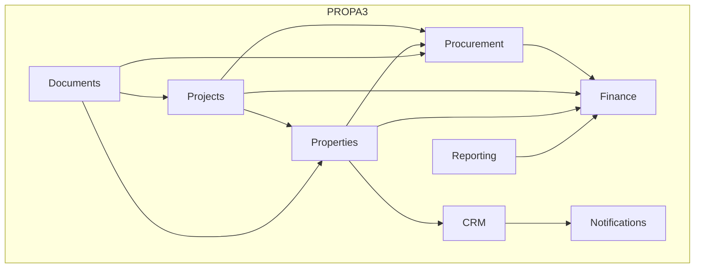

## M.2 Procurement categories feed

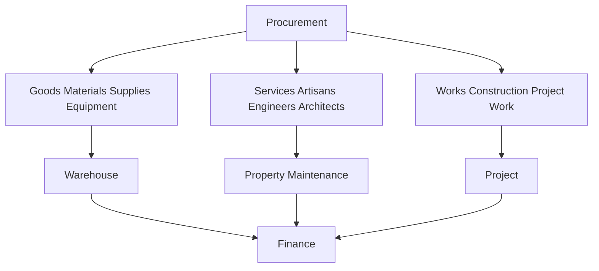

## M.3 Complete property sales journey (CONFIRMED + PROPOSED tail)

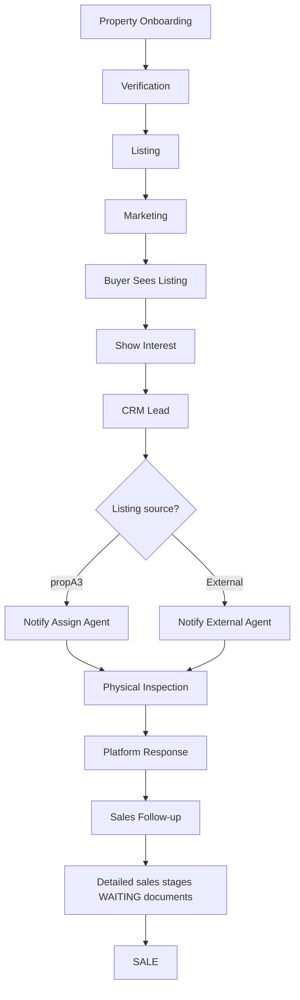

## M.4 Complete tenancy journey (CONFIRMED)

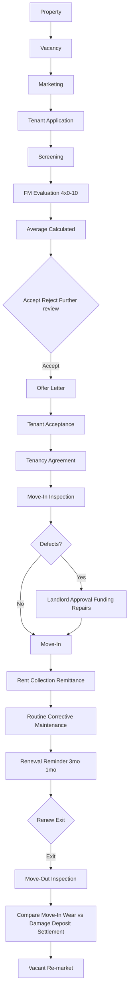

## M.5 Complete maintenance journey (CONFIRMED)

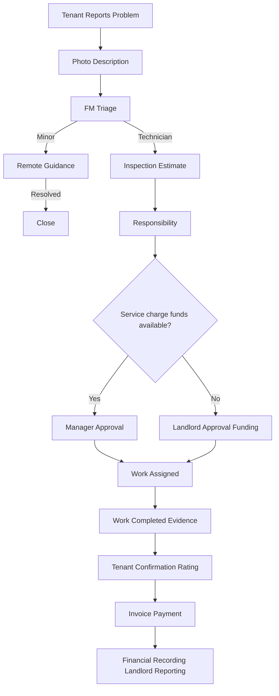

## M.6 Project to Property to Management lifecycle (CONFIRMED spine)

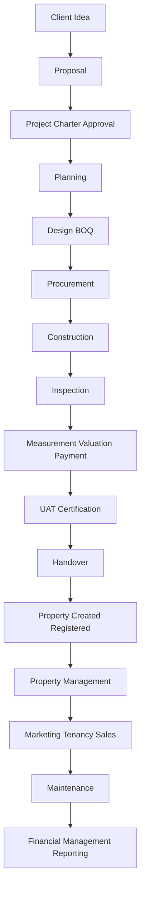

## M.7 Project management process groups (CONFIRMED methodology)

Initiation → Planning → Execution → Monitoring & Controlling → Closure.

Initial emphasis: building construction; structure must allow other project types where appropriate.

A project has: defined beginning; defined end; resources; objective/output; stakeholders; activities; costs; schedule; deliverables; approvals; evidence; completion criteria.

### M.7.1 Planning contents (CONFIRMED)

Kickoff; site survey; requirements; design; BOQ; schedule; HR; equipment; stakeholders; quality; procurement; safety; communication; scope; change management; resource planning; approvals.

### M.7.2 Design package (CONFIRMED)

| Discipline | Contents |
|------------|----------|
| Architectural | Drawings; layout; design documentation |
| Structural | Feasibility; stability; structural requirements (with architect) |
| MEP | Electricity; lighting; AC; water; plumbing; waste; passages; sleeves/openings |

### M.7.3 Soil test (CONFIRMED triggers)

Especially for high-rise/multi-storey; high loads; uncertain soil. Determines **soil bearing capacity** → foundation type/design.

### M.7.4 Dev Control / FCT (CONFIRMED tracking)

Submission; approval status; approval documents; amendments; dates; authority; inspection/approval evidence. References: Department of Development Control; FCT Ministry; applicable codes.

### M.7.5 Monitoring principle (CONFIRMED)

Work → Measurement → % Completion → Valuation → Payment.

Amount allocated → work progresses → measured → % complete → payment per approved arrangement.

Daily / weekly / monthly / milestone frequencies — align with Document 3 (EXTRACTED) and Part B.5.

### M.7.6 Pre-concrete internal control (CONFIRMED checklist domains)

Drawings · Formwork · Reinforcement · MEP · Materials/Site · Weather/Documentation · Safety · Approvals (consulting engineer, site manager, site supervisor). Full itemisation remains in Part B.3 / Document 4 / verbal pre-pour.

### M.7.7 Closure package (CONFIRMED)

UAT → Fitness for use certification → Financial closure (subs, workers, vendors) → Client satisfaction → Handover (maintenance may continue) → Retrospective → Testimonials → Continuous improvement.

**Guzape closeout lesson (EXTRACTED):** Closure is not merely construction complete — post-completion M&E issues, satisfaction, and maintenance obligations remain traceable.

### M.7.8 Commercial vs personal projects (CONFIRMED)

| Type | Capture emphasis |
|------|------------------|
| Commercial | Costs; benefits; profitability; commercial viability; expected returns |
| Personal / non-commercial | What matters most to the client |

Charter remains ~one page: title; client; goal; high-level scope; approximate cost range; approximate duration; expected benefits; key stakeholders; project authority; client + company sign-off. Project officially begins only after required initiation requirements and approvals.

### M.7.9 Equipment planning (CONFIRMED)

Plan machinery; equipment; tools; required dates; availability; sourcing; local availability; external/international procurement where required (order early if not local).

### M.7.10 Quality principle (CONFIRMED)

"Quality doesn't happen by accident." Applies to: material sourcing; workmanship; design compliance; construction methods; specified materials; industry standards. Check quality marks; standards; manufacturer reputation; compliance; testing where required. Blocks: mix ratio; reputable manufacturers; vendor records. Artisans: identify; evaluate; interview; train/upskill. Measurement: lasers; levelling instruments for height/depth/level/alignment.

### M.7.11 Safety (CONFIRMED)

Applies to workers; visitors; public; site operations. PPE where required: helmets; reflective jackets; gloves; safety belts; other appropriate PPE.

### M.7.12 Construction sequence (CONFIRMED list)

Site clearance → Setting out → Excavation → Blinding → Foundation/footing → Reinforcement → Formwork → Concrete casting → Trench excavation for walls → Blockwork → Plinth beam where required → Blockwork to DPC → Hollow filling where applicable → Backfilling/compaction → MEP sleeves → Slab preparation → Slab concrete → Curing → Blockwork to lintel → Head-course → Concrete columns/head-course → Lift shaft where applicable → Upper-floor construction → Beam/slab/staircase formwork → Reinforcement → MEP sleeves → Inspection before concrete.

### M.7.13 IVC / mobilisation (CONFIRMED)

IVC fields: work description; subcontractor; account details; scope/SOW; contract reference; contract amount; delivery duration; start/end; measured work; payment info. Payment table: S/N; stage; work achieved %; amount paid; % paid; payment date; performance comments. Milestones include mobilisation + first through fifth. Mobilisation payment may be made initially; if no work commenced Measured work = 0%. Subsequent payments performance-based. PM/supervisor recommends completion status, %, full vs partial payment. Accountability: Work → Measurement → Valuation → Approval → Payment.

### M.7.14 Mixed-use / Guzape examples

Remain EXTRACTED in Part B / Part C (Doc 1 charter; Doc 7 closeout). Use as acceptance fixtures, not alternate schemas.

---

# Part N: Project Management Detail Index (BRD ↔ Part B)

> Full phase workflows, user stories, and embedded Abraham documents remain in **Part B**. This index maps Master BRD sections to build locations so nothing is orphaned.

| BRD topic | Master location | Evidence |
|-----------|-----------------|----------|
| Client requirement / land / proposal / charter | B.1 | CONFIRMED + Doc 1 charter example |
| Kick-off | B.2.1 | EXTRACTED Doc 2 |
| Site survey & requirements | B.2.2 | CONFIRMED |
| Design Arch/Structural/MEP + TDP/C of O attaches | B.2.3 + A.7.1 | CONFIRMED |
| Soil test | B.2.4 | CONFIRMED |
| BOQ & cost distinctions | B.2.5 + I.5 | CONFIRMED concepts; template WAITING |
| Dev Control | B.2.6 | CONFIRMED |
| WBS / Gantt / time | B.2.7 | EXTRACTED Sheet 1 |
| HR / personnel log / labour + material schedules | B.2.8 + A.7.1 | Partial EXTRACTED; personnel WAITING |
| Equipment planning | M.7.9 + B.2 | CONFIRMED need |
| Stakeholders / communication / progress report | B.2.9–B.2.11 + B.5.1 | EXTRACTED Sheet 3 |
| Scope / change log | B.5.2 | EXTRACTED Sheet 6 |
| Quality / vendors / artisans | B.4 + Part J | CONFIRMED |
| Safety / PPE | M.7.11 / ethics | CONFIRMED + Infographic 2 |
| Execution sequence | B.3 + M.7.12 | CONFIRMED |
| Pre-concrete control | B.3 + M.7.6 | CONFIRMED verbal |
| Daily site log | B.3 | EXTRACTED Sheet 4 |
| IVC / mobilisation / payment control | B.5.3 + M.7.13 | EXTRACTED Doc 6 |
| 20-section inspection log | B.3 | EXTRACTED Doc 4 |
| Closure / UAT / retrospective | B.6 | EXTRACTED Doc 7, Doc 8 |
| Mixed-use example | B.1 / Part C Doc 1 | EXTRACTED |
| Property / Sales / Procurement 3-cat / KYC | Parts G–J | CONFIRMED (this imbibe) |
| Fee rules 2.5% / 10% | Part I + L | CONFIRMED |
| Documents expected / do not invent | Part F | WAITING list |

**Builder instruction:** Implement Part B + Parts G–M together. For every WAITING row in Part F, ship attachment + draft schema only — never invent contractual text, pass marks, commission %, or post-inspection sales stages.

# Part F: Gaps — Validation Needed

> **Rule:** Do not invent values for WAITING items. Build with configurable enums / draft schemas; mark UI as "pending client document" where needed. When Abraham uploads a document: extract → gap-reconcile against this Part F → mark **confirmed / contradicted / expanded / new / still unresolved** → then update schemas.

## F.1 Classification of current knowledge

| Class | Meaning | Action for builders |
|-------|---------|---------------------|
| **CONFIRMED** | Client stated explicitly in conversation | Implement as specified |
| **EXTRACTED** | From Abraham Google Docs/Sheets/infographics | Implement field-for-field |
| **PROPOSED** | Industry/logical design, not client-confirmed | Implement only behind feature flags or label as draft; validate before go-live |
| **WAITING** | Client will provide document | Schema stub + attachment slot; no invented clauses/scores/fees beyond CONFIRMED |

## F.2 Documents still expected (priority)

### F.2.0 Incoming Google Docs batch (Sep 8, 2026) — EXTRACTED

| # | Document | Status |
|---|----------|--------|
| 9 | Inventory Condition (Move-in/out) | **EXTRACTED** Doc 9 |
| 10 | Offer Letter (Guzape 2-bed example) | **EXTRACTED** Doc 10 |
| 11 | PM Services Proposal (Dawaki) | **EXTRACTED** Doc 11 |
| 12 | Tenant Application Personal Data | **EXTRACTED** Doc 12 |

### F.2.1 Production-default templates policy (Sep 8, 2026)

> **Product decision:** Missing Abraham forms are covered by **PRODUCTION DEFAULT** templates in \`planning/templates/provisional/\`.  
> They are complete enough to **ship and operate** if Abraham never sends alternatives.  
> If he later uploads a different document → extract → replace the matching default → mark EXTRACTED.  
> Abraham CONFIRMED rules (SC spend boundary, fees, scoring method, photo requests, inspections) are baked into these defaults.  
> Conveyancing / court recovery still may involve counsel for a specific matter; the in-app forms remain operationally complete.

Index: [`planning/templates/provisional/README.md`](../templates/provisional/README.md)

### Property Management — status

| Document | Status | File / note |
|----------|--------|-------------|
| Tenant application form | **EXTRACTED** Doc 12 | — |
| Tenant selection/evaluation form | **PRODUCTION DEFAULT** | \`TENANT_EVALUATION_SCORES.md\` (method CONFIRMED + default bands) |
| Offer letter | **EXTRACTED** Doc 10 | — |
| Offer acceptance | **PRODUCTION DEFAULT** | \`OFFER_ACCEPTANCE.md\` |
| Full tenant / FM / landlord agreement | **PRODUCTION DEFAULT** | \`FM_LANDLORD_AGREEMENT.md\` |
| Tenancy agreement | **PRODUCTION DEFAULT** | \`TENANCY_AGREEMENT.md\` |
| Move-in / move-out inspection | **EXTRACTED** Doc 9 | — |
| Maintenance request | **PRODUCTION DEFAULT** | \`MAINTENANCE_REQUEST.md\` |
| Maintenance work order | **PRODUCTION DEFAULT** | \`MAINTENANCE_WORK_ORDER.md\` |
| Maintenance invoice | **PRODUCTION DEFAULT** | \`MAINTENANCE_INVOICE.md\` |
| Service-charge statement | **PRODUCTION DEFAULT** | \`SERVICE_CHARGE_STATEMENT.md\` |
| Landlord remittance | **PRODUCTION DEFAULT** | \`LANDLORD_REMITTANCE.md\` |
| Renewal notices | **PRODUCTION DEFAULT** | \`RENEWAL_NOTICE.md\` |
| Possession / arrears notices | **PRODUCTION DEFAULT** | \`POSSESSION_ARREARS_NOTICE.md\` |

### Sales — status

| Document | Status | File |
|----------|--------|------|
| Property listing form | **PRODUCTION DEFAULT** | \`PROPERTY_LISTING.md\` |
| Buyer enquiry / interest | **PRODUCTION DEFAULT** | \`BUYER_INTEREST.md\` |
| Inspection / viewing + feedback | **PRODUCTION DEFAULT** | \`SALES_VIEWING_INSPECTION.md\` |
| Sales offer / quotation | **PRODUCTION DEFAULT** | \`SALES_OFFER_QUOTATION.md\` |
| Sales agreement | **PRODUCTION DEFAULT** | \`SALES_AGREEMENT.md\` |
| Payment schedule | **PRODUCTION DEFAULT** | \`SALES_PAYMENT_SCHEDULE.md\` |
| Receipt | **PRODUCTION DEFAULT** | \`../PAYMENT_RECEIPT.md\` |
| Commission arrangement | **PRODUCTION DEFAULT** (configurable %) | \`COMMISSION_ARRANGEMENT.md\` |
| Sale handover | **PRODUCTION DEFAULT** | \`PROJECT_HANDOVER.md\` |
| JV submission / agreement | **PRODUCTION DEFAULT** | \`JV_SUBMISSION.md\` |

### Procurement — status

| Document | Status | File |
|----------|--------|------|
| Purchase requisition | **PRODUCTION DEFAULT** | \`PURCHASE_REQUISITION.md\` |
| Supplier registration | **PRODUCTION DEFAULT** | \`SUPPLIER_REGISTRATION.md\` |
| Supplier evaluation | **PRODUCTION DEFAULT** | \`SUPPLIER_EVALUATION.md\` |
| Purchase order | **PRODUCTION DEFAULT** | \`PURCHASE_ORDER.md\` |
| Goods receipt / GRN | **PRODUCTION DEFAULT** | \`GOODS_RECEIPT_NOTE.md\` |
| Material request | **PRODUCTION DEFAULT** | \`../MATERIAL_REQUEST.md\` |
| Artisan KYC | **PRODUCTION DEFAULT** | \`ARTISAN_KYC.md\` |
| Service request | **PRODUCTION DEFAULT** | \`SERVICE_REQUEST.md\` |
| Artisan estimate | **PRODUCTION DEFAULT** | \`ARTISAN_ESTIMATE.md\` |
| Work completion | **PRODUCTION DEFAULT** | \`WORK_COMPLETION.md\` |
| User satisfaction / rating | **PRODUCTION DEFAULT** | \`USER_SATISFACTION_RATING.md\` |

### Works / Construction — status

| Document | Status | File |
|----------|--------|------|
| Contractor / subcontractor agreement | **PRODUCTION DEFAULT** | \`SUBCONTRACTOR_AGREEMENT.md\` |
| BOQ template | **PRODUCTION DEFAULT** | \`../BOQ_TEMPLATE.md\` |
| Material schedule | **PRODUCTION DEFAULT** | \`MATERIAL_SCHEDULE.md\` |
| Personnel log | **PRODUCTION DEFAULT** | \`PERSONNEL_LOG.md\` |
| Project handover | **PRODUCTION DEFAULT** | \`PROJECT_HANDOVER.md\` |
| IVC / inspection / closeout | **EXTRACTED** | Docs 4, 6, 7 |

## F.3 What we must NOT invent yet

| Area | Do not invent |
|------|----------------|
| Tenant score interpretation | Pass mark, preferred/acceptable/reject bands, weighting |
| Landlord-specific preferences | Hidden criteria content |
| Exact tenancy clauses | Responsibilities matrix |
| Maintenance responsibility matrix | Who pays what |
| Service-charge accounting | Reserved/unspent levy treatment |
| Exact renewal / termination / possession notices | Legal text & timelines beyond 3mo/1mo reminders |
| Sales stages after inspection | Offer → negotiation → agreement → payment → closing |
| Negotiation / sales approval authority | Who can accept |
| Sale payment structure / title transfer | Process |
| Commission structure | Internal or external agent |
| JV commercial structure | Shares, returns |
| Procurement approval hierarchy | Exact chain of command |
| Supplier scoring methodology | Weights |
| Exact artisan payment process | Beyond confirmation-before-pay + 2.5% rule |
| Exact rating scale | Beyond "configurable; 1–5 discussed" |
| Exact notification channels | SMS/email/WhatsApp mix |
| Exact RBAC matrix for every screen | Beyond role lists in Part E |
| Goods procurement service charge % | Not specified |
| VAT / tax on 2.5% / 10% fees | TBD |

## F.4 Confirmed items that ARE buildable now (no wait)

| Rule | Spec |
|------|------|
| Tenant scoring | 4 criteria × 0–10; FM assigns; system averages; tenant does not self-score |
| Maintenance spend boundary | Available service-charge funds — not fixed ₦ threshold; escalate if over |
| Sales interest | Show Interest → CRM; identify propA3 vs external agent listing |
| Physical inspection | Mandatory for every buyer interest path |
| Post-inspection | Platform response/update required |
| Procurement categories | Goods · Services · Works |
| Services fee | 2.5% of service/labour fee **excluding materials** |
| Professionals fee | 2.5% of professional fee |
| Works fee | ~10% of total project cost |
| Artisan service request | Photo + description + component + work required |
| Completion before payment | User confirmation + feedback/rating |
| Artisan KYC | Name, business, CAC, NIN/ID, address, phone, guarantor + phone |
| Cost model (projects) | Distinguish estimated · approved budget · actual · committed · remaining |
| Project → Property | Completed project registers/creates property asset for management/sale |

## F.5 Open stubs (build with draft schema)

| Item | Status | Action |
|------|--------|--------|
| BOQ template | Verbal | Abraham upload |
| Material Schedule | Verbal (A.7) | Confirm columns |
| Material Request / PO / GRN | Draft / missing | Upload templates |
| Personnel log | Verbal | Confirm format |
| Properties module depth | Expanded in Part G — agreements WAITING | Extract agreement when received |
| Sales pipeline post-inspection | PROPOSED in Part H | Validate with sales docs |
| UAT / Fitness certificate | Draft | Confirm forms |
| Management plans (9–10) | Named | Templates WAITING |

## F.6 Gap reconciliation procedure (when documents arrive)

1. Extract document verbatim into `planning/extractions/`.
2. Map each field/clause to Part G / H / I / J / B.
3. Tag each item: **confirmed** | **contradicted** | **expanded** | **new** | **still unresolved**.
4. Update Form Registry (A.7) and this Part F.
5. Do **not** rewrite the master from scratch.

---

*End of Abraham / Triple A Master Build Document*
