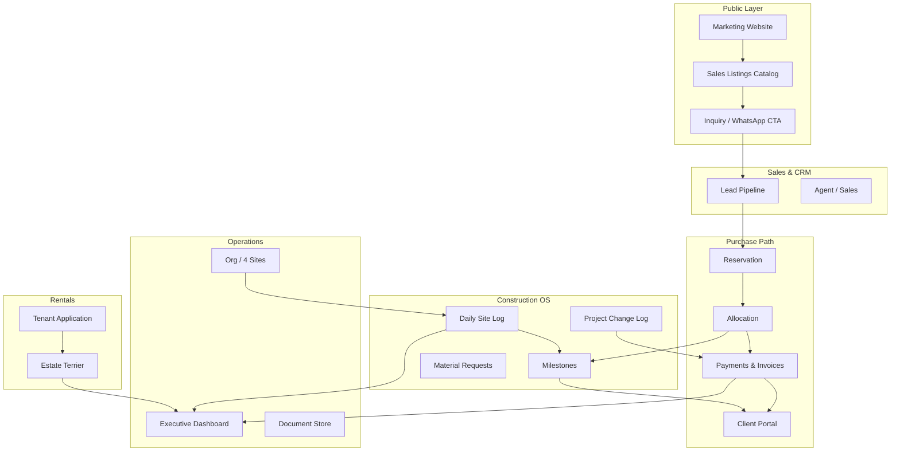

# Propa3 — Application Workflows (Complete System Map)

> **Derived from:** All real documents (Jul 16, 2026) + Team Charter + Company Profile  
> **Companion:** `OPERATIONAL_FORMS.md` (exact fields), `USER_JOURNEYS.md` (persona flows)  
> **Principle:** Every form = a live feature, automated to exact layout and business rules

---

## System Architecture Overview



---

## Module 1: Sales Listings (FOR SALE PROPERTIES)

**Source:** `FOR SALE PROPERTIES TRIPLE A REALTY.pdf`  
**Seed:** `data/LISTINGS_SEED.json`

### Workflow

```
1. Admin imports/syncs listing from catalog (or adds manually)
2. Listing published to public site with:
   - Location, type, finish (FF/SF), payment plan options, price tiers
3. Buyer searches/filters (area, bedrooms, finish, price range, plan type)
4. Buyer clicks "Inquire" or WhatsApp → CRM lead created with listing_id
5. Sales moves lead through pipeline
6. On close → convert to sale record → link to plot/unit OR external property
```

### Payment Plan Engine

When listing has multi-tier pricing (Outright / 6M / 12M / 18M):

```
Client selects plan at reservation
  → System loads correct price_*
  → Generates installment schedule from plan duration
  → Each installment appears in client portal + finance queue
```

### Listing Status Machine

`available` → `reserved` → `sold` → `archived`

### Integration Points

| Trigger | Action |
|---|---|
| New inquiry on listing | CRM lead + notify sales |
| Listing reserved | Status update; plot map color → Reserved |
| Payment plan selected | Finance schedule created |

---

## Module 2: CRM & Lead Pipeline

### Stages

`Inquiry` → `Contacted` → `Viewing Scheduled` → `Negotiation` → `Reserved` → `Won` / `Lost`

### Lead Sources (auto-tagged)

- Website form
- WhatsApp click (`wa.me/2349121061221`)
- Instagram (manual or UTM)
- Walk-in
- Referral

### On `Won`

1. Create `client` account
2. Link to `listing_id` or `plot_id`
3. Trigger allocation letter generation
4. Open client portal access
5. If agent involved → queue commission calc (Phase 2)

---

## Module 3: Construction — Daily Site Log

**Source:** `Guzape Site Daily activities Tracker` (authoritative)  
**Form ID:** `FORM_DAILY_SITE_LOG`

### Daily Automation Timeline

| Time | System Action |
|---|---|
| 06:00 | Push reminder to foreman: "Prepare morning briefing" |
| 12:00 | If no log started → reminder |
| 17:00 | "Complete log before leaving site" warning |
| 18:00 | If not submitted → alert PM + foreman (Team Charter compliance) |
| On submit | PM notification; data feeds milestone %; materials update store ledger |
| On incident flag | Auto-draft HSE incident form |
| PM approve | Log locked; visible in client portal (photos + summary only) |

### Ref Code Generation

```python
# Pattern: AAA/{SITE}/{PROJECT_NUM}/{MONTH}/{YEAR}/{SEQ}
# Example: AAA/GZP/530/JULY/2026/01
```

### Data Feeds

| Section | Feeds into |
|---|---|
| Activities + progress % | Milestone rollup |
| Manpower counts | HR/site analytics |
| Materials consumed | Store inventory (Phase 2) |
| Quality checks | Compliance report |
| Issues | PM alert + delay register |
| Next day plan | Tomorrow's task pre-fill |

### Offline Flow

```
Foreman opens PWA (no signal)
  → Fills all 10 sections
  → Signs supervisor field
  → Taps Submit → saved to IndexedDB queue
  → Signal returns → auto-sync
  → Server validates → notifies PM
```

---

## Module 4: Project Change Log (Jikwoyi + all projects)

**Source:** `PROJECT CHANGE LOG.xlsx`  
**Form ID:** `FORM_PROJECT_CHANGE_LOG`

### Workflow

```
1. Originator creates change (site, client, design, PM)
2. Status = In Review
3. PM assesses impact (High/Med/Low)
4. If High impact → CEO approval required
5. Approved →
   a. Update BOQ line items
   b. Adjust milestone schedule
   c. Generate invoice variation (V-01, V-02…) per invoice template
   d. Notify client (Agile open-book)
6. Rejected → log reason; notify originator
```

### Links

| Entity | Relationship |
|---|---|
| `project_id` | Required — e.g. Jikwoyi Mix-Use |
| `invoice_id` | Approved changes spawn variation lines |
| `milestone_id` | Time impact adjusts dates |
| `client_portal` | Approved changes visible to client |

### Excel Export

Admin can download `.xlsx` matching Abraham's original column layout for offline sharing.

---

## Module 5: Finance — Invoices & Payments

**Source:** `invoice Triple A.docx`  
**Form ID:** `FORM_INVOICE`

### Invoice Types

| Type | Use |
|---|---|
| `sales` | Property purchase installments |
| `variation` | Change order billing (V-01…) |
| `agency` | 20% tenant agency fee |
| `service` | Solar, finishing, consultancy (Laucarie example) |
| `rental` | Monthly rent from Estate Terrier |

### Invoice Lifecycle

```
Draft → Sent → Partially Paid → Paid → Overdue → Cancelled
```

### Payment Verification Flow (Phase 1)

```
1. Client sees settlement routing on invoice PDF:
   Bank: Polaris Bank Plc | A. A LAUCARIE CONSULTING | 4091991156
   (Configurable per entity — Triple A account TBC)

2. Client pays via bank transfer

3. Client uploads proof in portal OR finance receives bank alert

4. Finance user verifies → status = Verified

5. System:
   - Updates payment ledger
   - Recalculates outstanding balance
   - Generates receipt PDF
   - If reservation fee → trigger allocation workflow
   - If milestone payment → unlock next milestone gate
```

### Variation on Invoice (from real invoice)

```
Base contract lines
  + Approved variation V-01 (linked to change log)
  = Revised Total Contract Value
  - Paid to date (Milestone 1 & 2)
  = Outstanding Net Balance Due
```

### Milestone Payment Labels

Invoice supports: `Milestone 1`, `Milestone 2`, etc. — tied to Foundation/Shell/Finishing gates.

---

## Module 6: Client Portal

### What client sees (per purchased property)

| Screen | Data source |
|---|---|
| Dashboard | Plot, PM contact, next payment, milestone % |
| Progress | Daily log summaries (approved), photo gallery |
| Payments | Invoice list, outstanding, upload proof, receipts |
| Documents | Allocation letter, contract, permits |
| Changes | Approved variations from change log |
| Messages | PM thread |

### Access Control

- Client sees **only their** plot/project
- No raw foreman notes — PM-approved summaries only
- Financial data: own invoices only

---

## Module 7: Rentals — Tenant Application + Estate Terrier

### Tenant Onboarding Flow

```
1. Prospect fills FORM_TENANT_APPLICATION (digital)
2. Accepts legal clauses (20% agency fee)
3. System calculates agency_fee = rent_accepted × 0.20
4. Generates agency invoice
5. PM reviews application
6. On approve:
   a. Create tenant profile
   b. Assign unit in Estate Terrier (Dawaki Block of Flats)
   c. Set tenancy_start, rent_amount, caution_deposit
   d. Schedule rent reminders
7. On first rent payment → update Terrier row (DATE PAID, RENT PAID/FIXED)
```

### Estate Terrier Operations

**Source:** `Estate Terrier 2.pdf` — Dawaki Block of Flats

| Action | System |
|---|---|
| Add tenant row | Fill all 16 columns |
| Record rent payment | Update DATE PAID, MODE, amount |
| Record expense | EXPENSE DESCRIPTION + AMOUNT → recalc NET INCOME |
| Tenancy ending | Alert 60 days before TENANCY TERMINATION DATE |
| Vacancy | Clear tenant fields; status = Available |

### Estate Terrier Dashboard

- Total units / occupied / vacant
- Monthly gross rent vs expenses vs net income
- Upcoming lease expirations
- Arrears (rent not marked Paid by due date)

---

## Module 8: Organization & Site Assignment

**Source:** `Triple A PROJECT STRUCTURE.pdf`

### Four Live Sites

| Site ID | Name | Marketing |
|---|---|---|
| `JKW` | Jikwoyi | Jikwoyi Plaza / Mix-Use Devt |
| `MPP` | Mpape | Mall Mpape |
| `GZ2` | Guzape II | Vida Shelter / Bilamm |
| `GZ3` | Guzape III | Boing Estate |

**Plus Guzape daily tracker project:** 6-bedroom luxurious duplex (`AAA/GZP/...`)

### Site Team Template (per site)

- 1 Site Manager (PM)
- 1 Store/Stock Manager
- 2 Site Supervisors (Foremen)
- N Artisans/Labourers

### Daily Log Routing

```
Foreman submits log
  → project_id determines site
  → notifies that site's PM
  → rolls up to CEO dashboard by site
```

---

## Module 9: Milestones (Agile + Portfolio)

### Standard Milestones

`Foundation` → `Shell` → `Finishing` → `Handover`

### Progress Calculation

```
milestone.progress = weighted average of:
  - daily log activity progress_% (for matching stage)
  - PM manual override (if needed)
```

### Gates (business rules)

| Gate | Requirement |
|---|---|
| Foundation → Shell | FCDA permit uploaded; engineer inspection Pass |
| Shell → Finishing | Structural certification (COREN) |
| Finishing → Handover | Snag list cleared; final payment |

### Client Portal Sync

On milestone update → client sees new % + photo set + PM weekly report attachment

---

## Module 10: Notifications Matrix

| Event | Recipients | Channel |
|---|---|---|
| Daily log submitted | PM | In-app + email |
| Daily log overdue 18:00 | Foreman, PM | Push/email |
| Material shortage flagged | PM, Store Mgr | In-app |
| HSE incident flagged | PM, CEO, HR | In-app immediate |
| Change log submitted | PM | In-app |
| Change approved (High) | CEO, Client | In-app + email |
| Payment proof uploaded | Finance | In-app |
| Payment verified | Client | Email + portal receipt |
| Tenant application submitted | PM | In-app |
| Rent due in 7 days | Tenant | Email/SMS Phase 2 |
| Tenancy ending 60 days | PM, Tenant | In-app |
| COREN licence expiring | Engineer, CEO | In-app (30/7 days) |
| New listing inquiry | Sales | In-app |

---

## Module 11: Document & PDF Generation

| Document | Trigger | Template source |
|---|---|---|
| Daily site log PDF | On PM approval | `FORM_DAILY_SITE_LOG` |
| Invoice PDF | On send | `FORM_INVOICE` |
| Receipt PDF | On payment verify | `PAYMENT_RECEIPT` + invoice style |
| Allocation letter | On reservation verified | `ALLOCATION_LETTER` |
| Change log Excel | On demand | `FORM_PROJECT_CHANGE_LOG` |
| Tenant application PDF | On submit | `FORM_TENANT_APPLICATION` |
| Estate Terrier report | Monthly | `MODULE_ESTATE_TERRIER` |

All PDFs use Triple A logo (`WhatsApp Image 2026-07-15.jpeg`) + navy/orange brand colors.

---

## Module 12: Executive Dashboard (CEO)

### Widgets (real-time)

| Widget | Data |
|---|---|
| Active projects (4 sites) | Org structure |
| Today's log submission rate | Per site: submitted/expected |
| Open change requests | Jikwoyi + all |
| Revenue MTD | Invoices paid |
| Outstanding receivables | Invoice outstanding balances |
| Sales pipeline | CRM stage counts |
| Listings inquiries this week | CRM source=web |
| Rental net income | Estate Terrier rollup |
| Compliance | COREN expiry, SCUML, FCDA permits missing |

---

## Phase 1 Build Sequence (from real docs)

| Order | Feature | Source doc |
|---|---|---|
| 1 | Auth + org/RBAC | PROJECT STRUCTURE.pdf |
| 2 | Sales listings import | FOR SALE PROPERTIES.pdf |
| 3 | CRM leads | Inquiry workflow |
| 4 | Daily site log PWA | Guzape Tracker.pdf |
| 5 | Milestones + client portal | Company Profile Agile |
| 6 | Invoice + payment proof | invoice Triple A.docx |
| 7 | Project change log | PROJECT CHANGE LOG.xlsx |
| 8 | Tenant application | TENANT APPLICATION.docx |
| 9 | Estate Terrier Dawaki | Estate Terrier 2.pdf |
| 10 | CEO dashboard | All modules rollup |

---

## Entity Relationship Summary

```
Organization (Triple A)
├── Sites (JKW, MPP, GZ2, GZ3)
│   └── Projects
│       ├── Daily Logs
│       ├── Change Logs
│       ├── Milestones
│       └── Material Requests
├── Listings (sales catalog)
│   └── Leads → Clients
│       ├── Invoices → Payments → Receipts
│       └── Plots/Units → Allocation
├── Estates (Dawaki, etc.)
│   └── Estate Terrier Rows
│       └── Tenant Applications → Tenants
└── Users (RBAC from org chart)
```

---

## Gaps Closed by These Documents

| Previous gap | Now filled by |
|---|---|
| BOQ structure | Template remains; change log links to BOQ updates |
| Daily site log exact fields | Guzape Tracker PDF |
| Invoice layout + variations | invoice Triple A.docx |
| Payment/bank details | Laucarie Consulting Polaris account (configurable) |
| Listing prices | FOR SALE PROPERTIES (80+ entries) |
| Rental management | Estate Terrier + Tenant Application |
| Change order process | PROJECT CHANGE LOG.xlsx |
| Org/RBAC | PROJECT STRUCTURE.pdf |
| Payment rail vision | Pix research → Phase 2 Paystack/QR |

---

## Abraham Action Items (Remaining)

| Item | Why still needed |
|---|---|
| Confirm Triple A corporate bank (vs Laucarie Consulting) | Invoice settlement routing |
| Approve listing prices marked TBD | Public display |
| Legal review allocation/sales agreement | Handover docs |
| Commission % for agents | Phase 2 agent module |
| Additional Estate Terrier estates beyond Dawaki | Clone register |

Everything else is **specified and buildable** from documents on hand.
