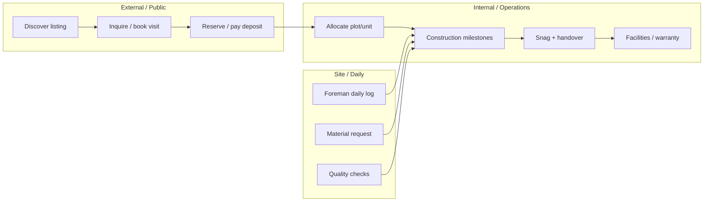

# Propa3 — User Journeys

> **Derived from:** Team Charter, Company Profile, Daily Site Log (Document 2), Agile operating model  
> **Priority:** Abraham's documents override these flows when they arrive  
> **Purpose:** Stitch modules into workflows — not isolated screens

---

## Journey Map Overview

---

## 1. Investor / Buyer Client Journey

**Persona:** High-value residential or commercial investor (primary audience from content calendar)  
**Channels:** Instagram, WhatsApp, website, referral  
**Triple A values reflected:** Integrity (transparent progress), Collaboration (Agile change orders)

### Stages

| # | Stage | Actor | System touchpoints | Data created |
|---|---|---|---|---|
| 1 | **Discovery** | Client | Public website — listings, project showcase, map | Page view, optional saved search |
| 2 | **Inquiry** | Client → Sales | Contact form, WhatsApp deep-link, or "Book consultation" CTA | **Lead** in CRM (source: Instagram/WhatsApp/web) |
| 3 | **Qualification** | Sales / PM | CRM pipeline; notes on budget, timeline, property type | Lead score, buyer preferences |
| 4 | **Consultation** | PM + Client | Calendar booking; meeting notes in CRM | Appointment, consultation record |
| 5 | **Proposal** | PM | Share project brief, payment plan options, BOQ summary (if custom build) | Quote / proposal document |
| 6 | **Reservation** | Client | Pay reservation fee — bank transfer + proof upload (Phase 1) or gateway (Phase 2) | **Reservation** record, payment pending verification |
| 7 | **Contract** | Legal / PM | Allocation letter or sales agreement; digital acceptance | **Contract** + document version |
| 8 | **Plot/unit allocation** | PM | Assign plot in estate map; status → Reserved/Allocated | Plot record linked to client |
| 9 | **Installment payments** | Client | Client portal — schedule, upload proof, download receipts | Payment ledger, receipt PDF |
| 10 | **Construction visibility** | Client (read-only) | Portal milestone view: Foundation → Shell → Finishing %; site photos; weekly PM report | Progress snapshots (no edit rights) |
| 11 | **Change request** | Client → PM | Variation register — scope/cost/time impact; Agile approval | **Change order** with audit trail |
| 12 | **Interim certificate** | Engr. Kanadi / PM | Milestone sign-off (Team Charter: interim completion certs) | Engineering certification doc |
| 13 | **Snagging** | Client + PM | Snag list walkthrough; defect tickets | Snag items with photos |
| 14 | **Handover** | PM | Final payment clearance; keys; C of O / allocation docs | **Handover** record, unit status → Complete |
| 15 | **Post-delivery** | Client | Facilities ticket (repairs, maintenance) | Maintenance ticket + SLA |

### Client portal — minimum screens (Phase 1)
1. Dashboard — my property, next payment, current milestone %
2. Payments — schedule, history, upload proof, receipts
3. Progress — milestone timeline + photo gallery
4. Documents — contracts, receipts, certificates
5. Messages — thread with assigned PM (in-app; WhatsApp link optional)
6. Support — request inspection, report snag

### Business rules (from Team Charter + Agile)
- No hidden costs — all variations in change order register
- Weekly written progress report auto-generated from site logs + PM narrative
- Client cannot approve substandard work — view only on quality checks
- FCDA permit must exist before Foundation milestone marked complete

---

## 2. Sales Agent Journey

**Persona:** Internal or partner agent driving leads to close  
**Note:** Commission rules pending Abraham; flow supports configurable %

| # | Stage | Actor | System | Output |
|---|---|---|---|---|
| 1 | Lead capture | Agent | CRM — manual entry or import from social DM | Lead assigned to agent |
| 2 | Follow-up | Agent | CRM reminders, comms history, WhatsApp link | Activity log |
| 3 | Site visit | Agent + Client | Book tour; QR check-in at site gate | Visit record, GPS/time |
| 4 | Pipeline | Agent | Move lead: Inquiry → Viewing → Negotiation → Reserved | Pipeline stage |
| 5 | Handoff to PM | Agent | On reservation, notify PM; link lead to project/plot | Lead → Client conversion |
| 6 | Commission | Finance | On handover + full payment, calculate per rules | Commission record |

### Agent app — minimum screens (Phase 2)
- My leads & pipeline
- Today's follow-ups
- Book site visit
- Log call/WhatsApp note
- My commissions (read-only until payout)

---

## 3. Foreman / Site Supervisor Journey

**Persona:** Frontline supervisor at Jikwoyi, Mpape, Guzape, or Lugbe  
**Critical constraint:** Must work **offline** on site; sync when connectivity returns  
**Team Charter rule:** Daily log submitted **before leaving site**

### Daily loop

| Time | Action | System |
|---|---|---|
| **06:30** | Morning briefing | Review yesterday's "Plan for Next Day"; assign tasks to artisans | Mobile — task list (read) |
| **07:00–16:00** | Execute work | Log activities, manpower, materials as they happen | Mobile — partial save offline |
| **Throughout** | Quality & safety | Tick slump test, cube casting, PPE, toolbox talk, incidents | Checkboxes in daily log |
| **16:30** | Close-out | Complete sections 1–10 of Daily Site Log | **Submit** — triggers PM notification |
| **If blocked** | Escalate | Material shortage, equipment breakdown, weather | Flags in §8 Issues; instant alert to PM |

### Daily Site Log — field mapping (from Document 2)

| Section | App fields | Validation |
|---|---|---|
| 1 Project Details | project_id, date, weather enum, supervisor_id | Required |
| 2 Work Executed | activities[], location, progress_% (0–100) | Min 1 row |
| 3 Manpower | skilled, unskilled, supervisors counts | Non-negative |
| 4 Machinery | equipment[], hours/units | Optional |
| 5 Materials | material, received, consumed, balance | Links to inventory if Phase 2 |
| 6 Quality | slump_test, cube_casting, rebar_inspection, concrete_inspection | Boolean |
| 7 Safety | ppe_compliance, toolbox_talk, incidents | incidents → auto HSE ticket |
| 8 Issues | material_shortage, equipment_breakdown, weather, other_text | Any → PM alert |
| 9 Next day plan | activities, materials_needed, manpower_needed | Required |
| 10 Signatures | supervisor_sign, pm_sign, client_sign (optional) | Supervisor required |

### Foreman — additional flows
- **Material request:** Foreman creates → PM approves → Store issues (see Journey 4)
- **Photo upload:** Attach to log entry; extract EXIF GPS if present
- **Defect report:** Flag workmanship issue → PM + Engineer notified

---

## 4. Store & Logistics Manager Journey

**Team Charter:** Zero tolerance for unrecorded issuances; monthly reconciliation

| # | Stage | Actor | System |
|---|---|---|---|
| 1 | PO created | PM / Procurement | Purchase order linked to project |
| 2 | Delivery received | Store Mgr | Inspect qty/quality vs PO; photo of delivery note | GRN (goods received note) |
| 3 | Stock update | Store Mgr | Real-time balance per material per site | Inventory ledger |
| 4 | Material request | Foreman → PM approval → Store | Issue qty; deduct balance | Issue voucher |
| 5 | Anomaly | Store Mgr | Report theft/shortage/damage | Incident form → PM + HR |
| 6 | Month-end | Store Mgr | Reconciliation report to management | Monthly stock report (auto-generated) |

---

## 5. Project Manager / Builder Journey

**PM time split (Company Profile):** 30% problem-solving, 30% relationships, 10% each docs/assess/budget/schedule

| Frequency | Deliverable | System automation |
|---|---|---|
| **Daily** | Review foreman logs from all assigned sites | Dashboard — logs pending/approved |
| **Daily** | Approve material requests | Approval queue |
| **Weekly** | Written progress report to management + clients | Auto-draft from logs + PM narrative edit |
| **Weekly** | Client sync (Agile principle #4) | Meeting notes → action items |
| **Monthly** | Budget variance report | Finance module rollup |
| **Per milestone** | Phase retrospective | Retrospective form (what worked / improve) |
| **Immediate** | Escalation — delay, overrun, safety | Alert from foreman log or whistleblower |

### PM dashboard — Phase 1 widgets
- Active projects (4 sites) with milestone %
- Today's submitted/pending daily logs
- Open material requests
- Overdue payments (client)
- COREN licence expiry (Engr. Kanadi — Dec 2025)
- Open change orders

---

## 6. Structural Engineer Journey (Engr. Kanadi)

| # | Action | Trigger | Output |
|---|---|---|---|
| 1 | Review structural drawings | Project start | Approval record |
| 2 | Site inspection | PM request or milestone gate | Inspection report + photos |
| 3 | Quality certification | Foundation, Shell complete | Interim certificate → project file |
| 4 | Flag structural risk | Any observation | Immediate alert to PM + CEO |
| 5 | Licence renewal | 90/30/7 day before expiry | System reminder (COREN) |

---

## 7. Executive (Abraham) Journey

| Need | Frequency | Source |
|---|---|---|
| Revenue & cash flow | Real-time | Finance module |
| Project health | Daily | Aggregated milestone % + log submission rate |
| Lead conversion | Weekly | CRM funnel |
| Compliance status | Monthly | Permits, SCUML, COREN, NSITF subcontractor checks |
| Agent performance | Monthly | Commissions, closings |
| Whistleblower items | As raised | Confidential queue — CEO-only access |

---

## 8. Security Personnel Journey (Gate)

**Team Charter:** Visitor log, vehicle log, no entry without PM authorization

| Action | System |
|---|---|
| Log visitor entry/exit | Visitor register (name, purpose, escort, time) |
| Log vehicle | Plate, driver, material in/out |
| Verify authorization | Check PM-approved visitor list or QR visit pass |
| Shift handover | Handover report — incidents, material movements |
| Incident | Alert PM + security breach ticket |

---

## 9. Cross-Journey Events (System-Wide)

| Event | Triggers | Notifies |
|---|---|---|
| Daily log submitted | Foreman submit | PM |
| Daily log missing by 18:00 | Cron | PM + Foreman |
| Material request approved | PM click | Store Mgr |
| Payment proof uploaded | Client portal | Finance |
| Milestone % reaches 100% | Auto from logs/PM confirm | Client, CEO, Engineer (inspection) |
| FCDA permit missing at Foundation complete | Business rule block | PM, Architect |
| COREN licence 30 days to expiry | Cron | Engineer, CEO, HR |
| Change order approved | PM + Client sign | Finance (budget adjust) |

---

## 10. Journey → Module Mapping

| Journey | Primary modules |
|---|---|
| Client buyer | Listings, CRM, Client Portal, Finance, Documents, Construction (read), Facilities |
| Sales agent | CRM, Agent Mgmt, Maps (visits) |
| Foreman | Engineer Portal, Construction, Documents (photos) |
| Store manager | Internal Ops / Procurement, Construction |
| PM | Construction, CRM, Finance, Workflows, Reports |
| Engineer | Engineer Portal, Construction, Documents |
| Executive | Executive Dashboard, Reports, HR (compliance) |
| Security | Construction (site access), Visitor log |
