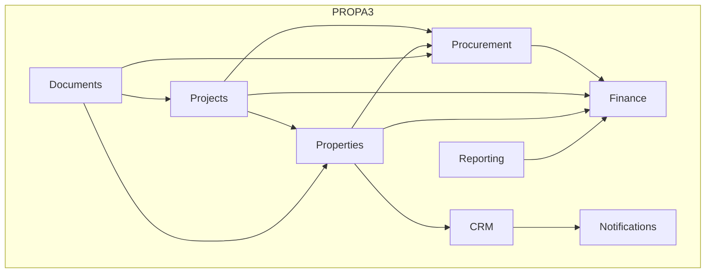
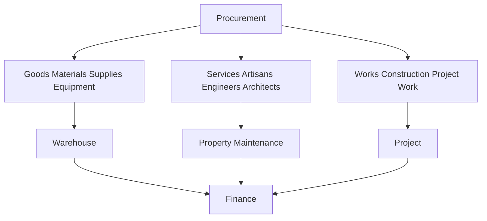
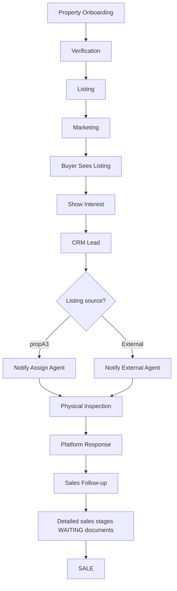
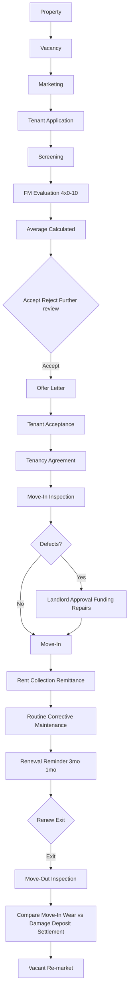
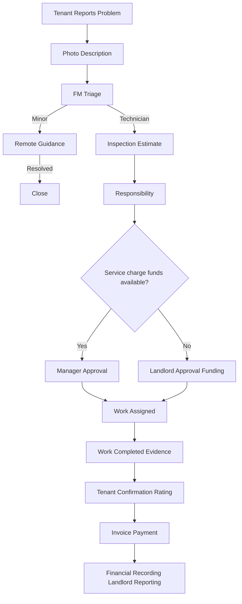
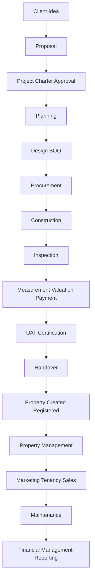

# Part G: Property Management

> **Source status:** CONFIRMED workflows & scoring (client clarification) · EXTRACTED tenant application partial (Part D FORM 4) · WAITING full FM–landlord–tenant agreement and remaining forms (Part F).  
> **Routes into PM:** (1) Company-developed property after construction handover · (2) External owner/landlord hands property to company to manage.

## G.1 Property management overview

Property management includes: rent collection; tenant administration; tenancy agreements; maintenance (routine + corrective); property administration; financial reporting / landlord remittance.

## G.2 Property master record

| Field group | Detail | Status |
|-------------|--------|--------|
| Property identity | Address, type, title docs, photos, GPS | CONFIRMED need |
| Multi-unit | One property → many units (e.g. 3-bed, 2-bed, 1-bed) | CONFIRMED |
| Per unit | Tenant, tenancy, rent, service charge, deposit, maintenance history, payment history | CONFIRMED |

**Data model rule:** `property` 1—N `unit` 1—N historical `tenancy`.

## G.3 Vacancy → marketing → tenant selection

```
Vacancy → Marketing → Tenant Selection → Offer → Agreement → Move-in → Occupied
```

Marketing channels (CONFIRMED examples): digital/online advertising; signpost on building; other approved channels. Platform must support **multiple** marketing methods.

## G.4 Tenant application

Prospective tenants complete an application/screening form.

**Capture (CONFIRMED list from client + Part D partial):**

| Field | Notes |
|-------|-------|
| Full name | |
| Other names | |
| Phone | |
| Email | |
| Nationality | |
| State of origin | |
| Place of work | |
| Work address | |
| Previous place of residence | |
| Reason for leaving previous residence | Used in Criterion 3 |
| Attesting person | |
| Relationship to attesting person | |
| Passport photograph | Attachment |
| Property inspection date | Where applicable |
| Traceable associated person/info | |

**Applicant-facing vs internal (CONFIRMED):**

| Layer | Content |
|-------|---------|
| Applicant-facing | Information the applicant must provide |
| Internal evaluation | Scoring, observations, investigations, landlord preferences — **not fully exposed to applicants** |

## G.5 Tenant selection scoring — CONFIRMED

> **Critical clarification:** Tenant does **not** assign their own scores. Application does **not** auto-score. Facility/property manager evaluates and assigns scores.

### G.5.1 Four criteria (each 0–10)

| # | Criterion | Evaluator considers | Score |
|---|-----------|---------------------|-------|
| 1 | **Compatibility of tenant/use with property** | Family size vs property size, intended use, suitability, pressure on facilities. Example: ~10 people for 2-bed → low score. System need not publish “max occupants” to applicants. | 0–10 |
| 2 | **Ability to pay** | Income/employment/business/expenses; may use market/income knowledge rather than invasive exact income disclosure. Example: low-paid security worker vs ₦5m/year rent → low score. Company may investigate/market-survey. | 0–10 |
| 3 | **Reason for vacating previous property** | Based on information obtained | 0–10 |
| 4 | **Guarantor** | Guarantor response/ability to attest character, reliability, care of property, meeting obligations | 0–10 |

Where: **0 = lowest**, **10 = highest**.

### G.5.2 Evaluation interface (CONFIRMED)

Authorised evaluator UI:

| Criterion | Score input |
|-----------|-------------|
| Property compatibility | 0–10 |
| Ability to pay | 0–10 |
| Previous residence / vacating reason | 0–10 |
| Guarantor | 0–10 |

**System calculates average:**

```
average = (C1 + C2 + C3 + C4) / 4
```

**WAITING — do not invent:** Interpretation of average (preferred / acceptable / reject bands); weighting; pass mark.

### G.5.3 Decision outcomes (CONFIRMED direction; names TBD)

```
Applicant → Evaluation → Scores → Average → Decision
```

Possible outcomes should ultimately include: **accepted** · **rejected** · **further review**. Exact status names/rules = WAITING.

## G.6 Offer letter → tenancy agreement

1. **Offer letter** (after accept): property type; fixed rent; service charge (if any); caution deposit. Tenant responds, accepts, signs acceptance of terms.
2. **Tenancy agreement** (after offer acceptance): landlord responsibilities; tenant responsibilities; maintenance responsibilities; rent obligations; rent due date; occupancy conditions; other terms.

> **NEW — WAITING critical document:** Separate agreement involving **tenant + facility manager + landlord** outlining complete agreement concept and parties’ rights/responsibilities. Client will provide — **extract; do not invent contractual rules**.

## G.7 Move-in inspection (CONFIRMED components)

Formal inspection before/around move-in. Attach photographic evidence.

### G.7.1 Header

| Field | Detail |
|-------|--------|
| Property condition summary | |
| Contents/components | |
| Landlord/agent info | |
| Tenant info | |
| Inspection date | |
| Inspection team | |

### G.7.2 Detailed components

| Area | Capture |
|------|---------|
| **Keys** | Front-door key count; back-door key count; other door keys |
| **Locks** | Condition; working / not working |
| **Electricity** | Meter exists?; current units; outstanding bill / none |
| **Water** | Outstanding bill?; amount/details / none |
| **External** | Fence; external environment; defects; maintenance needs |
| **Utilities** | Water supply; electricity; problems/condition |
| **Roof** | Leakage; details |
| **Windows** | Broken glass; details |
| **Security light** | Working / not |
| **Refuse** | Bin provided / not |
| **Landscaping** | Availability; condition |
| **Internal** | Ceiling; doors; walls; defects; painting/renovation needs; switches; sockets |

### G.7.3 Room-by-room (CONFIRMED)

Must support inspection of individual spaces, not only whole-property: living room; each bedroom; kitchen; kitchen cabinets; other rooms/spaces; other components.

Per space/component: **condition · defects · notes · photographs/evidence**.

## G.8 Pre-move-in repairs — CONTROL GATE (CONFIRMED)

```
Defect recorded → Required repair → Cost estimate → Submit to landlord
  → Landlord approval → Funds released → Repair completed → Verify
  → Allow move-in (unless authorised exception/waiver)
```

## G.9 Rent collection & multi-unit records

After repairs + move-in → rent collection begins.

**Remittance record:** amount collected; amount remitted to landlord; remittance date(s).

**Per tenancy (multi-unit):** property/unit (3-bed / 2-bed / 1-bed distinguishable); tenant; move-in date; contact; fixed rent; payment mode; tenancy commencement/expiry; service charge + period; caution deposit; agency fee; legal fee where charged.

## G.10 Financial recording

Capture: payment date; rent amount; gross amount; expenses.

**Rule:** Separate rent and expenses. Net remittance may be `Gross collected − approved expenses`. Exact accounting rules = WAITING confirmation from client financial documents.

## G.11 Routine maintenance

Planned activities to preserve quality (e.g. cleaning, security, scheduled maintenance). Frequencies mentioned: **daily · weekly · quarterly**. Support recurring maintenance schedules.

## G.12 Corrective maintenance journey (CONFIRMED)

```
Tenant reports problem
  → Photo + description + property/unit/tenant/date/component
  → FM triage
       ├─ Minor → remote guidance → resolved? → close
       └─ Technician required → inspect → scope → estimate → responsibility
            → Check available SERVICE CHARGE funds
                 ├─ Within funds → FM proceeds per approved process
                 └─ Exceeds funds → escalate to LANDLORD for approval/funding
            → Select artisan → notify → work → evidence
            → Tenant confirmation + feedback/rating
            → Invoice → payment → record SC expenditure
            → Landlord reporting per agreed frequency
```

### G.12.1 Service-charge funding rule — CONFIRMED

> **Not a fixed ₦ threshold.** Available **service charge / service levy** is the spending boundary. FM must not independently spend beyond available SC. Treatment of reserved/unspent SC = WAITING.

### G.12.2 Responsibility determination

FM determines: facility-management · landlord · tenant · other. Exact matrix = WAITING (from tenancy/FM agreement).

### G.12.3 Satisfaction & payment gate

After work: tenant confirms satisfactory completion; feedback; rating. Rating scale discussed as 1–5 style but must remain **configurable** until client confirms. **Payment must not release without required completion/confirmation controls.**

## G.13 Tenancy expiry / renewal (CONFIRMED reminders)

| Reminder | Timing |
|----------|--------|
| Reminder 1 | At least **3 months** before expiry |
| Reminder 2 | At least **1 month** before expiry |

Remind tenant to pay / renew.

**Non-renewal / holdover:** notice; inform consequences; recovery/possession may commence. Exact legal notices/wording/timelines beyond reminders = WAITING (tenancy/legal docs).

## G.14 Move-out inspection & deposit (CONFIRMED)

```
Move-out inspection
  → Retrieve original move-in inspection
  → Compare property + each component/space
  → Identify deterioration
  → Distinguish normal wear & tear vs tenant-caused damage
  → If tenant liable: apply caution deposit; if damage > deposit → seek additional payment
  → Produce closeout/settlement record
```

**Natural wear and tear** → not charged to tenant.  
**Tenant-caused damage / failure to maintain** → potentially chargeable.

---

# Part H: Property Sales

> **CONFIRMED:** listing categories, title types, Show Interest → CRM, propA3 vs external agent branching, **mandatory physical inspection**, post-inspection platform response.  
> **PROPOSED (not confirmed):** full pipeline from Offer onward — validate against forthcoming sales documents.  
> **WAITING:** listing/inspection/offer/agreement/commission/JV documents.

## H.1 Overview

Support marketing and sales for residential, commercial, and other applicable property types.

## H.2 Property categories (CONFIRMED discussion)

| Category | Types |
|----------|-------|
| Commercial | Vacant land; building |
| Residential | Vacant land; occupied land/property |

Preserve client terminology around “occupied land” until clarified. Data model: occupancy status field without silently renaming.

## H.3 Title documents (CONFIRMED examples; list configurable)

- C of O / Certificate of Occupancy;
- R of O / Right of Occupancy;
- no title document;
- other title types.

## H.4 Listing information (CONFIRMED capture list)

| Field | Notes |
|-------|-------|
| Property type | |
| Location / neighbourhood / neighbourhood character | |
| Density | **low · medium · high** (CONFIRMED) |
| Access road / road condition | |
| Year/date built | Where known |
| Coordinates | |
| Electricity / water / central sewage availability | |
| Property description | |
| Door type / window type | |
| Estate name / location name | |
| Photographs | |
| Title documents + other relevant documents | Attachments |
| Listing source | **propA3** vs **external agent** (CONFIRMED distinction) |
| Marketing purpose | Sale and/or **Joint Venture** |

Agents may submit/add properties under their care for sale or JV.

## H.5 Buyer interest → CRM (CONFIRMED)

```
Buyer clicks "Show Interest" on listing
  → CRM lead created
  → Identify: buyer · property · listing · source · responsible agent · listing ownership
  → Branch on listing source:
       ├─ propA3 listing → CRM → responsible agent → inspection request
       └─ External agent listing → CRM → notify external agent → initiate inspection
  → PHYSICAL INSPECTION (mandatory in both branches)
  → Platform response/update after inspection
  → Continue in CRM until sale
```

## H.6 Physical inspection — MANDATORY (CONFIRMED)

Regardless of propA3 or external agent listing, physical inspection **must** occur.

**Post-inspection platform response (CONFIRMED).** Proposed fields (subject to final confirmation): inspection date; inspector; buyer; property; attendance; observations; buyer feedback; level of interest; next action.

## H.7 Sales stages after inspection — PROPOSED ONLY

> Client stated process continues through CRM until sale. Exact stages after inspection **not fully explained**. Below is **industry-informed PROPOSED** — **NOT client-confirmed**. Do not treat as confirmed business process.

```
Buyer Interest → CRM Lead → Property Verification → Agent Assignment
  → Inspection Request → Inspection Scheduled → Physical Inspection
  → Inspection Response → Buyer Follow-up
  → [PROPOSED] Offer/Quotation → Negotiation → Offer Acceptance
  → Sale Agreement → Payment → Closing → Handover
```

Stages from Offer/Quotation onward = WAITING validation against client sales documents.

## H.8 Joint venture pathway (CONFIRMED need; fields WAITING)

Agents can add properties for **JV / Joint Venture** (owners want to partner with companies). Exact JV commercial info not fully specified.

**Proposed fields only (confirm against JV docs):** owner; property; title; location; proposed partnership; contribution; desired return/share; contact; supporting documents.

---

# Part I: Procurement — Goods / Services / Works

> **CONFIRMED:** Three categories · Goods workflow shape · payment normally before delivery · warehouse vs external · Services photo request · 2.5% on service fee excl. materials · 2.5% on professionals · Works ~10% of project cost · link Works → Project.  
> **WAITING:** PR/PO/GRN templates, supplier scoring, exact approval hierarchy, Goods fee %, VAT/tax treatment.

## I.1 Master category rule (CONFIRMED)

| Category | Examples | Client-stated charge |
|----------|----------|----------------------|
| **Goods** | Building materials (blocks, iron rods, paint, wood…); finishing (smart locks, devices…); bulk purchases | Not specified in this discussion |
| **Services** | Artisans (mason, carpenter, iron bender, welder, electrician, gypsum, solar installer…); professionals (architect, designer, SE…) | **2.5%** of service/professional fee |
| **Works** | Constructing a house; construction/project-execution technical works | **~10%** of total project cost |

For services involving materials: **2.5% applies to labour/service fee only — materials excluded.**

### I.1.1 Fee calculation examples (CONFIRMED logic)

**Services / artisans:**

```
Labour/service = ₦100,000
Materials      = ₦50,000
Chargeable base = ₦100,000
propA3 2.5%     = ₦2,500
```

**Professionals:** 2.5% × professional service amount.

**Works:**

```
Total project cost = ₦100,000,000
propA3 ~10%        = ₦10,000,000
```

Exact commercial/tax treatment = WAITING financial documents.

## I.2 Goods procurement workflow (CONFIRMED)

```
Need Identified
  → Purchase Requisition
  → Requirement Review
  → Supplier/OEM Matching
  → Quantity / MOQ / Price Evaluation
  → Purchase Order
  → PO Approval
  → PO Sent to Supplier (email)
  → Supplier Acceptance
  → Payment Arrangement  (payment normally BEFORE delivery — CONFIRMED)
  → Order / Shipment
  → Delivery Tracking (dispatch, expected days, actual, destination, status, delays)
  → Warehouse / Destination
  → Invoice Verification
  → Goods Verification (vs PO · invoice · qty · specs; record discrepancies)
  → Payment Confirmation
  → Supplier Performance Review (quality, delivery time, price, responsiveness, overall, satisfaction)
```

### I.2.1 Purchase requisition (CONFIRMED fields; template WAITING)

Item required; what; why; when; quantity; relevant details.

### I.2.2 Supplier / OEM database

OEMs; major suppliers; registered suppliers; warehouse goods; supply sources. Match requirements to suppliers. Scoring methodology = WAITING.

### I.2.3 Internal stock vs external

| Path | Flow |
|------|------|
| Internal | Warehouse → project / property / client |
| External | Supplier → warehouse / site / destination |

## I.3 Services procurement workflow (CONFIRMED)

```
Problem/Need Identified
  → Service Request
  → Photo + Description + item/component + work required
  → (Optional) suggested tools/materials/equipment — method WAITING
  → Select Artisan/Professional from registered list
  → Artisan Notified
  → Inspection/Assessment
  → Estimate
  → Funding/Approval (property SC rules or project budget as applicable)
  → Work Assigned
  → Work Completed
  → Completion Evidence
  → User Confirmation + Feedback/Rating   ← gate before payment
  → Invoice
  → Payment (apply 2.5% on service fee excl. materials where applicable)
  → Service Performance Record
```

## I.4 Works procurement (CONFIRMED link)

Construction/works record connects to: project; client; property/site; contractor/subcontractor; scope; contract; BOQ; milestones; valuation (IVC); payments.

```
Procurement → Works → Project → Property
```

Apply ~10% of total project cost as propA3 works/project service charge (commercial confirmation WAITING).

## I.5 Project cost accounting distinctions (CONFIRMED need)

System must distinguish:

| Concept | Meaning |
|---------|---------|
| Estimated cost | From BOQ estimate |
| Approved budget | Authorised baseline |
| Actual expenditure | Spent |
| Committed cost | POs/contracts open |
| Remaining budget | Budget − actual − committed (exact formula subject to finance procedures) |

Exact accounting implementation subject to client financial procedures (WAITING).

---

# Part J: Artisan Registration & KYC

> **CONFIRMED** identity/traceability fields. Exact guarantor form document = WAITING. Historical performance scoring rules = logical extension (TBD).

## J.1 Artisan / professional master profile

| Field | Required notes | Status |
|-------|----------------|--------|
| Full name | | CONFIRMED |
| Business name | Where applicable | CONFIRMED |
| CAC registration | Where applicable — do not assume every artisan has CAC | CONFIRMED |
| NIN / National Identity | | CONFIRMED |
| Voter's Card / other ID | Where applicable | CONFIRMED |
| Address / residence | | CONFIRMED |
| Business location | | CONFIRMED |
| Phone number | | CONFIRMED |
| Guarantor name | Traceability & accountability | CONFIRMED |
| Guarantor phone | | CONFIRMED |
| Relationship / guarantee details | As applicable | CONFIRMED concept; form WAITING |

Provide fields for these details rather than requiring every document for every artisan.

## J.2 Performance history (logical extension; scoring TBD)

Accumulate over time: jobs performed; property/project; service type; cost; completion time; quality; customer satisfaction; responsiveness; previous ratings; payment history.

---

# Part K: Cross-Module Integration

## K.1 Project ↔ Procurement

```
Project → Need 500 blocks → PR → Supplier → PO → Payment → Delivery → Verification → Project stock/use
Project → Need electrician → Service procurement → Artisan → Work → Completion → Payment
```

## K.2 Project ↔ Property

```
Client → Construction Project → Construction → Completion → Handover
  → Property created/registered (do not manually recreate)
  → Property Management and/or Sales
```

## K.3 Property ↔ Sales

Same property master: listed for sale; propA3 or external agent; JV; inspected; offered; sold.

## K.4 Property ↔ Property Management lifecycle

```
Vacant → Marketing → Tenant Selection → Tenancy → Occupied
  → Maintenance → Renewal → Move-out → Vacant → Re-marketing
```

## K.5 Property ↔ Maintenance ↔ Procurement

```
Broken electrical socket
  → Maintenance Request (+ photo)
  → Triage → Electrician Service Request → Estimate → SC check → Approval
  → Work → Tenant confirmation → Invoice → Payment
  → If materials needed: Goods Procurement (warehouse/supplier) → delivery → artisan completes
```

## K.6 Procurement ↔ Finance

Connect: requisition; PO; supplier; invoice; payment; delivery; expenses; project/property; service charge where applicable (2.5% / ~10%).

## K.7 Property Sales ↔ CRM ↔ External Agents

```
Listing → Show Interest → CRM Lead → Identify listing source
  → propA3 agent OR external agent notification → Physical Inspection → Platform Feedback → Sales Pipeline → Sale
```

## K.8 Inspection ↔ Deposit

Move-in baseline vs move-out compare → wear vs damage → deposit deduction / additional amount → evidence trail.

## K.9 Platform collaboration (replaces fragmented WhatsApp)

Authorised participants may: share/receive information; submit supervision reports; submit progress photographs; collaborate; communicate per access rights. (Project communication — Part B.2 / progress reports.)

---

# Part L: Confirmed Business Rules (Latest Client Clarifications)

| ID | Rule | Detail |
|----|------|--------|
| **L-A** | Tenant selection scoring | 4 criteria; 0–10 each; FM assigns; tenant does not; system averages; judgment + internal prefs; income may be inferred via investigation |
| **L-B** | Maintenance spend boundary | Available service charge/levy — not fixed Naira threshold; escalate to landlord if over |
| **L-C** | Physical sales inspection | Mandatory for every buyer-interest path (propA3 or external) |
| **L-D** | CRM listing-source verification | propA3-listed vs external-agent-listed drives notification |
| **L-E** | Post-inspection platform response | Required update after physical inspection |
| **L-F** | Three procurement categories | Goods · Services · Works |
| **L-G** | Artisan service charge | 2.5% of service fee **excluding materials** |
| **L-H** | Professional service charge | 2.5% of professional fee |
| **L-I** | Works/construction charge | ~10% of total project cost |
| **L-J** | Artisan photo-based request | Photo + description + component + work; optional tools/materials suggestions |
| **L-K** | Completion before payment | User confirmation + satisfaction + feedback/rating before pay advances |
| **L-L** | Artisan KYC | Name, business, CAC, NIN/ID, address, phone, guarantor + phone |

---

# Part M: End-to-End Journeys

## M.1 Overall propA3 operating system



## M.2 Procurement categories feed



## M.3 Complete property sales journey (CONFIRMED + PROPOSED tail)



## M.4 Complete tenancy journey (CONFIRMED)



## M.5 Complete maintenance journey (CONFIRMED)



## M.6 Project to Property to Management lifecycle (CONFIRMED spine)



## M.7 Project management process groups (CONFIRMED methodology)

Initiation → Planning → Execution → Monitoring & Controlling → Closure.

Initial emphasis: building construction; structure must allow other project types where appropriate.

A project has: defined beginning; defined end; resources; objective/output; stakeholders; activities; costs; schedule; deliverables; approvals; evidence; completion criteria.

### M.7.1 Planning contents (CONFIRMED)

Kickoff; site survey; requirements; design; BOQ; schedule; HR; equipment; stakeholders; quality; procurement; safety; communication; scope; change management; resource planning; approvals.

### M.7.2 Design package (CONFIRMED)

| Discipline | Contents |
|------------|----------|
| Architectural | Drawings; layout; design documentation |
| Structural | Feasibility; stability; structural requirements (with architect) |
| MEP | Electricity; lighting; AC; water; plumbing; waste; passages; sleeves/openings |

### M.7.3 Soil test (CONFIRMED triggers)

Especially for high-rise/multi-storey; high loads; uncertain soil. Determines **soil bearing capacity** → foundation type/design.

### M.7.4 Dev Control / FCT (CONFIRMED tracking)

Submission; approval status; approval documents; amendments; dates; authority; inspection/approval evidence. References: Department of Development Control; FCT Ministry; applicable codes.

### M.7.5 Monitoring principle (CONFIRMED)

Work → Measurement → % Completion → Valuation → Payment.

Amount allocated → work progresses → measured → % complete → payment per approved arrangement.

Daily / weekly / monthly / milestone frequencies — align with Document 3 (EXTRACTED) and Part B.5.

### M.7.6 Pre-concrete internal control (CONFIRMED checklist domains)

Drawings · Formwork · Reinforcement · MEP · Materials/Site · Weather/Documentation · Safety · Approvals (consulting engineer, site manager, site supervisor). Full itemisation remains in Part B.3 / Document 4 / verbal pre-pour.

### M.7.7 Closure package (CONFIRMED)

UAT → Fitness for use certification → Financial closure (subs, workers, vendors) → Client satisfaction → Handover (maintenance may continue) → Retrospective → Testimonials → Continuous improvement.

**Guzape closeout lesson (EXTRACTED):** Closure is not merely construction complete — post-completion M&E issues, satisfaction, and maintenance obligations remain traceable.

### M.7.8 Commercial vs personal projects (CONFIRMED)

| Type | Capture emphasis |
|------|------------------|
| Commercial | Costs; benefits; profitability; commercial viability; expected returns |
| Personal / non-commercial | What matters most to the client |

Charter remains ~one page: title; client; goal; high-level scope; approximate cost range; approximate duration; expected benefits; key stakeholders; project authority; client + company sign-off. Project officially begins only after required initiation requirements and approvals.

### M.7.9 Equipment planning (CONFIRMED)

Plan machinery; equipment; tools; required dates; availability; sourcing; local availability; external/international procurement where required (order early if not local).

### M.7.10 Quality principle (CONFIRMED)

"Quality doesn't happen by accident." Applies to: material sourcing; workmanship; design compliance; construction methods; specified materials; industry standards. Check quality marks; standards; manufacturer reputation; compliance; testing where required. Blocks: mix ratio; reputable manufacturers; vendor records. Artisans: identify; evaluate; interview; train/upskill. Measurement: lasers; levelling instruments for height/depth/level/alignment.

### M.7.11 Safety (CONFIRMED)

Applies to workers; visitors; public; site operations. PPE where required: helmets; reflective jackets; gloves; safety belts; other appropriate PPE.

### M.7.12 Construction sequence (CONFIRMED list)

Site clearance → Setting out → Excavation → Blinding → Foundation/footing → Reinforcement → Formwork → Concrete casting → Trench excavation for walls → Blockwork → Plinth beam where required → Blockwork to DPC → Hollow filling where applicable → Backfilling/compaction → MEP sleeves → Slab preparation → Slab concrete → Curing → Blockwork to lintel → Head-course → Concrete columns/head-course → Lift shaft where applicable → Upper-floor construction → Beam/slab/staircase formwork → Reinforcement → MEP sleeves → Inspection before concrete.

### M.7.13 IVC / mobilisation (CONFIRMED)

IVC fields: work description; subcontractor; account details; scope/SOW; contract reference; contract amount; delivery duration; start/end; measured work; payment info. Payment table: S/N; stage; work achieved %; amount paid; % paid; payment date; performance comments. Milestones include mobilisation + first through fifth. Mobilisation payment may be made initially; if no work commenced Measured work = 0%. Subsequent payments performance-based. PM/supervisor recommends completion status, %, full vs partial payment. Accountability: Work → Measurement → Valuation → Approval → Payment.

### M.7.14 Mixed-use / Guzape examples

Remain EXTRACTED in Part B / Part C (Doc 1 charter; Doc 7 closeout). Use as acceptance fixtures, not alternate schemas.

---

# Part N: Project Management Detail Index (BRD ↔ Part B)

> Full phase workflows, user stories, and embedded Abraham documents remain in **Part B**. This index maps Master BRD sections to build locations so nothing is orphaned.

| BRD topic | Master location | Evidence |
|-----------|-----------------|----------|
| Client requirement / land / proposal / charter | B.1 | CONFIRMED + Doc 1 charter example |
| Kick-off | B.2.1 | EXTRACTED Doc 2 |
| Site survey & requirements | B.2.2 | CONFIRMED |
| Design Arch/Structural/MEP + TDP/C of O attaches | B.2.3 + A.7.1 | CONFIRMED |
| Soil test | B.2.4 | CONFIRMED |
| BOQ & cost distinctions | B.2.5 + I.5 | CONFIRMED concepts; template WAITING |
| Dev Control | B.2.6 | CONFIRMED |
| WBS / Gantt / time | B.2.7 | EXTRACTED Sheet 1 |
| HR / personnel log / labour + material schedules | B.2.8 + A.7.1 | Partial EXTRACTED; personnel WAITING |
| Equipment planning | M.7.9 + B.2 | CONFIRMED need |
| Stakeholders / communication / progress report | B.2.9–B.2.11 + B.5.1 | EXTRACTED Sheet 3 |
| Scope / change log | B.5.2 | EXTRACTED Sheet 6 |
| Quality / vendors / artisans | B.4 + Part J | CONFIRMED |
| Safety / PPE | M.7.11 / ethics | CONFIRMED + Infographic 2 |
| Execution sequence | B.3 + M.7.12 | CONFIRMED |
| Pre-concrete control | B.3 + M.7.6 | CONFIRMED verbal |
| Daily site log | B.3 | EXTRACTED Sheet 4 |
| IVC / mobilisation / payment control | B.5.3 + M.7.13 | EXTRACTED Doc 6 |
| 20-section inspection log | B.3 | EXTRACTED Doc 4 |
| Closure / UAT / retrospective | B.6 | EXTRACTED Doc 7, Doc 8 |
| Mixed-use example | B.1 / Part C Doc 1 | EXTRACTED |
| Property / Sales / Procurement 3-cat / KYC | Parts G–J | CONFIRMED (this imbibe) |
| Fee rules 2.5% / 10% | Part I + L | CONFIRMED |
| Documents expected / do not invent | Part F | WAITING list |

**Builder instruction:** Implement Part B + Parts G–M together. For every WAITING row in Part F, ship attachment + draft schema only — never invent contractual text, pass marks, commission %, or post-inspection sales stages.
