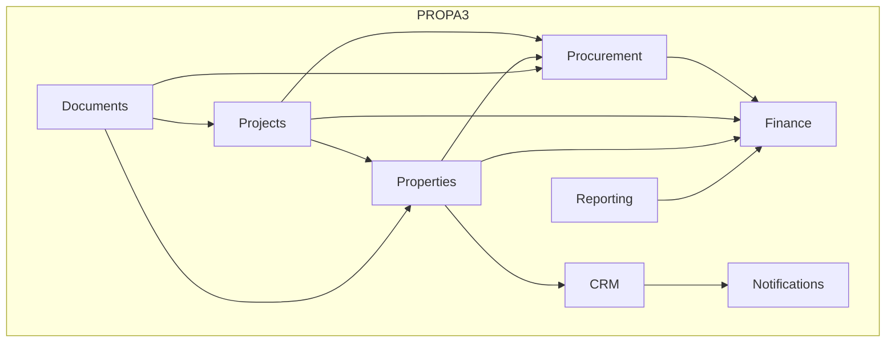
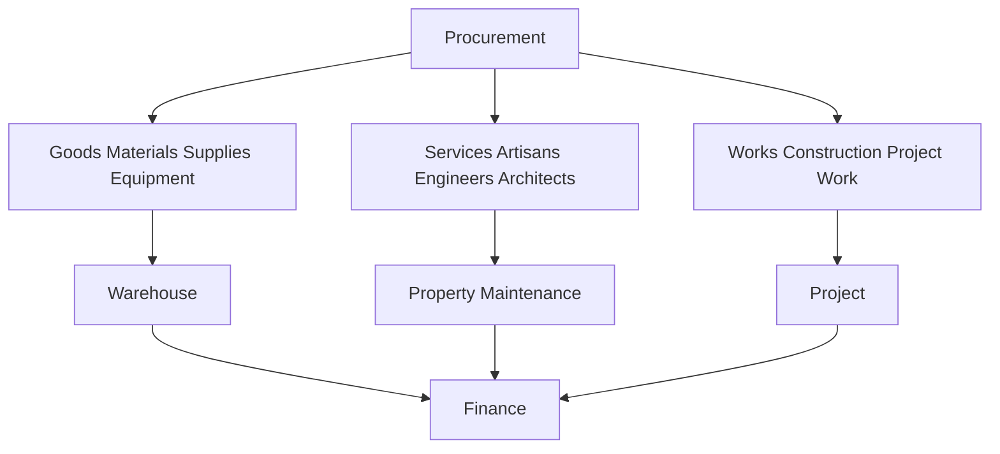
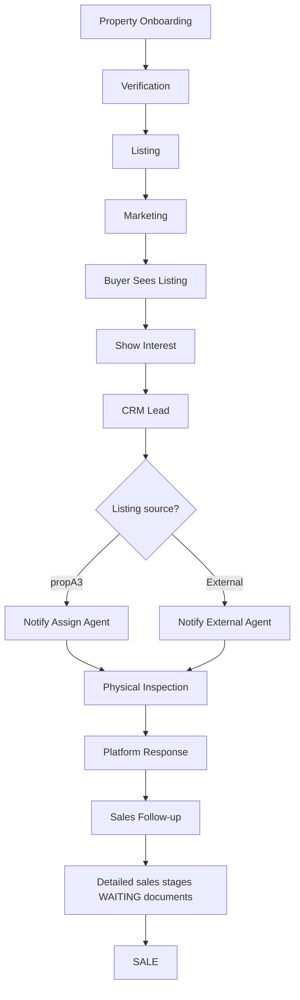
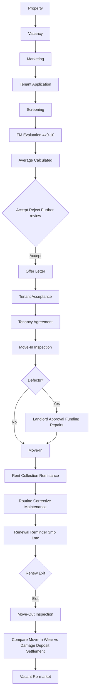
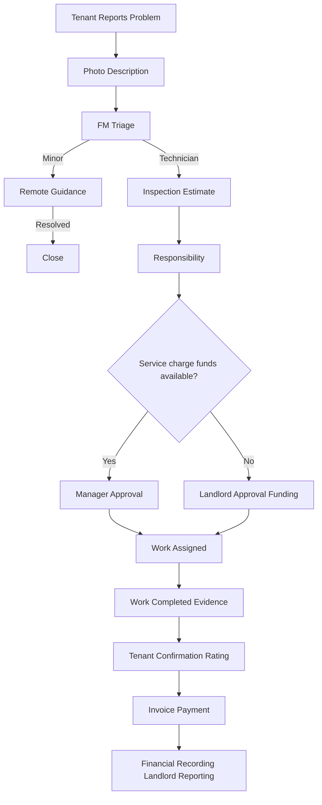
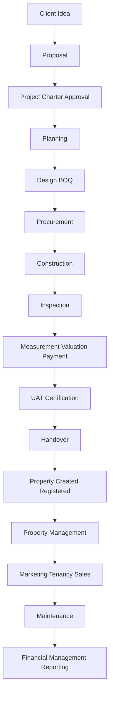

# Part L: Confirmed Business Rules (Latest Client Clarifications)

| ID | Rule | Detail |
|----|------|--------|
| **L-A** | Tenant selection scoring | 4 criteria; 0–10 each; FM assigns; tenant does not; system averages; judgment + internal prefs; income may be inferred via investigation |
| **L-B** | Maintenance spend boundary | Available service charge/levy — not fixed Naira threshold; escalate to landlord if over |
| **L-C** | Physical sales inspection | Mandatory for every buyer-interest path (propA3 or external) |
| **L-D** | CRM listing-source verification | propA3-listed vs external-agent-listed drives notification |
| **L-E** | Post-inspection platform response | Required update after physical inspection |
| **L-F** | Three procurement categories | Goods · Services · Works |
| **L-G** | Artisan service charge | 2.5% of service fee **excluding materials** |
| **L-H** | Professional service charge | 2.5% of professional fee |
| **L-I** | Works/construction charge | ~10% of total project cost |
| **L-J** | Artisan photo-based request | Photo + description + component + work; optional tools/materials suggestions |
| **L-K** | Completion before payment | User confirmation + satisfaction + feedback/rating before pay advances |
| **L-L** | Artisan KYC | Name, business, CAC, NIN/ID, address, phone, guarantor + phone |

---

# Part M: End-to-End Journeys

## M.1 Overall propA3 operating system

## M.2 Procurement categories feed

## M.3 Complete property sales journey (CONFIRMED + PROPOSED tail)

## M.4 Complete tenancy journey (CONFIRMED)

## M.5 Complete maintenance journey (CONFIRMED)

## M.6 Project to Property to Management lifecycle (CONFIRMED spine)

## M.7 Project management process groups (CONFIRMED methodology)

Initiation → Planning → Execution → Monitoring & Controlling → Closure.

Initial emphasis: building construction; structure must allow other project types where appropriate.

A project has: defined beginning; defined end; resources; objective/output; stakeholders; activities; costs; schedule; deliverables; approvals; evidence; completion criteria.

### M.7.1 Planning contents (CONFIRMED)

Kickoff; site survey; requirements; design; BOQ; schedule; HR; equipment; stakeholders; quality; procurement; safety; communication; scope; change management; resource planning; approvals.

### M.7.2 Design package (CONFIRMED)

| Discipline | Contents |
|------------|----------|
| Architectural | Drawings; layout; design documentation |
| Structural | Feasibility; stability; structural requirements (with architect) |
| MEP | Electricity; lighting; AC; water; plumbing; waste; passages; sleeves/openings |

### M.7.3 Soil test (CONFIRMED triggers)

Especially for high-rise/multi-storey; high loads; uncertain soil. Determines **soil bearing capacity** → foundation type/design.

### M.7.4 Dev Control / FCT (CONFIRMED tracking)

Submission; approval status; approval documents; amendments; dates; authority; inspection/approval evidence. References: Department of Development Control; FCT Ministry; applicable codes.

### M.7.5 Monitoring principle (CONFIRMED)

Work → Measurement → % Completion → Valuation → Payment.

Amount allocated → work progresses → measured → % complete → payment per approved arrangement.

Daily / weekly / monthly / milestone frequencies — align with Document 3 (EXTRACTED) and Part B.5.

### M.7.6 Pre-concrete internal control (CONFIRMED checklist domains)

Drawings · Formwork · Reinforcement · MEP · Materials/Site · Weather/Documentation · Safety · Approvals (consulting engineer, site manager, site supervisor). Full itemisation remains in Part B.3 / Document 4 / verbal pre-pour.

### M.7.7 Closure package (CONFIRMED)

UAT → Fitness for use certification → Financial closure (subs, workers, vendors) → Client satisfaction → Handover (maintenance may continue) → Retrospective → Testimonials → Continuous improvement.

**Guzape closeout lesson (EXTRACTED):** Closure is not merely construction complete — post-completion M&E issues, satisfaction, and maintenance obligations remain traceable.

### M.7.8 Commercial vs personal projects (CONFIRMED)

| Type | Capture emphasis |
|------|------------------|
| Commercial | Costs; benefits; profitability; commercial viability; expected returns |
| Personal / non-commercial | What matters most to the client |

Charter remains ~one page: title; client; goal; high-level scope; approximate cost range; approximate duration; expected benefits; key stakeholders; project authority; client + company sign-off. Project officially begins only after required initiation requirements and approvals.

### M.7.9 Equipment planning (CONFIRMED)

Plan machinery; equipment; tools; required dates; availability; sourcing; local availability; external/international procurement where required (order early if not local).

### M.7.10 Quality principle (CONFIRMED)

"Quality doesn't happen by accident." Applies to: material sourcing; workmanship; design compliance; construction methods; specified materials; industry standards. Check quality marks; standards; manufacturer reputation; compliance; testing where required. Blocks: mix ratio; reputable manufacturers; vendor records. Artisans: identify; evaluate; interview; train/upskill. Measurement: lasers; levelling instruments for height/depth/level/alignment.

### M.7.11 Safety (CONFIRMED)

Applies to workers; visitors; public; site operations. PPE where required: helmets; reflective jackets; gloves; safety belts; other appropriate PPE.

### M.7.12 Construction sequence (CONFIRMED list)

Site clearance → Setting out → Excavation → Blinding → Foundation/footing → Reinforcement → Formwork → Concrete casting → Trench excavation for walls → Blockwork → Plinth beam where required → Blockwork to DPC → Hollow filling where applicable → Backfilling/compaction → MEP sleeves → Slab preparation → Slab concrete → Curing → Blockwork to lintel → Head-course → Concrete columns/head-course → Lift shaft where applicable → Upper-floor construction → Beam/slab/staircase formwork → Reinforcement → MEP sleeves → Inspection before concrete.

### M.7.13 IVC / mobilisation (CONFIRMED)

IVC fields: work description; subcontractor; account details; scope/SOW; contract reference; contract amount; delivery duration; start/end; measured work; payment info. Payment table: S/N; stage; work achieved %; amount paid; % paid; payment date; performance comments. Milestones include mobilisation + first through fifth. Mobilisation payment may be made initially; if no work commenced Measured work = 0%. Subsequent payments performance-based. PM/supervisor recommends completion status, %, full vs partial payment. Accountability: Work → Measurement → Valuation → Approval → Payment.

### M.7.14 Mixed-use / Guzape examples

Remain EXTRACTED in Part B / Part C (Doc 1 charter; Doc 7 closeout). Use as acceptance fixtures, not alternate schemas.

---

# Part N: Project Management Detail Index (BRD ↔ Part B)

> Full phase workflows, user stories, and embedded Abraham documents remain in **Part B**. This index maps Master BRD sections to build locations so nothing is orphaned.

| BRD topic | Master location | Evidence |
|-----------|-----------------|----------|
| Client requirement / land / proposal / charter | B.1 | CONFIRMED + Doc 1 charter example |
| Kick-off | B.2.1 | EXTRACTED Doc 2 |
| Site survey & requirements | B.2.2 | CONFIRMED |
| Design Arch/Structural/MEP + TDP/C of O attaches | B.2.3 + A.7.1 | CONFIRMED |
| Soil test | B.2.4 | CONFIRMED |
| BOQ & cost distinctions | B.2.5 + I.5 | CONFIRMED concepts; template WAITING |
| Dev Control | B.2.6 | CONFIRMED |
| WBS / Gantt / time | B.2.7 | EXTRACTED Sheet 1 |
| HR / personnel log / labour + material schedules | B.2.8 + A.7.1 | Partial EXTRACTED; personnel WAITING |
| Equipment planning | M.7.9 + B.2 | CONFIRMED need |
| Stakeholders / communication / progress report | B.2.9–B.2.11 + B.5.1 | EXTRACTED Sheet 3 |
| Scope / change log | B.5.2 | EXTRACTED Sheet 6 |
| Quality / vendors / artisans | B.4 + Part J | CONFIRMED |
| Safety / PPE | M.7.11 / ethics | CONFIRMED + Infographic 2 |
| Execution sequence | B.3 + M.7.12 | CONFIRMED |
| Pre-concrete control | B.3 + M.7.6 | CONFIRMED verbal |
| Daily site log | B.3 | EXTRACTED Sheet 4 |
| IVC / mobilisation / payment control | B.5.3 + M.7.13 | EXTRACTED Doc 6 |
| 20-section inspection log | B.3 | EXTRACTED Doc 4 |
| Closure / UAT / retrospective | B.6 | EXTRACTED Doc 7, Doc 8 |
| Mixed-use example | B.1 / Part C Doc 1 | EXTRACTED |
| Property / Sales / Procurement 3-cat / KYC | Parts G–J | CONFIRMED (this imbibe) |
| Fee rules 2.5% / 10% | Part I + L | CONFIRMED |
| Documents expected / do not invent | Part F | WAITING list |

**Builder instruction:** Implement Part B + Parts G–M together. For every WAITING row in Part F, ship attachment + draft schema only — never invent contractual text, pass marks, commission %, or post-inspection sales stages.
